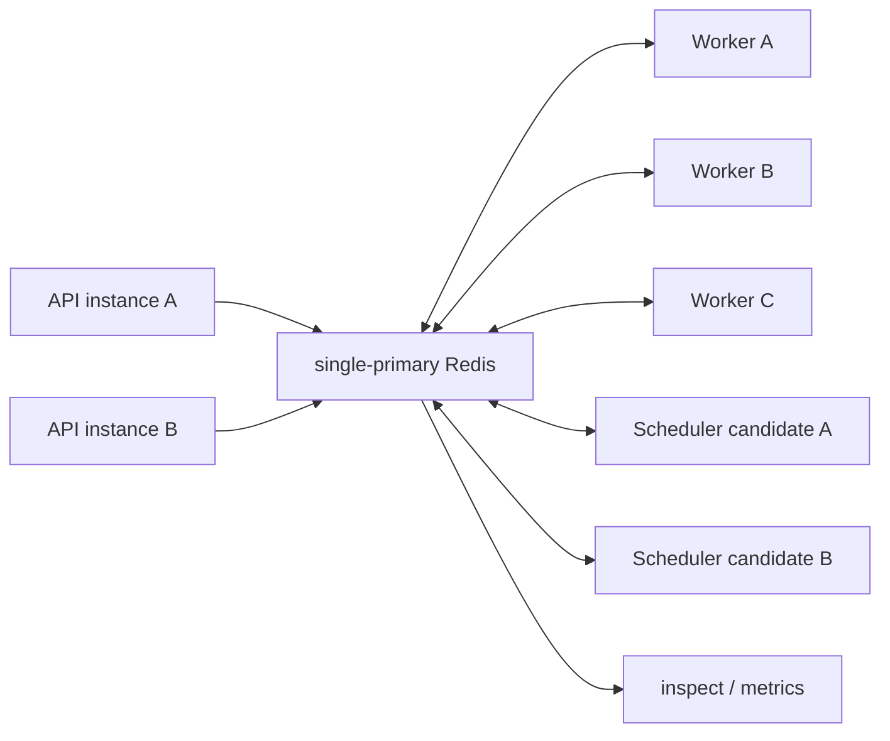
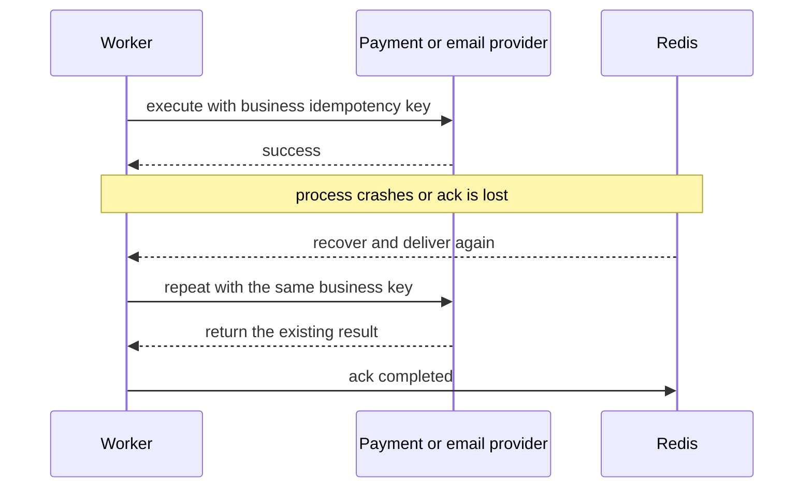

# Distributed Workers

<!-- queuebit-v01-legacy-doc -->
> [!WARNING]
> **Archived and no longer maintained.** The current v0.1 final-user manual is [`docs/v01/en`](../v01/en/index.md). This page remains for historical context only; do not use its APIs, commands, configuration, or examples for new integrations or implementation.

<span class="manual-label">Cluster operations guide</span>

queuebit's formal model is multiple processes or nodes sharing one single-primary Redis. Producers only enqueue, Workers compete to claim jobs, and Scheduler candidates compete for one active role. Redis Cluster is unsupported in v0.1.



<span id="s07-multi-worker"></span>
## S07 Scale Workers horizontally

Start Workers on multiple machines with the same Redis connection, `namespace`, and queue name, and give every process a traceable identity. Jobs are assigned through atomic Redis claims and leases, with no load balancer or static sharding required.

Estimate `total concurrency = healthy Workers × per-instance concurrency`. Downstream quotas, database pools, CPU, and memory remain the real limits. After scaling, run `npx queuebit inspect workers --queue notification --config queuebit.config.ts` and verify new heartbeats, unique identities, and expected total concurrency.

Jobs for the same business key may run on different Workers concurrently. v0.1 has no priority or global ordering guarantee. Serialize or reject concurrent updates in the business model when ordering matters.

<span id="s08-drain"></span>
## S08 Drain before deployment

```bash
npx queuebit worker drain --config queuebit.config.ts --queue notification --timeout 30s
```

After drain starts, the instance stops claiming new jobs but continues active jobs. Success means the instance reports `draining: true`, active count reaches zero, and the process exits. A timeout is not job success: unacknowledged jobs recover after lease expiry through the active Scheduler.

The platform termination grace period must exceed `drainTimeoutMs` and leave time to close Redis resources. Do not force-terminate first and attempt drain afterward.

<span id="s09-rolling-reload"></span>
## S09 Rolling deployment and vext reload

1. Keep at least one old Worker healthy.
2. Start a new Worker and wait for heartbeat and startup checks.
3. Drain one old instance, wait for active count to reach zero, then terminate it.
4. Replace remaining instances one at a time.
5. Replace Scheduler candidates one at a time while observing active identity; never treat both as active.

A vext Web/API reload affects the Producer process only and must not implicitly start or stop Workers. For payload schema changes, deploy Workers that read both old and new payloads, then deploy Producers, and remove compatibility reading last.

<span id="s10-worker-crash"></span>
## S10 Recover a Worker crash

After a crash, Redis keeps the job `active` until its lease expires. The active Scheduler detects the stalled job and returns it to an executable path, so another Worker may run it again.

Response sequence:

1. Do not delete the active job or immediately submit a duplicate.
2. Restore Worker capacity and confirm an active Scheduler exists.
3. Observe `stalled` and `stalledRecoveries` increments.
4. Use business idempotency records to determine whether the first attempt produced a side effect.
5. After completion, correlate logs and downstream request IDs from both attempts.

<span id="s11-ack-redelivery"></span>
## S11 Handle success with an uncertain ack

The most dangerous window is after a downstream success but before Worker completion reaches Redis. A disconnect or process crash can redeliver the job.



The queue `idempotencyKey` deduplicates enqueue, not external effects. The downstream must accept the same business idempotency key, or a local database must atomically record processing state. See [Idempotency patterns](./idempotency-patterns.md).

<span id="s13-scheduler-single-active"></span>
## S13 Run multiple Scheduler candidates

For availability, run multiple candidates with the same stable `domain` for one scheduling group. Only an instance that can prove ownership may advance delayed, retrying, and stalled work. It stops when ownership is uncertain rather than risking dual progression.

```bash
npx queuebit inspect scheduler --domain billing-notification --config queuebit.config.ts
```

Healthy output has exactly one active identity and all other candidates on standby. Use separate namespaces across environments so test and production candidates cannot compete.

<span id="s14-scheduler-failover"></span>
## S14 Fail over the Scheduler

When the active Scheduler stops, delayed, retrying, and stalled progression pauses briefly; healthy Worker jobs already running do not fail for that reason. A candidate resumes progression after the old ownership expires and it acquires a new one.

Record the old identity, stop time, new identity, takeover time, delayed/retrying depth, and whether dual-active appeared. If no candidate becomes active, check candidate processes, domain, namespace, Redis latency, and primary connectivity. Do not start a different-domain Scheduler as a temporary workaround.

## Capacity and safety boundaries

| Question | v0.1 answer |
|----------|-------------|
| Can Workers claim the same attempt normally? | Atomic Redis claims prevent it; failure recovery can create another attempt |
| Is strict ordering guaranteed? | No; concurrency and retry change completion order |
| Is global concurrency or rate limiting built in? | No; enforce it in a shared business layer |
| Is Redis Cluster supported? | No; use standalone, managed single-primary, or Sentinel connection failover |
| Can only one Scheduler process run? | Yes, but without failover; production should use multiple candidates and one active |

## Next steps

- Choose lease, concurrency, and Scheduler values: [Configuration recipes](./configuration-recipes.md)
- Respond to Redis or Scheduler incidents: [Failure runbooks](./failure-runbooks.md)
- Validate the deployment topology: [Production deployment](./production-deployment.md)
