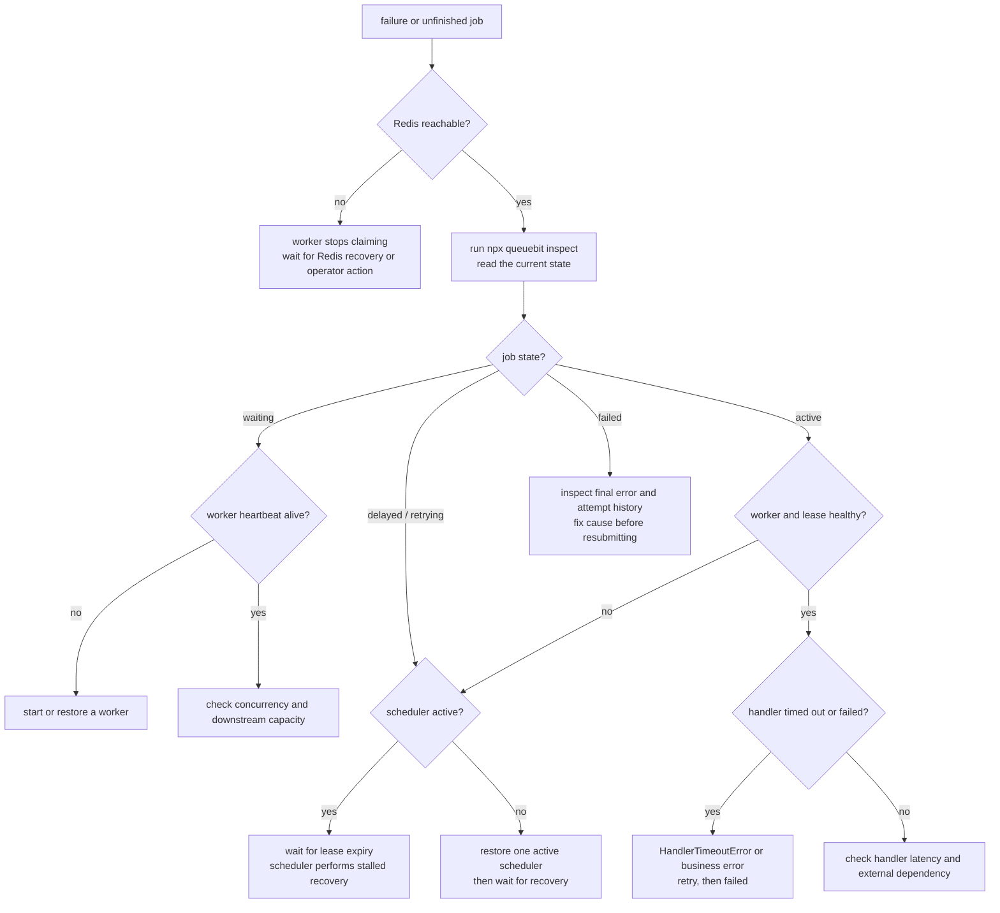

# Failure Modes and Recovery

<!-- queuebit-v01-legacy-doc -->
> [!WARNING]
> **Archived and no longer maintained.** The current v0.1 final-user manual is [`docs/v01/en`](../v01/en/index.md). This page remains for historical context only; do not use its APIs, commands, configuration, or examples for new integrations or implementation.

## Page positioning

User recovery guide

When a job does not finish as expected, use this page to decide whether Redis, Worker, Scheduler, or the business handler failed and choose the next action.

## Recovery principles

queuebit recovery follows:

- Prefer recoverable jobs over exactly-once guarantees.
- Stop progression when uncertain instead of writing risky state.
- Recovery actions must be observable.
- Users need business idempotency or deduplication for side effects.

## Failure handling flow

First identify what failed: Redis, worker, scheduler, handler, or shutdown. Each failure point has a different response.

Node explanations:

| Node | Handling principle |
|------|--------------------|
| Redis unreachable | Do not keep claiming new jobs and expand uncertainty |
| worker missing heartbeat | Do not assume job failure; wait for lease/recovery |
| handler failed | Retry by backoff; handlers must be idempotent |
| scheduler inactive | Pause delayed/retry promotion until single-active is restored |
| inspect output | The first user-facing evidence for the next action |

## Failure matrix

| Failure | What you will see | User action |
|---------|------------------------|-------------|
| Redis unavailable at startup | producer/worker/scheduler fails to start or backs off | Fix Redis and validate namespace/connection |
| Redis briefly unavailable while processing | worker stops claiming; renew failure enters uncertainty path | Watch retry/stalled metrics and confirm idempotency |
| Worker process crashes | job enters stalled recovery after lease expiration | Check worker logs and redelivery risk |
| Handler throws | job enters retry or terminal failed | Inspect error summary, attempts, backoff |
| Handler timeout | `HandlerTimeoutError`; `ctx.signal` is aborted and the attempt retries or fails | Pass the signal downstream, check side effects, then adjust `timeoutMs` or task granularity |
| Ack lost | job may be delivered again | Use idempotency key for business side effects |
| Lease renewal fails | worker stops claiming; active job waits for recovery | Check Redis latency, network, and worker load |
| Scheduler double-instance race | only active scheduler advances; uncertainty stops progression | Check scheduler domain and identity |
| Delayed jobs not promoted | scheduler is not running or lost leadership | Inspect scheduler identity and delayed depth |
| Drain timeout | active jobs follow lease/recovery rules | Shorten jobs, increase shutdown timeout, or split work |

## User troubleshooting path

When a job does not complete as expected:

1. Did queue depth increase? If not, check producer enqueue.
2. Are active jobs stuck? Check worker process and lease renewal.
3. Are delayed or retry jobs piling up? Check active scheduler status.
4. Is stalled recovery increasing? Check worker crash, Redis latency, or handler timeout.
5. Are failed jobs increasing? Inspect error summaries and attempt history.

## Idempotency guidance

Under at-least-once delivery, business handlers should:

- use a business unique key or job id for idempotency;
- protect external side effects with state-machine or check-before-write logic;
- split long tasks to keep lease and drain windows reasonable;
- log processing start, success, failure, and external request ids.

queuebit may expose an idempotency key entry point, but it cannot prove exactly-once behavior for a business system.

## Rehearse before production

- Stop one Worker and confirm stalled recovery increases after lease expiry and the job can run again.
- Stop the active Scheduler and confirm delayed/retry promotion pauses, then resumes after a candidate takes over.
- Briefly block Redis and confirm Workers stop claiming while state remains observable after reconnect.
- Simulate redelivery with the same `idempotencyKey` and confirm the business handler does not duplicate side effects.
- Run one drain and confirm new jobs stop being claimed while active jobs finish or fall back to recovery after timeout.
