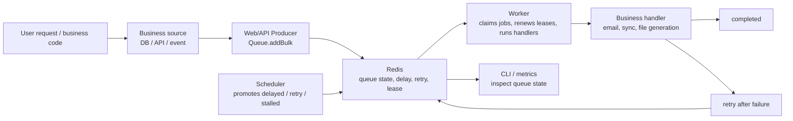

## Manual definition

v0.1 final user manual

This site is the queuebit v0.1 final user manual. It explains installation, configuration, runtime, troubleshooting, and limits in the order users need them; future development should use these user paths as the acceptance baseline.

The primary user path starts with what queuebit is, who should use it, how to install it, where business data comes from, how to enqueue jobs in bulk, how worker and scheduler processes run, how vext projects integrate, and where to troubleshoot failures.

## Understand queuebit in 30 seconds

If this is your first time reading queuebit docs, remember three things first:

1. The Web/API process only enqueues jobs.
2. Worker processes actually run jobs.
3. Scheduler processes move delayed, retry, and stalled jobs back into executable queues.

Node explanations:

| Node | Role | What the user does |
|------|------|--------------------|
| Business source | Provides real records that need async processing | Read pending records from a DB, API, event, or file |
| Web/API Producer | Converts business records into jobs and submits them in bulk | Create `Queue` and call `Queue.addBulk` |
| Redis | Stores queues, delayed jobs, retries, and leases | Prepare Redis 7 and avoid Redis Cluster in v0.1 |
| Worker | Consumes jobs and runs handlers | Start a dedicated worker process |
| Scheduler | Promotes delayed, retry, and stalled jobs | Start a dedicated scheduler process |
| CLI / metrics | Shows why jobs are stuck | Inspect queue, workers, and scheduler first |

## Who it is for

queuebit is intended for Node.js and vext projects that want a Redis-backed job queue.

It fits teams that:

- need background jobs, retries, delayed work, and worker processing;
- want the first version to depend only on Redis;
- care about leases, stalled recovery, and scheduler single-active boundaries in multi-instance deployments;
- want Web process topology and queue worker topology to stay separate.

If your first requirement is recurring jobs, workflow orchestration, a dashboard, or multiple queue backends, v0.1 is not the right target version.

## First successful path

First integration should follow this order:

1. Install `queuebit`.
2. Prepare Redis and confirm the topology in [Environment and Compatibility Boundary](./compatibility.md).
3. Read a batch of pending business records in the Web/API process and enqueue jobs with `Queue.addBulk`.
4. Start a dedicated `Worker` process and register handlers.
5. Start a dedicated `Scheduler` process for delayed, retry, and stalled recovery.
6. Inspect queue depth, active jobs, retry pending, and stalled recovery.
7. Drain workers during deploy or shutdown.
8. Design handlers for at-least-once delivery.

See the code path in [Quick Start](./quick-start.md).

## Capability boundary

| Capability | v0.1 user conclusion |
|------------|----------------------|
| Backend | Redis only; no memory, database, SQS, or Kafka adapters |
| Delivery | At-least-once; business handlers must be idempotent |
| Delay and retry | Delayed jobs, attempts, backoff, and scheduler promotion |
| Stalled recovery | Lease-expiration recovery with redelivery evidence |
| Scheduler | Single-active per `scheduler.domain` |
| Redis Cluster | Unsupported in v0.1; cluster configuration fails fast |
| vext | Adapter exposed through `queuebit/vext`; roles remain explicit |
| Dashboard | Not a v0.1 goal; use CLI, metrics, and introspection |

## User reading path

Read in this order:

| Goal | Entry |
|------|-------|
| Run the first batch of jobs in 15 minutes | [Quick Start](./quick-start.md) |
| Check environment, Redis shape, and distributed topology fit | [Environment and Compatibility Boundary](./compatibility.md) |
| Understand Queue, Job, Worker, Scheduler, Lease | [Core concepts](./concepts.md) |
| Integrate a vext project | [vext integration](./vext-integration.md) |
| Configure process roles and CLI commands | [CLI and configuration](./cli-and-config.md) |
| Know where to look when jobs do not complete | [Operations and troubleshooting](./operations.md) |
| Design recovery, troubleshooting, and idempotency | [Failure Modes and Recovery](./failure-modes.md) |
| Look up APIs, commands, and references | [Reference index](./reference.md) |

## Implementation notes

These pages help implementers align internals. They do not replace the user manual path.

| Implementation goal | Entry |
|---------------------|-------|
| Understand core / adapter and deployment topology | [Architecture](./architecture.md) |
| Align public API behavior | [API reference](./target-api.md) |
| Align Redis keyspace and state transitions | [Redis model](./redis-model.md) |
| Implement worker / scheduler runtime | [Worker and Scheduler Lifecycle](./worker-lifecycle.md) |
| Keep future development aligned with the manual | [Development guardrails](./development-contract.md) |

## Continue reading

- [Quick Start](./quick-start.md)
- [Environment and Compatibility Boundary](./compatibility.md)
- [Core concepts](./concepts.md)
- [vext integration](./vext-integration.md)
- [CLI and configuration](./cli-and-config.md)
- [Redis-only and distributed recovery](./distributed-semantics.md)
- [Failure Modes and Recovery](./failure-modes.md)
- [Operations and troubleshooting](./operations.md)
- [Reference index](./reference.md)
- [Architecture](./architecture.md)
- [API reference](./target-api.md)
- [Redis model](./redis-model.md)
- [Worker and Scheduler Lifecycle](./worker-lifecycle.md)
- [Development guardrails](./development-contract.md)
