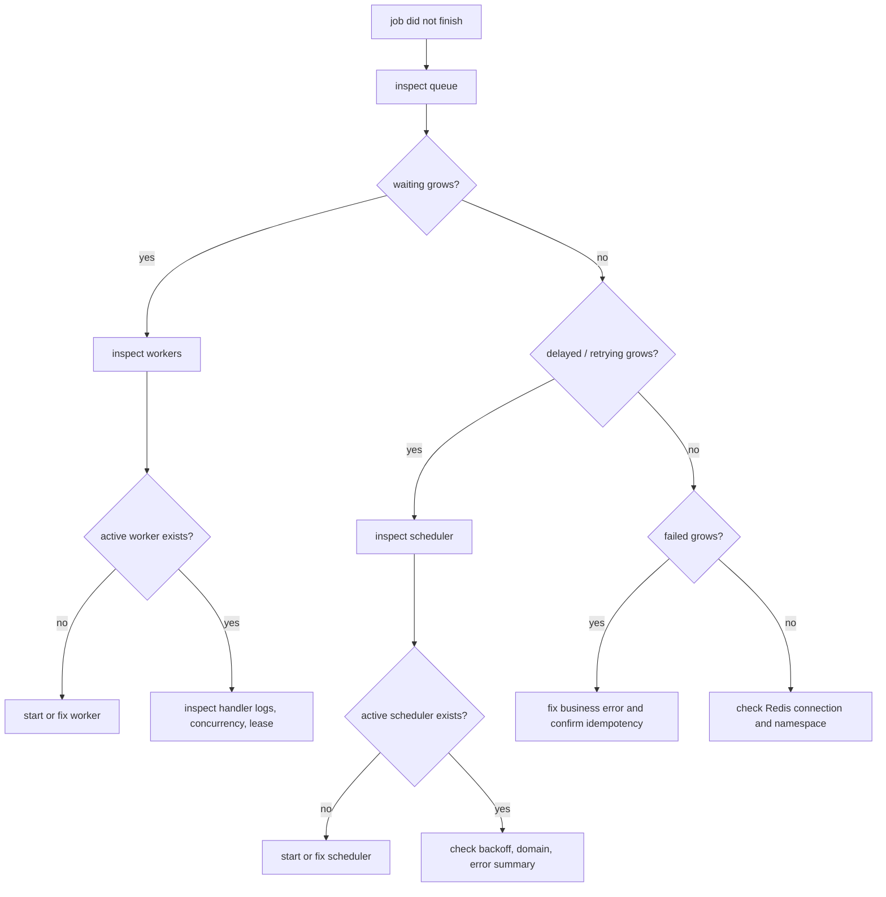

# Operations and Troubleshooting

<!-- queuebit-v01-legacy-doc -->
> [!WARNING]
> **Archived and no longer maintained.** The current v0.1 final-user manual is [`docs/v01/en`](../v01/en/index.md). This page remains for historical context only; do not use its APIs, commands, configuration, or examples for new integrations or implementation.

## Operations goal

<span class="manual-label">User operations guide</span>

queuebit operations docs answer two questions first:

- Is the queue healthy right now?
- If a job did not finish as expected, where should the user look first?

## Troubleshooting flow

When a job does not finish, use CLI output to find the stage first. Do not start by changing configuration or deleting Redis keys.



Node explanations:

| Node | What to inspect | Next step |
|------|-----------------|-----------|
| inspect queue | waiting / active / delayed / retrying / failed | Identify the stuck state |
| inspect workers | worker identity, heartbeat, drain state | Start a worker if none exists |
| inspect scheduler | active scheduler identity and domain | Start a scheduler if none exists |
| handler logs | business error, dependency outage, timeout | Fix business code before tuning queue internals |
| Redis / namespace | connection, namespace, queue name | Fix config and restart the affected role |

## Metrics / Introspection

v0.1 exposes at least:

- queue depth
- active jobs
- delayed jobs
- retry pending
- stalled recovery count
- active worker identity
- active scheduler identity

These signals help users distinguish between no jobs, workers not consuming, schedulers not advancing, and jobs being recovered.

## Health check matrix

Operations docs connect "what metric do I see?" with "what should I do next?".

| Signal | Healthy meaning | Abnormal signal | Likely cause | Next step |
|--------|-----------------|-----------------|--------------|-----------|
| queue depth | waiting count stays within business expectations or is drained by workers | depth keeps growing while active jobs stay at 0 | no worker, worker misconfiguration, Redis claim failure | inspect worker identity, then [CLI and configuration](./cli-and-config.md) |
| active jobs | count stays within effective worker concurrency and does not stall | active count is stuck, above expected concurrency, or near lease expiration | blocked handler, lease renewal failure, worker crash | read [Worker and Scheduler Lifecycle](./worker-lifecycle.md) |
| delayed jobs | future jobs remain delayed and are promoted after due time | due jobs do not move to waiting | scheduler not running, scheduler-domain conflict, Redis atomic transition failure | inspect active scheduler identity and [Redis model](./redis-model.md) |
| retry pending | failed jobs wait by backoff and retry when due | retry pending keeps growing | handler keeps failing, dependency outage, overly aggressive backoff | inspect error summaries and [Failure Modes and Recovery](./failure-modes.md) |
| stalled recovery count | rare and returns to baseline | count grows quickly or spikes periodically | frequent worker crashes, lease too short, jobs exceed expected duration | tune lease / concurrency and validate idempotency |
| active worker identity | expected worker instances keep heartbeating | workers missing, duplicate identity, heartbeat expired | replica not started, unstable identity, drain stuck | inspect worker startup config and drain state |
| active scheduler identity | exactly one active scheduler per domain | none active, multiple candidates believe they are active, or frequent switching | domain mismatch, Redis renewal failure, clock/connection jitter | stop promotion and verify single-active strategy |
| drain state | draining workers stop claiming and active jobs reach zero within the window | drain times out or still claims new jobs | shutdown hook missing, handler ignores cancellation, drain timeout too short | inspect worker lifecycle and configuration errors |

## Stalled recovery

Stalled recovery handles cases where a worker claimed a job and then disappeared, timed out, could not renew its lease, or lost an ack.

Operations output must explain stalled recovery count, recovery windows, and duplicate delivery risk:

- stalled recovery is not a normal throughput metric; continuous growth is a failure signal;
- operations output must distinguish a draining worker from a disappeared worker;
- after redelivery, business handlers must still be idempotent;
- if the scheduler cannot confirm active ownership, it should stop promoting instead of recovering optimistically.

## Failure modes

Operations coverage includes:

- Redis unavailable;
- worker crash;
- scheduler active ownership uncertain;
- lease renewal failure;
- ack lost;
- graceful drain timeout.

Each failure mode should describe what the system does and what the user should inspect.

## Troubleshooting

Start with inspect commands:

```bash
npx queuebit inspect queue notification --config queuebit.config.ts
npx queuebit inspect workers --queue notification --config queuebit.config.ts
npx queuebit inspect scheduler --domain billing-notification --config queuebit.config.ts
```

Target output should be this explicit, so users can understand the issue immediately:

```text
queue: notification
waiting: 12
active: 0
delayed: 3
retrying: 1
failed: 0
stalledRecoveries: 0
activeWorkers: []
activeScheduler: billing-notification@scheduler-1
hint: waiting > 0 but activeWorkers is empty. Start a worker for queue "notification".
```

Then apply these rules:

- at-least-once means business handlers must tolerate repeated execution;
- a scheduler that cannot confirm active ownership should stop advancing;
- a worker that cannot confirm its lease should stop pulling new work and let the job recover.
- Redis Cluster must not bypass startup validation just because a client appears connected when Cluster is unsupported;
- a Web process not consuming jobs is expected unless it explicitly enables the worker role.

## Triage order

When a job does not complete, target docs and CLI should guide users in this order:

1. Confirm Redis connectivity and matching namespace / queue.
2. Check whether queue depth is growing while active jobs stay at 0.
3. Inspect active worker identity and whether workers are draining.
4. Inspect active scheduler identity and whether delayed/retry work is promoted.
5. Check whether retry pending and stalled recovery count are growing abnormally.
6. Verify handler idempotency and downstream dependency failures.
7. Check whether configuration accidentally treats a Web producer as worker or scheduler.

## Reference relationships

| Operations question | Read first |
|---------------------|------------|
| Where do metrics come from? | [Redis model](./redis-model.md) |
| Is this environment or Redis Cluster shape supported? | [Environment and Compatibility Boundary](./compatibility.md) |
| Why can a worker become stalled? | [Worker and Scheduler Lifecycle](./worker-lifecycle.md) |
| How do Redis, ack, lease, and scheduler failures recover? | [Failure Modes and Recovery](./failure-modes.md) |
| How do API and CLI expose inspection? | [API reference](./target-api.md) and [CLI and configuration](./cli-and-config.md) |
