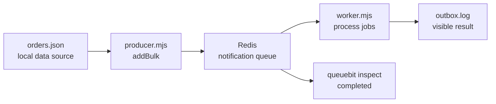

# Quick Start

<!-- queuebit-v01-legacy-doc -->
> [!WARNING]
> **Archived and no longer maintained.** The current v0.1 final-user manual is [`docs/v01/en`](../v01/en/index.md). This page remains for historical context only; do not use its APIs, commands, configuration, or examples for new integrations or implementation.

## Five-minute goal

<span class="manual-label">First successful path</span>

This page does one thing: read two orders from an explicit data file, enqueue them with `Queue.addBulk`, and let a Worker append visible results to `outbox.log`. When it finishes, Redis, Producer, Worker, and inspection are connected correctly.

The file-writing handler is a local verification fixture, not a production notification implementation. Replace it with your email, push, sync, or file-generation service in production, then continue to [Production deployment](./production-deployment.md).



## Prerequisites

- Node.js `>= 20`
- Redis `>= 7.0`, standalone or single-primary
- An empty directory

Redis Cluster is unsupported in v0.1. If the environment is uncertain, read [Environment and Compatibility Boundary](./compatibility.md) first.

## 1. Install and start Redis

```bash
npm install queuebit
docker run --name queuebit-redis -p 6379:6379 redis:7
```

If Redis is already running locally and `redis://127.0.0.1:6379` is reachable, do not start another container.

## 2. Write the minimal configuration

Create `queuebit.config.mjs`:

```js
import { defineQueuebitConfig } from 'queuebit';

export default defineQueuebitConfig({
  connection: { url: 'redis://127.0.0.1:6379' },
  namespace: 'dev:billing',
  queues: {
    notification: {}
  }
});
```

Only three values matter on the first run:

| Value | Meaning |
|---|---|
| `connection.url` | Redis address |
| `namespace` | Redis isolation prefix for this application |
| `notification` | Business queue name; Producer and Worker must match |

Authentication, TLS, Sentinel, retries, leases, and Scheduler are production concerns and come later.

## 3. Prepare a batch of business data

Create `orders.json`:

```json
[
  {
    "id": "order-1001",
    "userId": "user-42",
    "email": "ada@example.com",
    "orderNo": "NO-1001",
    "amountText": "$128.00"
  },
  {
    "id": "order-1002",
    "userId": "user-77",
    "email": "lin@example.com",
    "orderNo": "NO-1002",
    "amountText": "$86.00"
  }
]
```

This file is the data source for the first run. queuebit does not query users or invent recipients. In production, replace this step with a database query, internal API, event stream, or import file.

## 4. Start a Worker

Create `worker.mjs`:

```js
import { appendFile } from 'node:fs/promises';
import { Worker } from 'queuebit';

const connection = { url: 'redis://127.0.0.1:6379' };
const namespace = 'dev:billing';

const worker = new Worker('notification', async (job) => {
  await appendFile(
    'outbox.log',
    `${JSON.stringify({
      jobId: job.id,
      orderId: job.data.orderId,
      recipient: job.data.recipient,
      templateId: job.data.templateId
    })}\n`
  );
}, {
  connection,
  namespace
});

await worker.run();
```

Run this in terminal A:

```bash
node worker.mjs
```

A Worker is the process that executes jobs. It waits for new jobs continuously, so the terminal staying open is expected.

## 5. Enqueue jobs in bulk

Create `producer.mjs`:

```js
import { readFile } from 'node:fs/promises';
import { Queue } from 'queuebit';

const orders = JSON.parse(await readFile('orders.json', 'utf8'));

const queue = new Queue('notification', {
  connection: { url: 'redis://127.0.0.1:6379' },
  namespace: 'dev:billing'
});

const jobs = orders.flatMap((order) => {
  if (!order.email) {
    return [];
  }

  return [{
    name: 'send-receipt-notification',
    data: {
      orderId: order.id,
      userId: order.userId,
      recipient: order.email,
      templateId: 'receipt-paid',
      variables: {
        orderNo: order.orderNo,
        amountText: order.amountText
      }
    },
    opts: {
      idempotencyKey: `receipt:${order.id}`
    }
  }];
});

const createdJobs = await queue.addBulk(jobs);
console.log('queued job ids:', createdJobs.map((job) => job.id));
await queue.close();
```

Run this in terminal B:

```bash
node producer.mjs
```

The example uses `addBulk` because a batch of business records should become a batch of jobs. Orders without email are skipped instead of receiving fabricated recipients.

## 6. Confirm success

Read the handler output:

```bash
cat outbox.log
```

It should contain two JSON lines for `order-1001` and `order-1002`. Then inspect the queue:

```bash
npx queuebit inspect queue notification --config queuebit.config.mjs
```

Success means:

- Producer prints two job ids.
- `outbox.log` contains two results.
- `waiting` and `active` eventually return to `0`.
- `completed` increases by at least `2`.

## Why there is no Scheduler yet

These jobs run immediately and do not retry, so the first successful result does not require Scheduler. In production, Scheduler advances delayed, retrying, and stalled jobs. After the minimal path works, start a dedicated Scheduler by following [Production deployment](./production-deployment.md).

## Troubleshoot the first run

| Symptom | Check first | Action |
|---|---|---|
| Producer cannot connect | Redis process and port `6379` | Fix `connection.url` |
| Job stays waiting | Terminal A, queue name, and namespace | Restart Worker and match the three minimal values |
| `outbox.log` is missing | Worker stderr and directory permissions | Fix the handler error or write permission |
| Job runs twice | At-least-once may redeliver | Use a business idempotency key in the real handler |
| inspect cannot find the queue | Config path and namespace | Use this page's `queuebit.config.mjs` |

For more, see [Operations and troubleshooting](./operations.md).

## Next steps

- Prepare production: [Production deployment](./production-deployment.md)
- Integrate vext: [vext integration](./vext-integration.md)
- Look up every field and command: [CLI and configuration](./cli-and-config.md)
- Understand redelivery: [Failure Modes and Recovery](./failure-modes.md)
