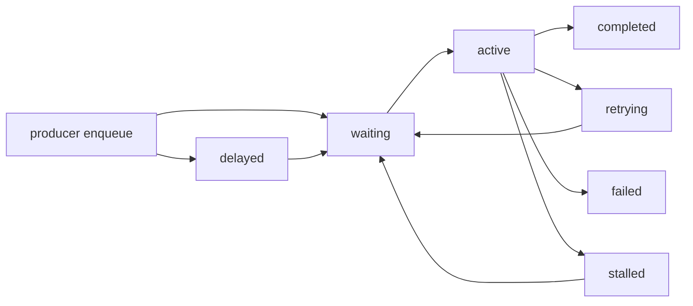

# API Reference

## API positioning

<span class="manual-label">v0.1 final user manual</span>

This page defines queuebit v0.1 public user-facing API semantics. Runtime implementation, quick start examples, the vext adapter, CLI behavior, and tests must remain aligned with this page.

## API design principles

- APIs express queue semantics first and do not expose Redis keys as the normal user path.
- Producers, workers, and schedulers can be created and run independently.
- Distributed semantics must be explicit: namespace, queue name, lease, retry, and scheduler domain.
- Business handlers must be designed for at-least-once delivery; APIs do not promise exactly-once.
- Long-lived objects must provide close, stop, or drain operations.

## Core objects

| Object | Target responsibility | Lifecycle |
|--------|-----------------------|-----------|
| `Queue` | User entry for submitting jobs, reading state, and closing resources | Reused during app lifetime, releases Redis resources on close |
| `Producer` | Submit jobs and return job handles | Short-lived or application-scoped |
| `Worker` | Process jobs, renew leases, ack/fail, drain | Long-lived, must support graceful shutdown |
| `Scheduler` | Promote delayed, retry, and stalled work | Long-lived, must prove single-active status |
| `Job` | Job metadata, payload, attempt, state, and error summary | Persisted and queryable by queuebit |

Public type outline:

```ts
type QueuebitConnection = {
  url?: string;
  host?: string;
  port?: number;
  database?: number;
};

type QueueOptions = {
  connection: QueuebitConnection;
  namespace: string;
};

type QueuebitJobState =
  | 'waiting'
  | 'delayed'
  | 'active'
  | 'retrying'
  | 'completed'
  | 'failed'
  | 'stalled'
  | 'draining';

type JobInput<TPayload> = {
  name: string;
  data: TPayload;
  opts?: {
    idempotencyKey?: string;
    delayMs?: number;
    attempts?: number;
    backoff?: { type: 'fixed' | 'exponential'; delayMs: number };
  };
};
```

## Minimal examples

Producer:

`pendingReceipts` should come from your business database, API, event stream, or import file. queuebit APIs receive job payloads after your app has prepared them.

```ts
import { Queue } from 'queuebit';

const queue = new Queue('notification', {
  connection: { url: 'redis://127.0.0.1:6379' },
  namespace: 'dev:billing'
});

const jobs = pendingReceipts.map((order) => ({
  name: 'send-receipt-notification',
  data: {
    orderId: order.id,
    userId: order.user.id,
    recipient: order.user.email,
    templateId: 'receipt-paid'
  },
  opts: {
    idempotencyKey: `receipt:${order.id}`,
    attempts: 3,
    backoff: { type: 'exponential', delayMs: 1000 }
  }
}));

await queue.addBulk(jobs);
```

Worker:

```ts
import { Worker } from 'queuebit';

const worker = new Worker('notification', async (job) => {
  await sendReceiptNotification(job.data);
}, {
  connection: { url: 'redis://127.0.0.1:6379' },
  namespace: 'dev:billing',
  concurrency: 4
});

await worker.run();
```

Scheduler:

```ts
import { Scheduler } from 'queuebit';

const scheduler = new Scheduler({
  connection: { url: 'redis://127.0.0.1:6379' },
  namespace: 'dev:billing',
  queues: ['notification'],
  domain: 'billing-notification'
});

await scheduler.run();
```

## Queue operations

| Operation | Target semantics | Required constraints |
|-----------|------------------|----------------------|
| create queue | Bind Redis connection, namespace, and queue name | namespace required; queue name stable |
| add | Write one waiting or delayed job | Return a traceable job id; useful for tests, admin actions, or truly single-record business actions |
| addBulk | Atomically submit a batch of jobs | Return job ids for the batch; first-time user flows should prefer batch submission |
| get job | Query job metadata and state | Does not require exposing payload beyond configured policy |
| inspect | Read queue depth, active, delayed, retry, and stalled overview | Must not trigger state transitions |
| drain | Stop new claims or request worker drain | Does not delete jobs or force success |
| close | Release resources | Must not leave renew loops in this process |

## Worker operations

| Operation | Target semantics | Required constraints |
|-----------|------------------|----------------------|
| start | Start claiming jobs and executing handler | Must set worker identity and concurrency |
| renew lease | Renew lease during processing | Lease failure enters uncertainty handling |
| ack complete | Mark job completed | Lost ack may cause redelivery |
| fail retryable | Record failure and schedule retry | Attempts and backoff must be observable |
| fail terminal | Mark failed after maximum attempts | Error summary must be diagnosable |
| drain | Stop claiming new jobs and wait for active jobs | Timeout falls back to lease/recovery rules |
| stop | Stop worker runtime | Must not claim or renew unknown jobs |

## Scheduler operations

| Operation | Target semantics | Required constraints |
|-----------|------------------|----------------------|
| acquire leadership | Acquire scheduler-domain single-active role | Stop progression when uncertain |
| promote delayed | Move due delayed jobs to waiting | Must be atomic |
| reschedule retry | Move due retry jobs to waiting | Must not consume attempts twice |
| recover stalled | Recover active jobs with expired leases | Must preserve redelivery evidence |
| heartbeat | Maintain scheduler identity | Stop progression after losing leadership |
| stop | Stop time progression | Must not leave fake active state |

## Job states

Target state machine:



Node explanations:

| Node | Meaning |
|------|---------|
| `waiting` | Job can be claimed by a worker |
| `delayed` | Job is not executable until a scheduler promotes it |
| `active` | Job has been claimed and has a lease |
| `retrying` | Job failed and waits for the next attempt |
| `completed` | Job was acknowledged as completed |
| `failed` | Job reached terminal failure |
| `stalled` | Active job became uncertain and waits for recovery |

## Errors and events

v0.1 needs at least these categories:

| Type | Target example | User action |
|------|----------------|-------------|
| Configuration error | Missing namespace, queue name, or invalid Redis config | Fail before start and fix config |
| Redis unavailable | Connection failure, command timeout, script failure | Stop claiming and wait for recovery or operator action |
| Lease uncertainty | Renew failure, token mismatch, missing TTL | Worker stops claiming; recovery handles the job |
| Handler failure | Business exception, timeout, explicit failure | Retry or terminal failure policy applies |
| Scheduler uncertainty | Cannot prove leadership | Stop delayed/retry progression |

## Related references

| Question | Entry |
|----------|-------|
| First integration path | [Quick Start](./quick-start.md) |
| Configuration fields and CLI | [CLI and configuration](./cli-and-config.md) |
| vext adapter API | [vext integration](./vext-integration.md) |
| Redis keyspace and state transitions | [Redis model](./redis-model.md) |
| Worker / scheduler lifecycle | [Worker and Scheduler Lifecycle](./worker-lifecycle.md) |
