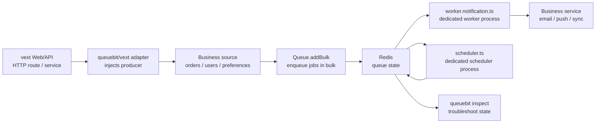

# vext Integration

## Positioning

`vext` is queuebit's first real integration target, but it is not a dependency of queuebit core.

queuebit exposes the adapter through `queuebit/vext`. The adapter wires vext configuration, lifecycle, and dependency injection into queuebit without turning `vext start` into a worker or scheduler.

<span class="manual-label">v0.1 final user manual</span>

## Integration flow

When integrating with vext, do not put every role into `vext start`. The recommended flow is: Web/API only enqueues jobs; worker and scheduler have dedicated entries.



Node explanations:

| Node | Role | Common mistake |
|------|------|----------------|
| vext Web/API | Receives requests, validates input, enqueues jobs | It should not consume jobs by default |
| queuebit/vext adapter | Wires vext config into queuebit | It should not hide worker/scheduler topology |
| Business source | Provides users, orders, preferences, and device tokens | Do not hardcode users or fabricate recipients in examples |
| Worker entry | Runs business handlers | Do not depend on Web hot reload lifecycle |
| Scheduler entry | Promotes delayed, retry, and stalled jobs | It does not run business handlers |
| inspect | Finds where jobs are stuck | Do not infer state from Redis keys first |

## Install

```bash
npm install queuebit
```

## Enable Producer in the Web/API process

Enable producer behavior in the vext app. This does not start workers or acquire scheduler ownership.

```ts
import { defineConfig } from 'vext';
import { queuebit } from 'queuebit/vext';

export default defineConfig({
  plugins: [
    queuebit({
      connection: { url: 'redis://127.0.0.1:6379' },
      namespace: 'prod:billing',
      queues: {
        notification: {
          defaultJobOptions: {
            attempts: 3,
            backoff: { type: 'exponential', delayMs: 1000 }
          }
        }
      },
      producer: { enabled: true },
      worker: { enabled: false },
      scheduler: { enabled: false }
    })
  ]
});
```

## Enqueue jobs from a vext route

Get the queue inside a route, service, or action, but user data must first come from your business system. The vext route receives the trigger, validates access, reads pending records, and converts each record into a job payload.

```ts
import { useQueuebit } from 'queuebit/vext';
import { services } from './services';

export async function POST(request: Request) {
  const { orderIds, limit = 100 } = await request.json();
  const queuebit = useQueuebit();

  const orders = await services.orders.findPaidOrdersNeedingReceipt({
    ids: orderIds,
    limit
  });

  const jobs = orders.flatMap((order) => {
    const wantsPush = order.user.preferredChannel === 'push' && Boolean(order.user.pushToken);
    const channel = wantsPush ? 'push' : 'email';
    const recipient = wantsPush ? order.user.pushToken : order.user.email;

    if (!recipient) {
      return [];
    }

    return [{
      name: 'send-receipt-notification',
      data: {
        orderId: order.id,
        userId: order.user.id,
        channel,
        recipient,
        templateId: 'receipt-paid',
        variables: {
          orderNo: order.orderNo,
          amountText: order.amountText
        }
      },
      opts: {
        idempotencyKey: `receipt:${order.id}`
      }
    }];
  });

  const createdJobs = jobs.length > 0
    ? await queuebit.queue('notification').addBulk(jobs)
    : [];

  if (jobs.length > 0) {
    await services.orders.markReceiptNotificationQueued(
      jobs.map((job) => job.data.orderId)
    );
  }

  return Response.json({
    jobIds: createdJobs.map((job) => job.id),
    skipped: orders.length - jobs.length
  });
}
```

Users, orders, email addresses, push tokens, and template variables in this example all come from your business services. queuebit does not fetch that data; it reliably queues it, retries it, and gives it to workers.

## Dedicated Worker entry

```ts
import { createVextQueueWorker } from 'queuebit/vext';

const worker = createVextQueueWorker({
  config: './vext.config.ts',
  queue: 'notification',
  concurrency: 4,
  handlers: {
    'send-receipt-notification': async (job, ctx) => {
      const order = await ctx.services.orders.findById(job.data.orderId);

      if (!order) {
        throw new Error(`Missing order for job ${job.id}`);
      }

      if (job.data.channel === 'email') {
        await ctx.services.email.sendReceipt({
          to: job.data.recipient,
          orderId: job.data.orderId,
          variables: job.data.variables
        });
        return;
      }

      await ctx.services.push.sendReceipt({
        token: job.data.recipient,
        orderId: job.data.orderId,
        variables: job.data.variables
      });
    }
  }
});

await worker.run();
```

Start it:

```bash
node worker.notification.ts
```

Or through queuebit CLI:

```bash
queuebit worker start --vext ./vext.config.ts --queue notification
```

## Dedicated Scheduler entry

```ts
import { createVextQueueScheduler } from 'queuebit/vext';

const scheduler = createVextQueueScheduler({
  config: './vext.config.ts',
  domain: 'billing-notification',
  queues: ['notification']
});

await scheduler.run();
```

Start it:

```bash
node scheduler.ts
```

Or through queuebit CLI:

```bash
queuebit scheduler start --vext ./vext.config.ts --domain billing-notification
```

## Recommended process topology

| Process | Recommended responsibility | Should not do |
|---------|----------------------------|---------------|
| vext Web / API | receive requests, validate business input, submit jobs | start workers by default, promote delayed / retry work by default |
| queuebit worker | claim jobs, renew leases, run handlers, ack / fail, drain | depend on Web reload lifecycle or implicitly share HTTP concurrency |
| queuebit scheduler | promote delayed, retry, and stalled recovery work inside one single-active domain | let multiple instances promote without protection |
| Redis | store queue state, leases, delayed jobs, and recovery state | behave like one backend among many |

This separation prevents Web scaling from accidentally scaling worker count, and keeps reload/shutdown semantics clear.

## Configuration relationship

The adapter reads vext configuration and produces an inspectable queuebit configuration summary:

| Configuration layer | Meaning |
|---------------------|---------|
| Redis connection | the only first-version backend connection |
| queue namespace | isolates business queues and environments |
| producer | minimal settings required for Web / API processes to submit jobs |
| worker | concurrency, lease, drainTimeout, handler registration, and runtime settings |
| scheduler | scheduler domain, renewal window, and delayed / retry / stalled recovery promotion strategy |
| observability | metrics, health checks, and introspection output |

Field names and defaults are defined in [CLI and configuration](./cli-and-config.md).

## Release checklist

Before shipping a vext queuebit deployment, confirm:

- Web / API processes only submit jobs and do not implicitly consume because the vext app started.
- Workers have an independent start command, shutdown behavior, and log identity.
- Scheduler domain is unique and observable, and explains why delayed / retry work is not advancing.
- Redis Cluster is not silently accepted before it is marked supported.
- reload / shutdown enters drain instead of letting workers keep claiming in uncertainty.
- operations docs explain queue depth, active jobs, active worker, active scheduler, and stalled recovery.

## Next steps

- Run the non-vext path in [Quick Start](./quick-start.md).
- Configure worker, scheduler, and inspect commands in [CLI and configuration](./cli-and-config.md).
- Build rollout checks from [Operations and troubleshooting](./operations.md).
