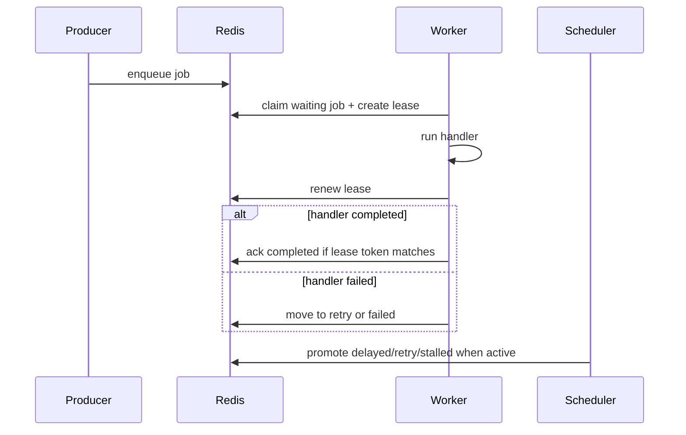

# Worker and Scheduler Lifecycle

## Page positioning

v0.1 final user manual

This page explains the queuebit v0.1 Producer, Worker, and Scheduler lifecycles, including startup, shutdown, drain, lease uncertainty, and recovery behavior users can observe.

## Producer lifecycle

Producer path:

1. Read Redis connection, namespace, and queue name.
2. Validate enqueue arguments, payload limits, retry, and delay options.
3. Create job id and job metadata.
4. Write to waiting or delayed state.
5. Return a job handle for status tracking.

Producer does not start workers, renew active jobs, or advance delayed/retry work.

## Worker lifecycle

Worker path:

| Phase | Action | Failure handling |
|-------|--------|------------------|
| boot | Create worker identity, validate config, connect Redis | Startup fails before consumption |
| claim | Atomically claim waiting job and create lease | Wait when no job; back off on Redis failure |
| handle | Run business handler | Handler failure goes to retry or failed |
| renew | Periodically renew active job lease | Renew failure enters lease uncertainty |
| ack | Validate lease and write completed | Uncertain ack follows at-least-once behavior |
| fail | Record error, attempt, retry/failed state | State transition must be atomic |
| drain | Stop claiming new jobs and let active jobs settle | Timeout falls back to recovery rules |
| stop | Clean renew loops and Redis resources | Must not leave orphan timers |

Lease uncertainty is conservative: once a worker cannot prove that it still owns the job, it must stop claiming new work and let recovery handle the job.

## Scheduler lifecycle

Scheduler path:

| Phase | Action | Failure handling |
|-------|--------|------------------|
| boot | Validate scheduler domain and connect Redis | Startup fails before time progression |
| acquire | Acquire single-active token | Failure means standby or exit |
| heartbeat | Renew scheduler token | Renewal failure immediately stops progression |
| promote delayed | Move due delayed jobs to waiting | Failure leaves retryable state |
| reschedule retry | Move due retry jobs to waiting | Does not consume attempts twice |
| recover stalled | Check active job leases and recover expired jobs | Records stalled evidence |
| stop | Release or stop renewing single-active token | No further time progression |

Scheduler does not run business handlers, create producers, or bypass worker lease rules.

## Drain and shutdown

Drain is the core of graceful shutdown:

- Worker in drain stops claiming new jobs.
- Active jobs may continue until completion, failure, or drain timeout.
- After drain timeout, worker must not force completed unless it can still prove lease ownership.
- Before process exit, renew loops must stop.
- If the process crashes, stalled recovery returns the job to a claimable state.

## Sequence diagram

Node explanations:

| Node | Meaning |
|------|---------|
| Producer | Submits jobs only |
| Redis | Sole source of shared and coordination state |
| Worker | Claims, handles, renews, ack/fails jobs |
| Scheduler | Advances timing and recovery state, single-active per domain |

## Implementation acceptance

- Worker shutdown proves no renew timer remains.
- Scheduler stops progression after losing single-active status.
- Drain, lease failure, handler timeout, and Redis reconnect have tests.
- vext reload maps to worker drain or stop; it must not silently hard-kill work.
