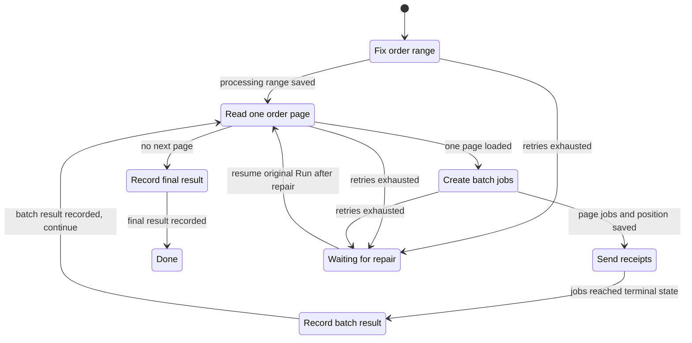
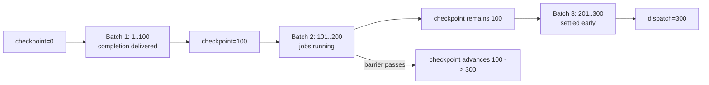
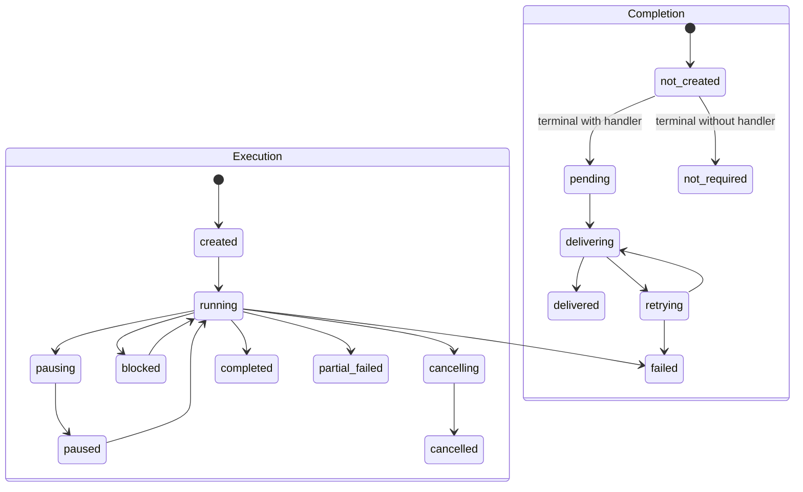
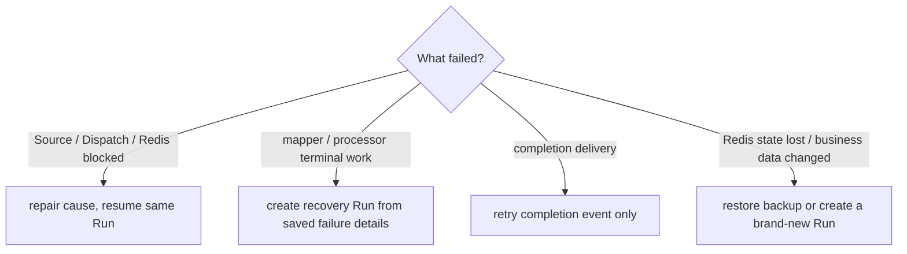

# Process Many Database Records

<span class="manual-label">On-demand capability · read this only for large database batches</span>

If your need is simply "an HTTP request should run one background task", start with [Run one background job](./job-recipes.md). This page solves a more specific problem: **your database has many records, you cannot load them all at once, and you need per-batch completion, final completion, and recovery records.**

In one sentence: BatchRun = `runs.start()` starts one whole batch operation; Queuebit repeatedly reads one database page, turns that page into jobs, lets multiple Workers execute them, and calls completion handlers to write results.

| Direct job | BatchRun |
|---|---|
| You already have one explicit payload | Queuebit must page many database records |
| Call `jobs.add()` | Call `runs.start()` |
| One processor handles one task | Source reads records, mapper creates jobs, processor executes jobs |
| Inspect job success/failure | Inspect Run, Batch, job, and completion progress together |

You do not need every detail on this page for a first integration. Come back when you actually need database batch processing.

## Full Example Path

This example demonstrates a receipt batch that should not wait inside one slow HTTP request. The short version: **Web creates the Run; the Coordinator pages and dispatches; Workers execute jobs; completion records batch and final results.**

<div class="qb-canonical-flow" role="img" aria-label="Find paid orders in the database, create a batch run, split records into background jobs, send receipts with multiple workers, and record batch and final results">
  <div class="qb-flow-stage"><span class="qb-flow-step">01 FIND ORDERS</span><strong>Seed example orders and fix the range</strong><span>23 paid orders → example database → process only through boundary.maxId</span></div>
  <span class="qb-flow-arrow" aria-hidden="true">→</span>
  <div class="qb-flow-stage"><span class="qb-flow-step">02 CREATE BATCH</span><strong>Web records the batch request</strong><span>POST /receipt-campaigns → return runId immediately</span></div>
  <span class="qb-flow-arrow" aria-hidden="true">→</span>
  <div class="qb-flow-stage"><span class="qb-flow-step">03 SPLIT JOBS</span><strong>The Coordinator reads orders by page</strong><span>read one paid-orders page → create Batch + jobs</span></div>
  <span class="qb-flow-arrow" aria-hidden="true">→</span>
  <div class="qb-flow-stage"><span class="qb-flow-step">04 SEND RECEIPTS</span><strong>Worker A / B claim background jobs</strong><span>Call the idempotent receipt service without duplicate sends</span></div>
  <span class="qb-flow-arrow" aria-hidden="true">→</span>
  <div class="qb-flow-stage qb-flow-stage--final"><span class="qb-flow-step">05 RECORD RESULTS</span><strong>Record each batch, then the Run</strong><span>Advance checkpoint after each batch; write run completion after all orders finish</span></div>
</div>

Prerequisites: Node.js `>=20.19`, Docker Compose, and npm. The example touches only its own Redis/database containers and volumes; if a port is occupied, use the override printed by the script. The full boundary lives in [Can my environment use Queuebit?](./compatibility.md).

> Release status: if the installed package or source example prints `target-contract skeleton`, the full batch example is not published as a runnable path yet. Do not treat that message as a Redis or local machine failure. First get a normal background job working in [Quick Start](./quick-start.md).

```bash
cd examples/receipt-batch-vext
npm install
npm run infra:up
npm run infra:health
```

Seed local fixtures:

```bash
npm run seed
```

Expected:

```text
tenant=tenant-demo
orders.inserted=24
orders.paid=23
orders.withReceiptEmail=21
orders.expectedSkipped=2
```

Validate config and runtime registrations:

```bash
npx queuebit config validate --config queuebit.config.ts --runtime queuebit.runtime.ts
```

Expected shape:

```text
message=Queuebit configuration is valid.
config.namespace=receipt-demo
config.queues=notification
config.batchRuns=receipt-campaign
validation.runtime=loaded
validation.sources=paid-orders
validation.mappers=receipt-jobs
validation.processors=send-receipt
validation.completions=record-receipt-batch-result,record-receipt-run-result
```

Start four terminals:

```bash title="Terminal A · vext Web"
npm run start:web
```

```bash title="Terminal B · Coordinator"
npx queuebit coordinator start --config queuebit.config.ts --runtime queuebit.runtime.ts
```

```bash title="Terminal C · Worker A"
npx queuebit worker start --config queuebit.config.ts --runtime queuebit.runtime.ts --queue notification --worker-id worker-a
```

```bash title="Terminal D · Worker B"
npx queuebit worker start --config queuebit.config.ts --runtime queuebit.runtime.ts --queue notification --worker-id worker-b
```

Inside the vext route, the handler calls `app.queuebit.runs.start('receipt-campaign', { input, idempotencyKey })`. The HTTP layer owns authentication and business input; Queuebit owns durable Run identity, paging, dispatch, Worker execution, and completion delivery.

```bash
curl -i http://127.0.0.1:4100/receipt-campaigns \
  -H "Authorization: Bearer local-demo-user" \
  -H "Content-Type: application/json" \
  --data '{"paidBefore":"2026-07-15T00:00:00.000Z"}'
```

Expected HTTP 202:

```json
{
  "runId": "run_01...",
  "deduplicated": false,
  "executionState": "created",
  "completionState": "not_created"
}
```

The first creation response is always `created + not_created`; the Coordinator advances the Run to `running` asynchronously. Retrying the same authenticated business request returns the same `runId`, its current snapshot, and `deduplicated: true`. The same key with different input returns 409 `QB_RUN_DEDUPLICATION_CONFLICT`.

```bash
npx queuebit run inspect <runId> --config queuebit.config.ts
npx queuebit workers inspect --queue notification --config queuebit.config.ts
```

An in-flight snapshot can show:

```text
definition=receipt-campaign@1
executionState=running
completionState=not_created
dispatchCursor=20
checkpointCursor=10
batches=2
recordsSeen=20
jobsCreated=18
activeWorkers=worker-a,worker-b
```

`dispatchCursor > checkpointCursor` is not data loss. It means later batches are durable while an earlier execution or completion barrier has not passed yet. `not_created` means the Run is not execution-terminal, so no run-completion event exists yet.

Verify final evidence:

```bash
npm run audit:show -- --run <runId>
```

Expected:

```text
batchCompletions=3
runCompletions=1
recordsSeen=23
recordsDispatched=21
recordsSkipped=2
recordsFailed=0
recordsUndispatched=0
jobsCreated=21
jobsCompleted=21
jobsFailed=0
jobsCancelled=0
receiptDeliveries=21
duplicateReceiptDeliveries=0
```

<span id="sc01-database-batch"></span>
## Database batch to final completion



Text equivalent: decide which orders belong to this run; let the Coordinator read one page by cursor; save that page and its jobs together; let Workers send receipts for that batch; record the batch result before advancing "how far is complete" and reading the next page; when no page remains, record final Run completion. Queuebit stores the processing range, current position, batches/jobs, failure details, and completion state in Redis, so a crash can resume from the saved position.

## 1. Define a finite processing range

```ts
sources: {
  'paid-orders': defineQueuebitSource({
    async freeze({ input }) {
      const db = await getDb();
      const max = await db.orders.findMaxPaidId({
        tenantId: input.tenantId,
        paidBefore: input.paidBefore
      });
      return { boundary: { maxId: max?.id ?? 0 }, cursor: 0 };
    },
    async load({ input, boundary, cursor, limit }) {
      const db = await getDb();
      const records = await db.orders.findPaidPage({
        tenantId: input.tenantId,
        paidBefore: input.paidBefore,
        afterId: cursor,
        maxId: boundary.maxId,
        limit
      });
      const nextCursor = records.at(-1)?.id ?? cursor;
      return {
        records,
        nextCursor,
        exhausted: records.length === 0 || nextCursor >= boundary.maxId
      };
    }
  })
}
```

A max ID excludes later inserts but does not freeze updates or deletes inside the boundary. Use a database snapshot token, immutable event table, or materialized work table when those mutations matter.

Source invariants:

- A non-empty page must advance the cursor or fail with `QB_SOURCE_CURSOR_NOT_ADVANCED`.
- An empty page is not automatically exhausted; the source states exhaustion explicitly.
- Use a keyset cursor; think of it as "where the previous page stopped". Production does not use offset pagination.
- Input, processing range, cursor, and records are JSON-serializable and within payload limits.

## 2. Map records to jobs, skip, or fail the record

```ts
mappers: {
  'receipt-jobs': defineQueuebitMapper((record) => {
    if (!record.receiptEmail) {
      return null;
    }
    return {
      name: 'send-receipt',
      data: {
        schemaVersion: 1,
        orderId: record.id,
        tenantId: record.tenantId,
        recipient: record.receiptEmail
      },
      identity: `order:${record.id}`,
      options: {
        idempotencyKey: `receipt:${record.tenantId}:${record.id}`
      }
    };
  })
}
```

The mapper is a pure transformation. Return `null` or `undefined` to count the record as skipped. One record may create multiple jobs, but every output needs a stable `identity`; duplicate side-effect protection belongs in `options.idempotencyKey`. When the mapper fails, Queuebit stores replayable failure details for that record so no other record in the page disappears.

## 3. Choose batch pacing

```ts
dispatch: {
  mode: 'sequential',
  intervalMs: 2_000,
  maxInFlightBatches: 1
}
```

| Mode | Next-batch clock starts | Use when |
|---|---|---|
| `sequential` | The previous execution and completion barrier passes | Downstream capacity requires one batch at a time |
| `paced` | The previous batch is durably created, while respecting the in-flight cap | Bounded overlap is safe and useful |

<span id="sc03-paced-cursors"></span>
### Why paced mode has two positions



Batch 3 may settle first, but "how far is complete" cannot skip Batch 2. When Batch 2 passes, the completed position can move through the already settled Batch 3.

<span id="sc07-completion-delivery"></span>
## 4. Deliver batch and final results

```ts
completion: {
  batch: { handler: 'record-receipt-batch-result', attempts: 5 },
  run: { handler: 'record-receipt-run-result', attempts: 10 }
}
```

```ts
completions: {
  'record-receipt-batch-result': defineQueuebitCompletionHandler(async (event) => {
    const db = await getDb();
    await db.batchAudit.upsert(event.id, event.summary);
  }),
  'record-receipt-run-result': defineQueuebitCompletionHandler(async (event) => {
    const db = await getDb();
    await db.runAudit.upsert(event.id, event.summary);
  })
}
```

Completion is a durable Redis event, not an in-process callback. Delivery is at-least-once, so handlers deduplicate external writes by event ID.



Execution tells you whether the business jobs finished. Completion tells you whether the result callback finished. Before execution becomes terminal, completion is `not_created`; the terminal transition creates the event and moves it to `pending` or `not_required`. Fixing a failed completion handler retries only the event.

## 5. Start and control a run

```ts
const run = await queuebit.runs.start('receipt-campaign', {
  input: { tenantId: 'tenant-42', paidBefore: '2026-07-15T00:00:00.000Z' },
  idempotencyKey: 'receipt-campaign:tenant-42:2026-07-15'
});
```

```bash
npx queuebit run inspect <runId> --config queuebit.config.ts
npx queuebit run pause <runId> --config queuebit.config.ts
npx queuebit run resume <runId> --config queuebit.config.ts
npx queuebit run cancel <runId> --reason "campaign withdrawn" --config queuebit.config.ts
```

Pause and resume continue the same non-terminal run. Cancel stops new batches and lets active work converge; it never invents counts for unread records when the source total is unknown.

## 6. Choose the correct recovery



```bash
npx queuebit run failures <runId> --stage mapper --limit 100 --config queuebit.config.ts
npx queuebit run retry-failed <runId> --idempotency-key "recovery:<runId>:1" --config queuebit.config.ts
npx queuebit completion inspect --run <runId> --config queuebit.config.ts
npx queuebit completion retry <eventId> --config queuebit.config.ts
```

Recovery runs replay saved mapper-record or processor-job failure details, not current database rows. Create a brand-new run when current business data should be used.

## 7. Summary invariants

```text
recordsSeen = recordsDispatched + recordsSkipped + recordsFailed + recordsUndispatched
jobsCreated = jobsCompleted + jobsFailed + jobsCancelled
```

One record can create multiple jobs: count it once in `recordsDispatched` and count every job in `jobsCreated`. Use `boundaryTotalRecords=null` when an exact frozen count is not available cheaply.

## Next

- Protect side effects: [Prevent duplicate side effects](./idempotency-patterns.md).
- Deploy all roles: [Deploy Queuebit in production](./production-deployment.md).
- Check every BatchRun field: [Configuration field dictionary](./cli-and-config.md#batchrun-definition).
