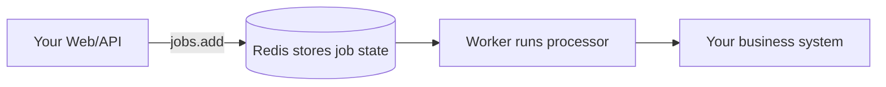

# Use It First, Then Learn Queuebit

Quick start · progressive learning path

Queuebit is a Redis-backed Node background job module. For a first integration, you do not need internal architecture. Start with one idea: **Web/API code enqueues a job, and a Worker reads it from Redis and runs a processor**.

## The Only 5 Terms You Need First

| Term | Think of it this way |
|---|---|
| Queue | A category of work, such as `notification` |
| Job | One background task, such as sending one receipt email |
| Processor | The business function you write; Workers call it |
| Producer | The code that submits work, usually in a Web/API process |
| Worker | A background process that claims jobs and runs processors |

That is enough to start. Result callbacks, duplicate protection, retry, database batching, multiple Workers, and Redis internals can wait.

## Four Learning Layers

| Layer | Read when | Docs |
|---|---|---|
| Required | First time running one background job | [Quick start](./quick-start.md), [Run one background job](./job-recipes.md) |
| Common daily use | Jobs need to be safer and more controllable | [Run one background job](./job-recipes.md), [Prevent duplicate side effects](./idempotency-patterns.md) |
| Advanced scenarios | Database paging, multiple Workers, production deployment | [Process database records in batches](./batch-runs.md), [How multiple Workers run together](./distributed-workers.md), [Deploy Queuebit in production](./production-deployment.md) |
| Exact lookup | Already integrating and need fields, states, or errors | [API quick reference](./target-api.md), [Configuration field dictionary](./cli-and-config.md), [States and errors](./failure-modes.md) |

Maintainer-internal pages are for implementation and governance; they are not prerequisites for users.

## When to Learn More

| Need | Learn next |
|---|---|
| Network failures should retry automatically | `attempts`, `backoff`, `timeoutMs` |
| Email, webhook, or payment effects must not duplicate | `idempotencyKey` and business-side deduplication |
| The same request may be submitted twice | `deduplicationKey` |
| Many database records need processing | batch runs, data source, job mapping, result delivery |
| More processes should raise throughput | Worker concurrency, drain, health checks |
| Production incidents need debugging | Redis policy, health, metrics, runbooks |

## Common Misunderstandings

| Misunderstanding | Correct model |
|---|---|
| You must learn BatchRun before using Queuebit | Normal background jobs use only `jobs.add()` |
| You must write a result-delivery handler first | Write one only when batch or final results need callback delivery |
| You must understand Redis keys and leases first | Users integrate and recover through public API/CLI only |
| Business work must run through CLI or CI | CLI validates and debugs; business code can run in Node services and worker scripts |
| Multiple Workers are required up front | Start with one Worker, then add more for throughput |

## Next

- Run one task: [Quick start](./quick-start.md).
- See standalone jobs: [Run one background job](./job-recipes.md).
- Read BatchRun only for database batching: [Process database records in batches](./batch-runs.md).
