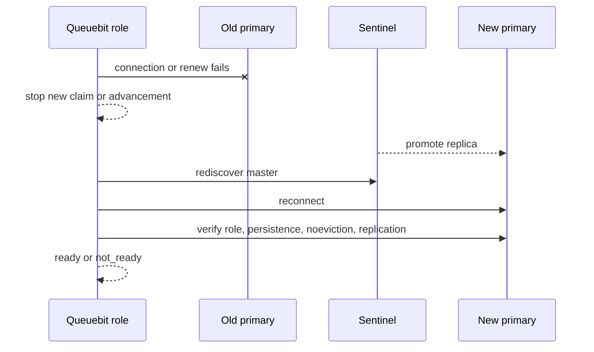

# What happens when Redis is down

<span class="manual-label">Production operations · outage, failover, and data-loss boundaries</span>

Queuebit treats Redis as the only queue state. Workers can rerun business functions, but they cannot rebuild jobs, Runs, or completion events that Redis has lost. First classify the situation, then choose whether to wait for recovery, resume the original Run, or start fresh from the business database.

## Classify the situation first

| What you see | What Queuebit does | What you should do |
|---|---|---|
| Redis is temporarily unreachable | Background Workers and Coordinators stop taking new work and keep reconnecting | Repair Redis or networking and wait for health to return to ready |
| Sentinel is failing over | Rediscover the primary and rerun Redis policy checks | Wait for failover to finish; do not edit Queuebit keys manually |
| A Run becomes `blocked` | Keep the same Run identity and wait for you to repair preconditions | Inspect the original Run and resume only when safe |
| Redis data is confirmed lost | Report a durability gap instead of pretending old state exists | Restore Redis backup, or accept the loss window and create a fresh Run |
| Downstream succeeded but the job ran again | This is a normal at-least-once risk | Deduplicate external effects with business `idempotencyKey` |

## Temporary Redis outage

- Producer, inspect, and control commands may fail or report `not_ready`.
- Workers, Coordinators, and time-advancement owners stop new claim/load/dispatch/promotion work.
- A running processor can settle only while the current job identity and lease are still valid.
- After Redis recovers, background roles continue from the state that still exists in Redis.

Queuebit waits for Redis instead of continuing with local offline queues. It also does not merge local state back into Redis later.

## Sentinel failover



Queuebit does not optimistically commit during failover. After reconnect, it checks Redis role, persistence, `noeviction`, and replication again. If the new primary does not contain an old write, Queuebit does not fabricate that write.

<span id="sc08-blocked-resume"></span>
## Recover a blocked Run

`executionState=blocked` means Queuebit believes continuing may be unsafe, so it stops on the original Run until you verify the situation. Common causes are exhausted source/dispatch retries, long Redis uncertainty, or a failed recovery precondition.

```bash
npx queuebit run inspect <runId> --config queuebit.config.ts --json
npx queuebit run resume <runId> --config queuebit.config.ts
```

Before resume, check:

- The current Redis role and server policy are safe, and the original Run state still exists.
- The source rereads the same business scope from the original input, boundary, and cursor.
- `dispatchCursor`, `checkpointCursor`, and persisted batches do not contradict each other.
- The old Coordinator has exited or lost ownership and cannot commit with an old lease.
- This is not mapper/processor replay; without retained failure details, `retryFailed` must reject.

If those checks pass, resume the original Run. If they do not, do not force resume; restore a Redis backup or create a fresh Run from the business database.

## Confirmed Redis state loss

1. Stop Producers from creating new work and preserve the incident boundary.
2. Preserve Redis and Queuebit logs, failover timeline, backup timestamp, and business audit records.
3. Prefer restoring a Redis backup; if you accept the RPO loss window, create a fresh Run from the business database.
4. Do not mark an incomplete old Run as completed.
5. Do not use a recovery run to pretend missing failure details still exist.
6. Reconcile external effects with business `idempotencyKey` or provider request ID.

## Do not mix these concepts

| Concept | Question it answers | It cannot replace |
|---|---|---|
| Availability | Can Queuebit roles connect to Redis and continue serving? | It cannot prove old writes survived |
| Durability | Did acknowledged writes survive crash/failover? | It depends on Redis persistence, replication, backup, and RPO |
| At least once | Can surviving work run again? | It cannot rebuild work already lost from Redis |

Sentinel high availability is not zero data loss. At-least-once is not exactly-once. Your business code still needs stable idempotency keys and reconciliation records.
