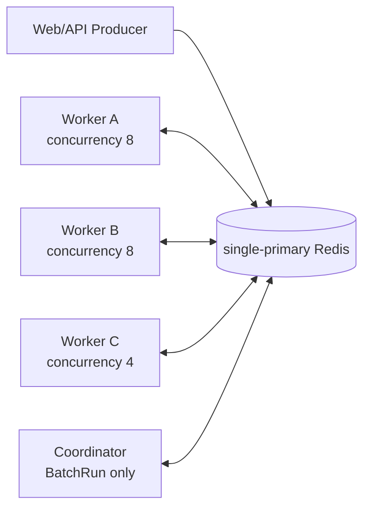
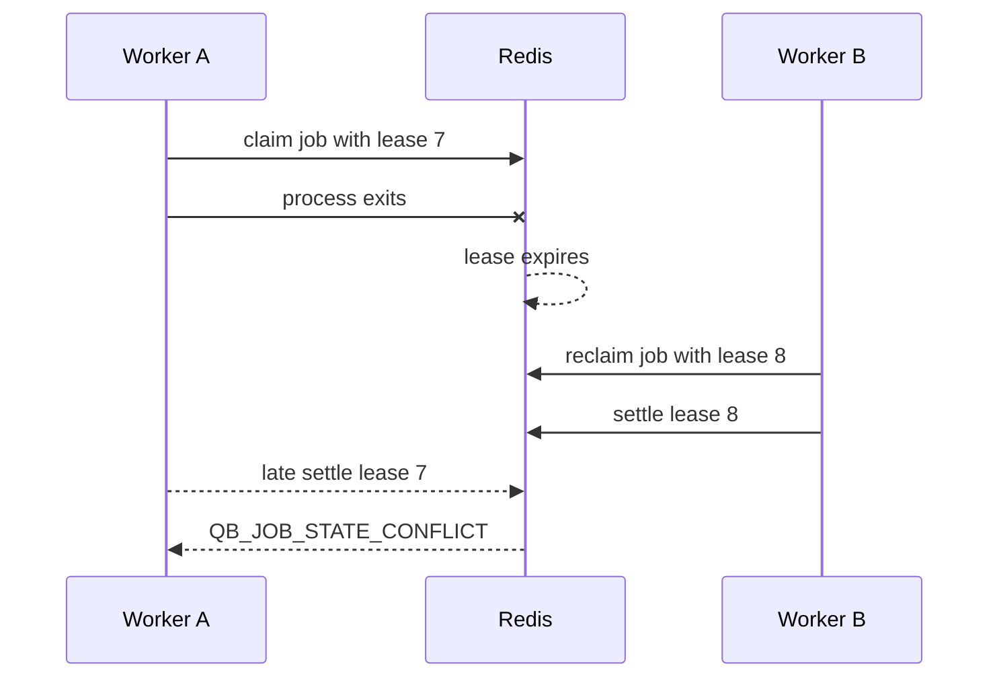

# Run multiple Workers together

<span class="manual-label">On-demand capability · scale out, crash recovery, and rolling releases</span>

Queuebit scales by running more Worker processes against the same Redis, `namespace`, and queue. Redis decides which Worker gets each job. Your business code still protects external side effects from duplicates.

<span id="sc04-distributed-workers"></span>
## Start with what you need

| Need | Key point |
|---|---|
| Run more Workers | Every Worker uses the same config/runtime and queue name |
| Increase throughput | Total concurrency is roughly the sum of `concurrency` across ready Workers |
| Recover after one Worker crashes | After lease expiry, another Worker reclaims the job |
| Roll out a new version | Start the new Worker, drain the old one, never remove all capacity at once |
| Avoid duplicate email or payment | Processors must use a stable `idempotencyKey` |

## Minimal deployment



All instances use the same Redis, `namespace`, and queue name. Direct jobs need only Producer plus Worker. You need a Coordinator only when `runs.start` processes database records in batches.

```bash
npx queuebit worker start \
  --queue notification \
  --config queuebit.config.ts \
  --runtime queuebit.runtime.ts \
  --concurrency 8
```

Run the same command on multiple machines or containers. Give each process a distinct identity or hostname in logs so incidents can be traced.

## Calculate concurrency

```text
maximum active jobs = sum(concurrency of all ready Workers)
```

With three Workers at `8`, `8`, and `4`, the theoretical maximum is `20` active jobs. This is not a downstream quota. Keep the real value below the tightest database pool, provider quota, CPU, memory, and Redis capacity limit.

When scaling out, do not look only at waiting count. Watch waiting age, downstream 429/5xx, database pool usage, Redis latency, queue backpressure, and duplicate business results.

## When a Worker crashes



After a Worker crashes, Redis waits for the lease to expire and then lets another Worker take over. If the old Worker returns late, its settle is rejected and cannot overwrite the new result.

This protects Queuebit state in Redis only. If the old Worker already sent email, charged money, or called a webhook, the external side effect is not automatically undone. Use [duplicate side-effect protection](./idempotency-patterns.md) in processors.

## Scale out

1. Confirm downstream capacity first, not only queue depth.
2. Start the new Worker and wait for `ready` plus heartbeat.
3. Confirm old and new runtime versions can process in-flight payloads.
4. Increase replicas or per-process `concurrency` gradually.
5. Watch downstream errors, Redis latency, waiting age, and backpressure.

```bash
npx queuebit workers inspect --queue notification --config queuebit.config.ts
npx queuebit queue inspect notification --config queuebit.config.ts
```

Use `--include-stale` during rolling releases or incident review when you need recently expired Worker heartbeats instead of only active roles.

## Rolling release and drain

```bash
npx queuebit worker drain \
  --queue notification \
  --worker-id worker-a \
  --reason rolling-release \
  --config queuebit.config.ts
```

The remote drain command only tells that Worker to stop taking new jobs. After the Worker observes the request, it waits for active handlers using the drain timeout configured on its own start command, such as `worker start --drain-timeout-ms 60000`. If the timeout expires, Queuebit does not mark jobs successful or failed; renewal stops, the process exits non-zero, and another Worker reclaims after lease expiry.

Rolling release order:

1. Keep at least one old Worker ready.
2. Start the new Worker and verify it can process in-flight payloads.
3. Drain one old Worker and stop it after active=0.
4. Repeat; never remove all capacity at once.
5. If you use BatchRun, replace Coordinators one at a time and keep old definition runtime until old Runs finish.

## No separate time-advancement process

v0.1 fixes `scheduler.mode=cooperative`: background Workers also compete for the time-advancement lease that promotes delayed/retrying jobs back to runnable. Users do not need to deploy a standalone Scheduler, and should not look for `scheduler start`, `scheduler inspect`, or `scheduler drain` from older drafts.

For resource isolation, deploy Workers separately from Web/API and keep at least two Worker instances eligible for time advancement.

## Safety line before adding Workers

| Signal | Condition before adding Workers |
|---|---|
| Downstream 429/5xx | Not already rising with current concurrency |
| Database/HTTP pool | Clear spare capacity exists |
| Redis memory/latency | Inside budget and no persistence error |
| Queue backpressure | Jobs and bytes return to or below low watermark under load |
| Duplicate side-effect protection | ACK-loss drill has passed |
