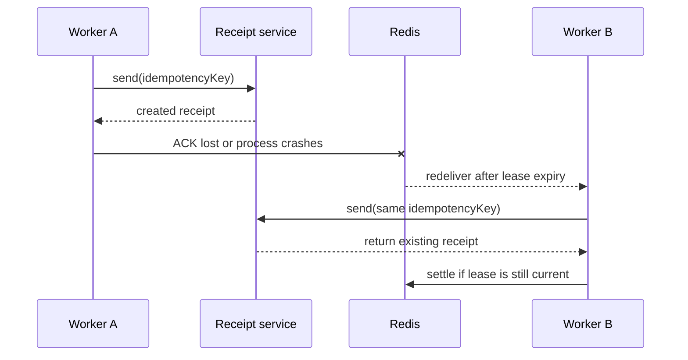

# Business idempotency: one result after repeated execution

<span class="manual-label">On-demand capability · prevent duplicate email, payment, webhook, and database effects</span>

Queuebit is at-least-once: it tries to finish work, but the same business action can execute more than once. Your goal is not to stop Workers from retrying. Your goal is to make email, payment, webhook, or database writes produce one business result.

## Remember this first

| Name | Controls | Does not control |
|---|---|---|
| `deduplicationKey` | Whether Queuebit creates a second job or Run identity | Whether an external system sends email, charges money, or writes data twice |
| `idempotencyKey` | Whether one business action produces one result | Whether Redis already contains the same queue identity |

In short: `deduplicationKey` answers "is this the same queue item?" and `idempotencyKey` answers "is this the same business action?" Most integrations should pass a stable business key for both.

<span id="sc06-business-idempotency"></span>
## Why execution can repeat

The common case is ACK loss: the downstream action succeeds, but the Worker crashes before it writes the ACK to Redis. After the lease expires, another Worker receives the same job and runs it again.



Worker B must receive the same `idempotencyKey` as Worker A. The downstream system can then return the existing result instead of sending another email, charging again, or writing another business record.

## How to choose the key

| Scenario | Recommended key |
|---|---|
| Send an order receipt | `receipt:${tenantId}:${orderId}` |
| Create a payment charge | `charge:${tenantId}:${paymentIntentId}` |
| Sync one CRM change | `crm-sync:${tenantId}:${changeId}` |
| Rerun failed Run work | Reuse the original business key; do not generate a random one |
| Create a replacement job | Reuse the original business key while creating a new queue identity |

Do not include attempt number, Worker ID, timestamp, or randomness in a business `idempotencyKey`. Those values change on retry and tell the downstream system this is a new action.

## Pattern 1: downstream native idempotency

```ts
await receiptProvider.send(receipt, {
  idempotencyKey: job.idempotencyKey,
  signal: job.signal
});
```

Use this when a payment, email, SMS, or webhook provider already supports an idempotency key. In tests, verify that retries return the same provider request or result ID, not merely another HTTP 2xx.

## Pattern 2: business state machine in a database

```sql
CREATE TABLE receipt_deliveries (
  idempotency_key text PRIMARY KEY,
  status text NOT NULL,
  provider_request_id text,
  updated_at timestamptz NOT NULL
);
```

Use this order:

1. Atomically create `pending` under the business key.
2. If status is already `succeeded`, return the existing result.
3. If the previous attempt timed out, query the provider or business state first.
4. Retry with the original key only when failure is confirmed.
5. Persist the provider request ID and business result for reconciliation.

A unique row alone is not enough. If the external send succeeds and the process crashes before status becomes `succeeded`, the external send still needs an idempotent provider, or you should use an outbox.

## Pattern 3: transactional outbox

Write business state and an outbox event in the same database transaction. A later dispatcher uses the outbox identity as the downstream idempotency key. Use this when local business state must commit before integration work is sent.

## After an uncertain timeout

1. Do not generate a new `idempotencyKey`.
2. Query the business database or provider using the original key.
3. If success is confirmed, return the original result.
4. Retry with the original key only when failure is confirmed.
5. If the result is still uncertain, leave it pending reconciliation; a Queuebit ACK is not business truth.

## Anti-patterns

| Anti-pattern | Risk | Use instead |
|---|---|---|
| Random business key per attempt | Every attempt is a new side effect | Derive from stable business identity |
| Queuebit deduplication only | It cannot undo a side effect after ACK loss | Provider key, state machine, or outbox |
| Manually setting completed in Redis | Queue state and business truth permanently diverge | Public API plus business reconciliation |
| Treating processor result as long-lived business data | Retention eventually removes it | Store durable results in business storage |

## Acceptance drill

- Terminate a Worker after the downstream side effect succeeds but before ACK.
- Wait for lease expiry and redelivery to another Worker.
- Confirm Queuebit attempt or stalled evidence increases while only one business result exists.
- Log `runId/jobId/attempt/leaseGeneration/idempotencyKey/providerRequestId`.
