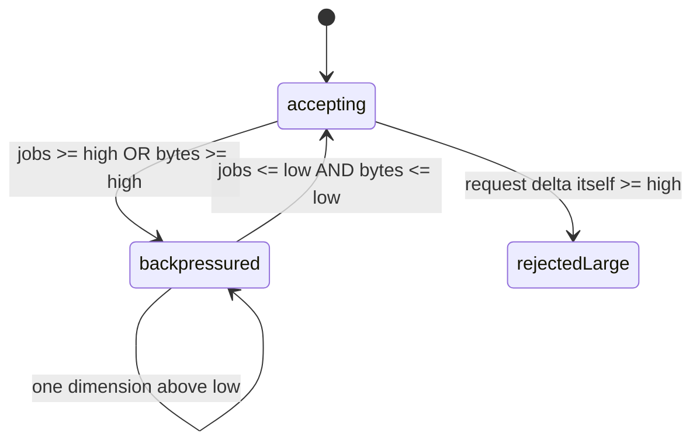

# Check Problems After Launch

<span class="manual-label">Production operations · start from symptoms</span>

<span id="sc12-observability"></span>
## First Decide What Kind of Problem It Is

When debugging Queuebit after launch, do not start by memorizing metric names. Start with four questions: is work piling up, are Workers running, is Redis ready, and is a database BatchRun stuck?

| Symptom | Inspect first | Usually means |
|---|---|---|
| New work is slow or queued | `queue inspect` | Not enough Workers, slow downstream, queue backpressure |
| Workers are not processing | `workers inspect` | Process down, draining, incompatible config version |
| API returns 503/429 | `health inspect` / `queue inspect` | Redis unavailable, unsafe Redis policy, queue too full |
| Database batch is not advancing | `run inspect` / `coordinator inspect` | Slow source, no Worker, result callback failure |

The four commands you will use most:

```bash
npx queuebit queue inspect notification --config queuebit.config.ts --json
npx queuebit workers inspect --queue notification --config queuebit.config.ts --json
npx queuebit health inspect --config queuebit.config.ts --json
npx queuebit run inspect <runId> --config queuebit.config.ts --json
```

## What Each View Answers

```bash
npx queuebit queue inspect notification --config queuebit.config.ts --json
npx queuebit workers inspect --queue notification --config queuebit.config.ts --json
npx queuebit coordinator inspect --config queuebit.config.ts --json
npx queuebit health inspect --config queuebit.config.ts --json
```

| View | Read first | Answers |
|---|---|---|
| Queue | waiting/active/delayed/retrying/failed, `oldestWaitingMs`, jobs/bytes watermarks | Which state is accumulating work? |
| Workers | ready/draining, concurrency, activeJobs, heartbeat, version | Are enough compatible Workers available? |
| Coordinator | active Runs, cursors, inFlightBatches, dispatchHoldReason, source/completion errors | Why is database batching paused or slow? |
| Health | ready/degraded/not_ready/draining plus checks | Are Redis, policy, and role leases safe? |

## Capacity: Start with Rough Math

```text
total Worker concurrency = sum(concurrency of all ready Workers)
maximum records in flight per Run = pageSize * maxInFlightBatches
job start rate ~= total Worker concurrency / average processing time
```

This is only a debugging starting point, not a replacement for load testing. One database record may create multiple jobs, payloads may be large, and downstream quotas may be lower than Worker capacity, so also check actual job count, serialized bytes, downstream limits, and Redis capacity.

From application code, `queuebit.capacity.snapshot()` reads jobs/bytes watermarks for declared Queues. Use CLI inspect for human debugging and `capacity.snapshot()` for readiness checks, dashboards, or local alert evaluation.

## Backpressure: When Work Is Rejected and When It Recovers

Backpressure is Queuebit's capacity guard: when a queue is too full, Queuebit rejects new work until the queue drops below the recovery watermark.



Temporary lack of capacity returns retryable `QB_BACKPRESSURE_REJECTED`. A request that is itself too large returns non-retryable `QB_BACKPRESSURE_REQUEST_TOO_LARGE`; reduce page, bulk size, fan-out, or payload instead of waiting for it to recover.

BatchRun can pause with `dispatchHoldReason` values such as `interval`, `in_flight_limit`, `backpressure`, `no_active_worker`, or `redis_reconnecting`. These are automatic wait reasons. They clear when conditions improve, require no manual resume, and consume no source/dispatch retry.

## Metrics: Start with the Few That Answer Questions

With default `observability.metrics.prefix=queuebit_`, start with these process-local samples to answer whether work is arriving, being processed, failing, and whether roles are alive:

| Metric suffix | Use first for |
|---|---|
| `jobs_submitted_total` / `job_data_bytes_submitted_total` | Producer submit volume and payload growth |
| `worker_jobs_claimed_total` / `worker_jobs_completed_total` / `worker_jobs_failed_total` | Worker consumption, success, and failure |
| `worker_job_duration_ms_count` / `worker_job_duration_ms_sum` | Average processing time |
| `worker_job_attempts_total` / `worker_stalled_jobs_recovered_total` | Retry volume and Worker takeover |
| `role_heartbeats_total` / `role_drain_requests_observed_total` | Worker/Coordinator liveness and rolling shutdown |
| `coordinator_runs_advanced_total` / `coordinator_jobs_created_total` | BatchRun advancement and job creation |
| `completion_events_delivered_total` | Result callback delivery |

Queuebit core provides an in-process registry, Prometheus rendering, `observabilityHttp.handle()` response helpers, and `alerts.evaluate()` local findings. It does not start an HTTP server; your application mounts, authenticates, and network-isolates health/metrics endpoints.

Some operational views currently come from CLI inspect or `capacity.snapshot()` rather than dedicated Prometheus series:

| What you want to see | How to cover it today |
|---|---|
| Queue depth by state | `queue inspect` state samples + capacity counters |
| Oldest waiting age | `queue inspect` `oldestWaitingMs` |
| BatchRun / completion backlog | `run` / `completion` inspect + coordinator metrics |
| Role lease validity | `workers` / `coordinator` inspect heartbeats |

Do not treat older planned metric names from draft dashboards as currently exported Prometheus series.

## Alerts: Start with a Small Rule Set

| Alert | Window | First action |
|---|---|---|
| Oldest waiting above business SLO | 5 to 15 minutes | Check Worker capacity, downstream latency, and backpressure |
| Stalled recoveries rising | Rate over time | Check Worker crashes, event loop, renewal, and Redis latency |
| Completion failed > 0 | Immediate | Repair handler/downstream and retry only the completion event |
| `role_lease_valid=0` with pending work | More than two lease windows | Check candidate processes, domain, and Redis connection |
| Server policy degraded/not_ready | Immediate | Stop new work and repair noeviction, persistence, or role |
| Queue bytes near high | Trend | Reduce page, fan-out, or payload and verify Redis capacity |

Thresholds come from business SLOs and load tests. A non-empty queue alone is not an incident.

`queuebit.alerts.evaluate()` can be the starting point for smoke checks, simple probes, and default dashboards. Production thresholds should still live in your monitoring system, with every Producer, Worker, and Coordinator process scraped and aggregated.

Completion retention is controlled separately by `retention.completionEvents.ageMs/maxCount`. Delivered or not-required Completion events can be removed after their parent Run is terminal; pending, retrying, delivering, or failed Completion events remain available for recovery and alerting.

## Log Correlation Keys

Use `namespace`, `queue`, `runId`, `batchId`, `jobId`, `eventId`, `attempt`, `leaseGeneration`, `workerId`, `coordinatorId`, `advancementOwnerId`, and `errorCode`.

Do not log full input, job data, results, Redis credentials, or sensitive business payloads by default.

## Graceful Shutdown: Stop Workers During Releases

```bash
npx queuebit worker drain --queue notification --worker-id worker-a --reason rolling-release --config queuebit.config.ts
npx queuebit coordinator drain --coordinator-id coordinator-a --reason rolling-release --config queuebit.config.ts
```

Remote drain commands only tell the target process to prepare for shutdown; they do not wait until it has fully stopped. On SIGTERM, Worker stops claiming new jobs, Coordinator stops reading sources and dispatching new batches, and both wait for the current Redis atomic operation to finish. The process uses its configured `--drain-timeout-ms` during shutdown. On timeout, it stops renewing and exits non-zero without inventing a business success or failure state.
