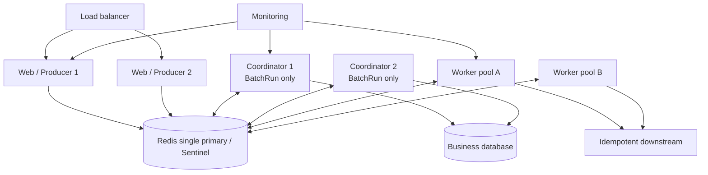

# Deploy Queuebit in production

<span class="manual-label">Production operations · Redis, Workers, Coordinators, and startup order</span>

Queuebit deployment does not require the test pipelines in this repository. A normal project needs a reliable Redis, a Web/API Producer, and separate Workers. If you use `runs.start` to process database records in batches, run Coordinators separately too.

<span id="sc10-redis-production"></span>
## Choose the path for your environment

| Environment | Recommended path |
|---|---|
| Local or trial | One Redis plus one Worker; start with [Quick start](./quick-start.md) |
| Production single Redis or managed Redis | Redis `>=7.2`, `noeviction`, persistence/backups, TLS/ACL |
| Sentinel | At least two Sentinel addresses; accept async-replication loss during failover |
| Kubernetes or containers | Separate Web, Worker, and Coordinator Deployments |
| Direct jobs only | Web/API Producer plus Workers |
| BatchRun database scans | Web/API Producer plus Workers plus Coordinators |



Web instances create work. Workers execute business jobs. Coordinators advance database pages only for BatchRun. Redis is Queuebit's only shared state.

## Redis requirements

| Requirement | Why | Check |
|---|---|---|
| Redis `>=7.2` | Queuebit needs these Redis capabilities | `INFO server` |
| `maxmemory-policy=noeviction` | Queue state must not be evicted | `CONFIG GET maxmemory-policy` |
| Persistence enabled and healthy | Explicit RPO and backup recovery | `INFO persistence` |
| ACL and TLS | Restrict network and command access | Connection preflight |
| Backup restore drill | Sentinel is not zero-loss | Scheduled restore drill |
| `serverPolicy.mode=strict` | Unsafe or unknown Redis policy must not look ready | `health inspect --json` |

Redis Cluster is outside v0.1. Sentinel failover can lose acknowledged writes that were not replicated. Queuebit can recover only state that still exists in Redis.

The Redis/Sentinel environment scripts in this repository are maintainer release verification: direct Redis uses `QUEUEBIT_REDIS_URL` or `QUEUEBIT_REDIS_HOST`, and Sentinel uses `QUEUEBIT_REDIS_SENTINEL_MASTER` plus `QUEUEBIT_REDIS_SENTINELS`. They are not required for user integration. Cleanup is limited to the unique Queuebit namespace created for that drill.

## Roles to deploy

| Role | Minimum production count | Scale when |
|---|---:|---|
| Web/API Producer | 2 | HTTP request load grows |
| Worker | 2+ | Waiting age grows and downstream capacity remains |
| Coordinator | 2 | Active Runs grow and source DB capacity remains |
| Time advancement | elected from 2+ Workers | delayed/retrying jobs accumulate |

Readiness checks Redis, role ownership, and business dependencies. Liveness only proves the process is alive; it does not replace readiness.

## Startup order

1. Verify Redis policy, persistence, primary role, and connectivity.
2. Run `config validate --runtime`; block missing handlers and version drift.
3. Start Workers and confirm heartbeat plus time advancement.
4. If you use BatchRun, start Coordinators and confirm source/completion dependencies.
5. Only then allow Web/API to create new work.

```bash
npx queuebit config validate --config queuebit.config.ts --runtime queuebit.runtime.ts
npx queuebit worker start --config queuebit.config.ts --runtime queuebit.runtime.ts --queue notification
npx queuebit coordinator start --config queuebit.config.ts --runtime queuebit.runtime.ts
vext start
```

Producer should not create unbounded work with no active Worker. Queue jobs/bytes backpressure is the final guard, not a replacement for startup order and capacity planning.

## Containers and Kubernetes

- Use separate Deployments for Workers and Coordinators; do not hide them as Web Pod sidecars.
- `terminationGracePeriodSeconds` exceeds role `drainTimeoutMs` plus business-resource cleanup time.
- Do not use liveness to restart-loop background roles during a short Redis outage. Roles stop new work and reconnect persistently.
- Each process exposes its own metrics and health. Monitoring aggregates them; a process gauge is not a cluster total.
- During rolling releases, both old and new Workers must accept in-flight payload schemas.

## Configuration version and rolling release

- Run creation stores definition `version`, resolved policies, and config digest.
- A new Coordinator recognizes in-flight old definitions, or old Runs finish before replacement.
- Job payloads carry business `schemaVersion`; old and new Workers both accept in-flight schemas during rollout.
- Changing `pageSize`, source, mapper, or completion increments definition version and never rewrites an existing Run.
- Inspect exposes package version and config digest; incompatible digests in one namespace should alert.

## Production acceptance

```bash
npx queuebit health inspect --config queuebit.config.ts --json
npx queuebit workers inspect --queue notification --config queuebit.config.ts --json
npx queuebit coordinator inspect --config queuebit.config.ts --json
npx queuebit queue inspect notification --config queuebit.config.ts --json
```

When you validate from application code, call `queuebit.capacity.snapshot()` after startup to read declared queue counters, jobs/bytes watermarks, utilization ratios, and backpressure state. It does not scan arbitrary Redis keys; treat it as a capacity-readiness view.

Rehearse Worker crash during processing, Coordinator crash at page/dispatch boundaries, time-advancement takeover, Redis disconnect/reconnect, Sentinel failover loss boundary, completion-handler failure, and drain timeout. Follow [Recover from failures](./failure-runbooks.md).
