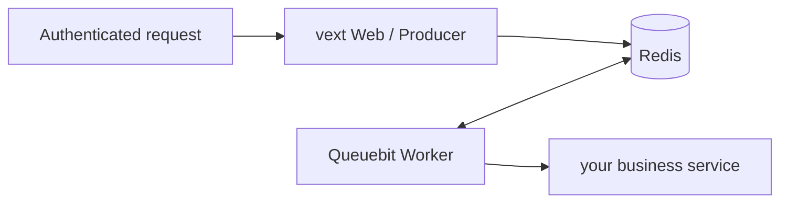

# How to Integrate Queuebit in a vext Project

<span class="manual-label">On-demand capability · use Queuebit with vextjs@0.3.26</span>

If your project is not vext, use the normal Node path: create a Queuebit client and run Worker processes. A vext project adds one thing: inject the long-lived client as a vext plugin at `app.queuebit`.

For a first vext integration, call `app.queuebit.jobs.add()` from a route and run one normal job. Use `app.queuebit.runs.start()` only when the route starts database batch processing.

<span id="sc11-vext-integration"></span>
## Start with the Moving Parts

| Location | What it does | Important boundary |
|---|---|---|
| `src/plugins/queuebit.ts` | Creates the vext plugin and injects `app.queuebit` | The Web process is only a Producer |
| vext route | Authenticates, validates input, and calls `app.queuebit.jobs.add` | Derive tenant on the server |
| Worker process | Runs business processors | Started separately, not by `vext start` |
| Coordinator process | Advances database pages only for BatchRun | Not needed for normal jobs |
| metrics/readiness | Mounted and protected by the vext app | Queuebit core starts no hidden HTTP server |



`vext start` launches Web/Producer only. Queuebit Workers are explicit processes or containers. The vext cluster Worker count is not the Queuebit Worker count.

## 1. Add the vext plugin

```ts
// src/plugins/queuebit.ts
import { defineAppExtensions } from 'vextjs';
import { type QueuebitClient } from 'queuebit';
import { createQueuebitVextPlugin } from 'queuebit/vext';
import queuebitConfig from '../../queuebit.config.js';

export const appExtensions = defineAppExtensions<{
  queuebit: QueuebitClient;
}>();

export default createQueuebitVextPlugin({
  config: queuebitConfig
});
```

vext scans `src/plugins/`, so you usually do not add a manual `plugins[]` entry in `vext.config.ts`. Keep `defineAppExtensions` in the local plugin file so `vext typegen` attaches `app.queuebit` to the application type. The adapter reuses one Queuebit client for the app lifecycle and does not close it after each route.

Advanced options:

| Option | Default | Meaning |
|---|---|---|
| `config` | required | Queuebit config object or `(app) => config` resolver |
| `extensionName` | `queuebit` | Property injected on `app` |
| `pluginName` | `queuebit` | vext plugin name |
| `dependencies` | none | vext plugin dependency names |
| `logger` | app logger adapter | Queuebit logger object or `(app) => logger` resolver |
| `clientOptions` | none | Advanced `createQueuebitClient` options such as injected Redis for tests |
| `onClient` | none | Hook after client creation and injection |

Do not use `clientOptions.redis` in normal application code unless you intentionally own the Redis command client lifecycle.

## 2. Enqueue One Normal Job from a Route

```ts
// src/routes/send-receipt.ts
import { defineRoutes } from 'vextjs';

export default defineRoutes((app) => {
  app.post(
    '/receipts',
    {
      auth: true,
      validate: { body: { orderId: 'string!' } }
    },
    async (req, res) => {
      const { orderId } = req.valid('body');
      const tenantId = await app.services.tenants.requireTenantId(
        req.auth.userId
      );

      const job = await app.queuebit.jobs.add(
        'notification',
        'send-receipt',
        { tenantId, orderId }
      );

      res.json({ jobId: job.id, state: job.state }, 202);
    }
  );
});
```

Do not trust `tenantId` from the request body. Derive it from the authenticated user on the server. Queuebit core does not provide tenant authorization; the vext app authorizes public job, run, and failure queries before exposing them.

## 3. Use `runs.start` Only for Database Batches

```ts
// src/routes/start-receipt-campaign.ts
import { defineRoutes } from 'vextjs';

export default defineRoutes((app) => {
  app.post(
    '/receipt-campaigns',
    {
      auth: true,
      validate: { body: { paidBefore: 'string!' } }
    },
    async (req, res) => {
      const { paidBefore } = req.valid('body');
      const tenantId = await app.services.tenants.requireTenantId(
        req.auth.userId
      );
      const run = await app.queuebit.runs.start('receipt-campaign', {
        input: { tenantId, paidBefore },
        idempotencyKey: `receipt:${tenantId}:${paidBefore}`
      });

      res.json({
        runId: run.id,
        deduplicated: run.deduplicated,
        executionState: run.executionState,
        completionState: run.completionState
      }, 202);
    }
  );
});
```

Use this only for [database batch processing](./batch-runs.md). Both the first request and an identical idempotent retry return 202 with the same `runId`; `deduplicated` distinguishes them.

## 4. Return HTTP Errors Consistently

| Case | HTTP | Meaning |
|---|---:|---|
| Unauthenticated/forbidden | 401/403 | vext auth owns the response |
| Request shape invalid | 400 | vext validation failed |
| BatchRun input invalid | 422 | `QB_RUN_INPUT_INVALID` |
| Same key with different input, or state disallows action | 409 | deduplication/state conflict |
| Queue backpressure | 429 | Send `Retry-After` only when retry timing is known |
| Redis unavailable or strict policy failed | 503 | Do not claim work was accepted |
| Unknown error | 500 | Do not expose stack, cause, or full input |

## 5. Start Web and Worker Separately

```bash title="Web / Producer"
vext start
```

```bash title="Worker"
npx queuebit worker start --config queuebit.config.ts --runtime queuebit.runtime.ts --queue notification
```

Start a Coordinator only when you use BatchRun:

```bash title="Coordinator · BatchRun only"
npx queuebit coordinator start --config queuebit.config.ts --runtime queuebit.runtime.ts
```

v0.1 users should use the core CLI role commands above. Do not look for vext-specific Worker or Coordinator startup paths until a future version explicitly ships them.

## 6. Reload and Shutdown

- Web reload invokes plugin `onClose` and releases the current client connection.
- Stopping Web does not cancel durable jobs or Runs in Redis.
- Worker and Coordinator follow their own SIGTERM drain lifecycle, independent from Web reload.
- Importing `queuebit.runtime.ts` opens no database or HTTP connection; a role activates only the factories it needs.

## 7. Production Acceptance

- Two Web instances starting the same `idempotencyKey` produce one Run.
- Restarting the vext cluster does not spawn duplicate Workers or Coordinators.
- Two Queuebit Workers process jobs from the same queue.
- Tenant A cannot inspect tenant B's run, failure payload, or job result.
- The vext app mounts and protects metrics/readiness endpoints.
- Reload releases the old client while durable Redis work continues.
