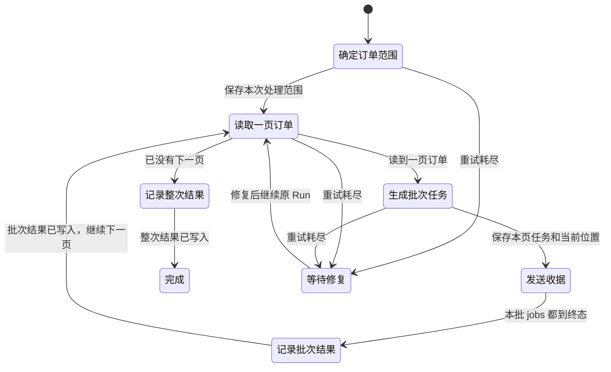
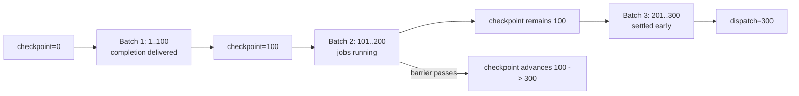
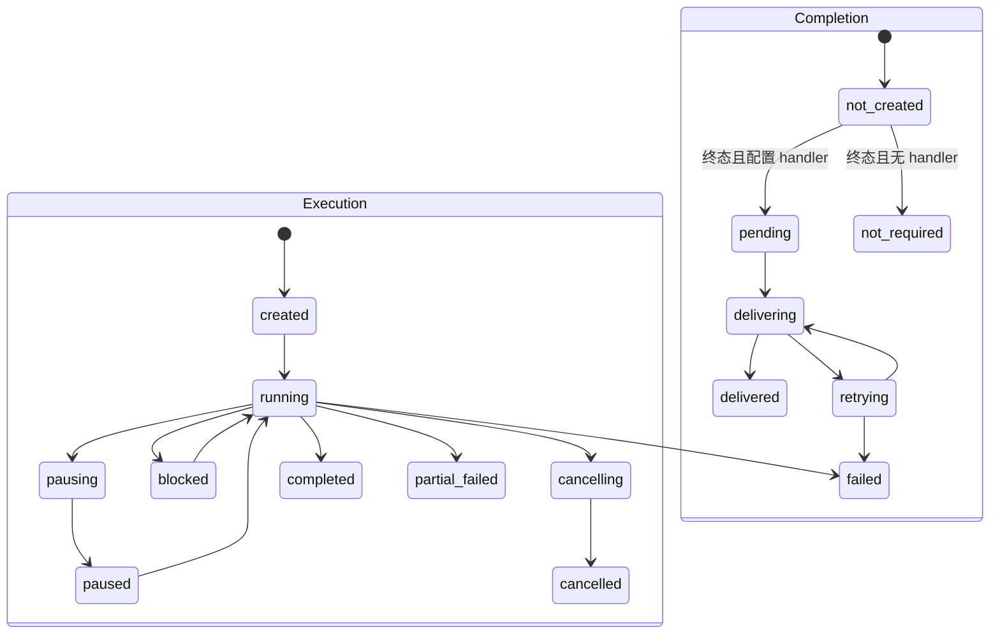
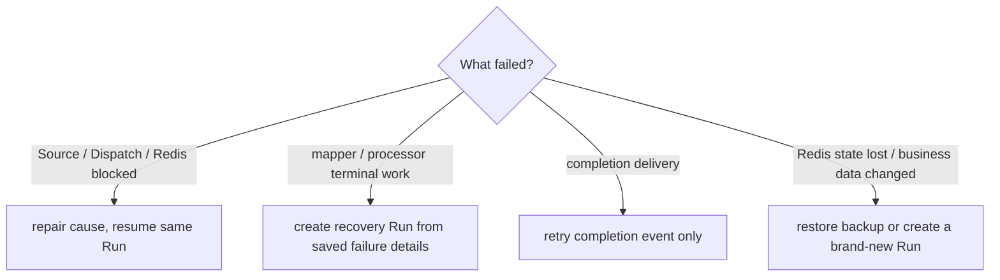

# 批量处理数据库记录

<span class="manual-label">按需能力 · 数据库记录很多时才看</span>

如果你只是“请求进来，执行一个后台任务”，不要先看这页，去看 [执行一个后台任务](./job-recipes.md)。这页只解决一种更复杂的需求：**数据库里有很多记录，不能一次全读出来，要一页页拆成任务，并且希望每批完成、整次完成、失败恢复都有记录。**

用一句话说：BatchRun = `runs.start()` 启动一整次批处理；Queuebit 反复从数据库读一页记录，把这一页变成 jobs，交给多个 Worker 执行，最后调用 completion handler 写回结果。

| 普通 job | BatchRun |
|---|---|
| 已经有一个明确 payload | 需要从数据库分页找很多条记录 |
| 调 `jobs.add()` | 调 `runs.start()` |
| 一个 processor 处理一个任务 | source 读记录、mapper 生成 jobs、processor 执行 jobs |
| 查 job 成功/失败 | 查 Run、Batch、job、completion 的整体进度 |

第一次接入 Queuebit 不需要理解本页所有细节；只有当你真的要做数据库批处理时再回来。

## 完整示例路径

这段演示一个“Web 请求不能等几千封邮件发完”的收据批处理。只抓主线的话：**Web 创建 Run；Coordinator 分页派发；Worker 执行任务；completion 记录每批和整次结果。**

<div class="qb-canonical-flow" role="img" aria-label="从数据库找到已支付订单，创建批处理，拆成后台任务，由多个 Worker 发送收据，并记录每批和整次结果">
  <div class="qb-flow-stage"><span class="qb-flow-step">01 找到订单</span><strong>写入示例订单并固定范围</strong><span>23 条 paid orders → example database → 本次只处理到 boundary.maxId</span></div>
  <span class="qb-flow-arrow" aria-hidden="true">→</span>
  <div class="qb-flow-stage"><span class="qb-flow-step">02 创建批处理</span><strong>Web 只登记这次处理</strong><span>POST /receipt-campaigns → 立即返回 runId</span></div>
  <span class="qb-flow-arrow" aria-hidden="true">→</span>
  <div class="qb-flow-stage"><span class="qb-flow-step">03 拆成任务</span><strong>Coordinator 分页读取订单</strong><span>读一页 paid orders → 生成 Batch + jobs</span></div>
  <span class="qb-flow-arrow" aria-hidden="true">→</span>
  <div class="qb-flow-stage"><span class="qb-flow-step">04 发送收据</span><strong>Worker A / B 领取后台任务</strong><span>调用幂等 receipt service，避免重复发送</span></div>
  <span class="qb-flow-arrow" aria-hidden="true">→</span>
  <div class="qb-flow-stage qb-flow-stage--final"><span class="qb-flow-step">05 记录结果</span><strong>先记录每批，再记录整次</strong><span>每批完成后推进 checkpoint；全部处理完后写入 run completion</span></div>
</div>

前置条件：Node.js `>=20.19`、Docker Compose、npm。example 只操作自己的 Redis/database 容器和 volume；端口冲突时使用脚本提示的 override，不终止未知进程。完整边界见 [我的环境能不能用](./compatibility.md)。

> 发布状态：如果当前安装包或源码里的示例提示 `target-contract skeleton`，表示这个完整批处理示例尚未发布为可运行路径。不要把这种提示当成 Redis 或本机环境故障；先按 [快速开始](./quick-start.md) 跑通普通后台任务。

```bash
cd examples/receipt-batch-vext
npm install
npm run infra:up
npm run infra:health
```

写入本地 fixture：

```bash
npm run seed
```

预期输出：

```text
tenant=tenant-demo
orders.inserted=24
orders.paid=23
orders.withReceiptEmail=21
orders.expectedSkipped=2
```

检查配置和 runtime 注册：

```bash
npx queuebit config validate \
  --config queuebit.config.ts \
  --runtime queuebit.runtime.ts
```

预期输出形态：

```text
message=Queuebit configuration is valid.
config.namespace=receipt-demo
config.queues=notification
config.batchRuns=receipt-campaign
validation.runtime=loaded
validation.sources=paid-orders
validation.mappers=receipt-jobs
validation.processors=send-receipt
validation.completions=record-receipt-batch-result,record-receipt-run-result
```

打开四个终端：

```bash title="终端 A · vext Web"
npm run start:web
```

```bash title="终端 B · Coordinator"
npx queuebit coordinator start --config queuebit.config.ts --runtime queuebit.runtime.ts
```

```bash title="终端 C · Worker A"
npx queuebit worker start --config queuebit.config.ts --runtime queuebit.runtime.ts --queue notification --worker-id worker-a
```

```bash title="终端 D · Worker B"
npx queuebit worker start --config queuebit.config.ts --runtime queuebit.runtime.ts --queue notification --worker-id worker-b
```

vext route 内部调用 `app.queuebit.runs.start('receipt-campaign', { input, idempotencyKey })`。HTTP 层负责认证和业务输入，Queuebit 负责持久 Run identity、分页、派发、Worker 执行和 completion delivery。

```bash
curl -i http://127.0.0.1:4100/receipt-campaigns \
  -H "Authorization: Bearer local-demo-user" \
  -H "Content-Type: application/json" \
  --data '{"paidBefore":"2026-07-15T00:00:00.000Z"}'
```

预期 HTTP 202：

```json
{
  "runId": "run_01...",
  "deduplicated": false,
  "executionState": "created",
  "completionState": "not_created"
}
```

首次创建的响应固定返回 `created + not_created`；Coordinator 随后异步把 Run 推进到 `running`。用同一 credential、`paidBefore` 和稳定 idempotency key 重试返回相同 `runId`、当前 snapshot 与 `deduplicated: true`；相同 key 不同 input 返回 409 `QB_RUN_DEDUPLICATION_CONFLICT`。

```bash
npx queuebit run inspect <runId> --config queuebit.config.ts
npx queuebit workers inspect --queue notification --config queuebit.config.ts
```

运行中关键字段：

```text
definition=receipt-campaign@1
executionState=running
completionState=not_created
dispatchCursor=20
checkpointCursor=10
batches=2
recordsSeen=20
jobsCreated=18
activeWorkers=worker-a,worker-b
```

`dispatchCursor > checkpointCursor` 不是丢数据，而是说明后续 Batch 已持久化，前缀 Batch 的 execution/completion 屏障尚未全部通过。`not_created` 表示 Run 尚未进入执行终态，因此还没有 run completion event。

验证最终结果：

```bash
npm run audit:show -- --run <runId>
```

预期：

```text
batchCompletions=3
runCompletions=1
recordsSeen=23
recordsDispatched=21
recordsSkipped=2
recordsFailed=0
recordsUndispatched=0
jobsCreated=21
jobsCompleted=21
jobsFailed=0
jobsCancelled=0
receiptDeliveries=21
duplicateReceiptDeliveries=0
```

<span id="sc01-database-batch"></span>
## 从数据库批量处理到最终完成



文字步骤：先确定本次要处理到哪一批订单；Coordinator 按游标读取一页订单；这一页订单和对应 jobs 一起保存；Worker 发送本批收据；批次结果写入后才推进“已完成到哪里”，然后继续下一页；没有下一页时记录整次 Run completion。Queuebit 会把处理范围、当前位置、批次/jobs、失败详情和 completion 状态都保存到 Redis，所以崩溃后能从已保存的位置继续。

## 1. 确定有限处理范围

```ts
sources: {
  'paid-orders': defineQueuebitSource({
    async freeze({ input }) {
      const db = await getDb();
      const max = await db.orders.findMaxPaidId({
        tenantId: input.tenantId,
        paidBefore: input.paidBefore
      });
      return { boundary: { maxId: max?.id ?? 0 }, cursor: 0 };
    },
    async load({ input, boundary, cursor, limit }) {
      const db = await getDb();
      const records = await db.orders.findPaidPage({
        tenantId: input.tenantId,
        paidBefore: input.paidBefore,
        afterId: cursor,
        maxId: boundary.maxId,
        limit
      });
      const nextCursor = records.at(-1)?.id ?? cursor;
      return {
        records,
        nextCursor,
        exhausted: records.length === 0 || nextCursor >= boundary.maxId
      };
    }
  })
}
```

`maxId` 只排除边界外的新记录，不自动防止边界内记录被修改或删除。如果这些变化会破坏结果，使用数据库 snapshot token、不可变事件表或物化任务表。

Source 必须满足：

- 非空页必须推进 cursor，否则 `QB_SOURCE_CURSOR_NOT_ADVANCED`。
- 空页不自动等于 exhausted，由 source 明确返回。
- 使用 keyset cursor；可以把它理解成“上一页读到哪里”，生产主路径不使用 offset 分页。
- input、处理范围、cursor 和 record 可 JSON 序列化且不超 payload limit。

## 2. 把记录转成 jobs、跳过或失败

```ts
mappers: {
  'receipt-jobs': defineQueuebitMapper((record) => {
    if (!record.receiptEmail) {
      return null;
    }
    return {
      name: 'send-receipt',
      data: {
        schemaVersion: 1,
        orderId: record.id,
        tenantId: record.tenantId,
        recipient: record.receiptEmail
      },
      identity: `order:${record.id}`,
      options: {
        idempotencyKey: `receipt:${record.tenantId}:${record.id}`
      }
    };
  })
}
```

mapper 是纯转换。返回 `null` 或 `undefined` 会把该 record 计为 skipped。一条 record 可产生多个 jobs，但每个 job 必须有稳定 `identity`；防止外部副作用重复的 key 放在 `options.idempotencyKey`。mapper 失败时，Queuebit 会保存这条 record 的可重放失败详情，不让同页其他记录消失。

## 3. 选择批次节奏

```ts
dispatch: {
  mode: 'sequential',
  intervalMs: 2_000,
  maxInFlightBatches: 1
}
```

| 模式 | 什么时候开始下一批 | 适用场景 |
|---|---|---|
| `sequential` | 前一 Batch execution 终态且 completion 为 `not_required/delivered`，再从屏障通过时计 `intervalMs` | 下游容量严格，希望每批完成后再继续 |
| `paced` | 从前一 Batch 成功创建时计间隔，同时不超 `maxInFlightBatches` | 允许有界并行的高吞吐场景 |

<span id="sc03-paced-cursors"></span>
### paced 模式下为什么有两个位置



文字说明：Batch 3 可以先完成，但“已完成到哪里”不能跳过尚未完成的 Batch 2；Batch 2 通过后，完成位置可以一次推进到 300。

<span id="sc07-completion-delivery"></span>
## 4. 配置每批和最终结果回写

```ts
completion: {
  batch: {
    handler: 'record-receipt-batch-result',
    attempts: 5
  },
  run: {
    handler: 'record-receipt-run-result',
    attempts: 10
  }
}
```

```ts
completions: {
  'record-receipt-batch-result': defineQueuebitCompletionHandler(async (event) => {
    const db = await getDb();
    await db.batchAudit.upsert(event.id, event.summary);
  }),
  'record-receipt-run-result': defineQueuebitCompletionHandler(async (event) => {
    const db = await getDb();
    await db.runAudit.upsert(event.id, event.summary);
  })
}
```

completion event 在 Redis 中持久化，不是进程内 callback。handler 必须用 `event.id` 幂等写入，因为 delivery 也是 at-least-once。



文字说明：execution 表示业务 job 是否完成，completion 表示结果回写是否完成。业务执行终态前 completion 固定为 `not_created`；终态提交 event 后才进入 `pending` 或 `not_required`。业务 work 完成后，completion 仍可重试或失败；修复 handler 后只重试 completion event。

## 5. 启动、查询与控制

```ts
const run = await queuebit.runs.start('receipt-campaign', {
  input: {
    tenantId: 'tenant-42',
    paidBefore: '2026-07-15T00:00:00.000Z'
  },
  idempotencyKey: 'receipt-campaign:tenant-42:2026-07-15'
});
```

```bash
npx queuebit run inspect <runId> --config queuebit.config.ts
npx queuebit run pause <runId> --config queuebit.config.ts
npx queuebit run resume <runId> --config queuebit.config.ts
npx queuebit run cancel <runId> --reason "campaign withdrawn" --config queuebit.config.ts
```

pause/resume 连续控制同一条非终态 Run。cancel 停止创建新 Batch，等待 active work 收敛；它不会把边界中未读且总数未知的记录伪造成已处理数。

## 6. 选择正确的恢复动作



文字决策：

| 状况 | 动作 | 不要做 |
|---|---|---|
| Source/Dispatch 重试耗尽后 `blocked` | 修复原因，`runs.resume(runId)` | 不创建 recovery run |
| mapper/processor 终止失败 | `runs.retryFailed` 创建新 Run，重放保存的失败详情 | 不重开原 Run |
| completion handler 失败 | `completions.retry(eventId)` | 不重做 jobs |
| Redis 原状态已丢失 | 从备份恢复，或根据业务 DB 创建全新 Run | 不凭本地内存伪造原 Run |
| 希望使用已变化的 DB 数据 | 创建全新 Run | recovery run 固定重放旧失败详情 |

```bash
npx queuebit run failures <runId> --stage mapper --limit 100 --config queuebit.config.ts
npx queuebit run retry-failed <runId> --idempotency-key "recovery:<runId>:1" --config queuebit.config.ts
npx queuebit completion inspect --run <runId> --config queuebit.config.ts
npx queuebit completion retry <eventId> --config queuebit.config.ts
```

## 7. 汇总守恒式

Run 终态时必须满足：

```text
recordsSeen = recordsDispatched + recordsSkipped + recordsFailed + recordsUndispatched
jobsCreated = jobsCompleted + jobsFailed + jobsCancelled
```

一条 record 生成多个 jobs 时，`recordsDispatched` 只加 1，`jobsCreated` 按实际 jobs 计数。边界总数无法低成本确定时，`boundaryTotalRecords=null`。

## 下一步

- 设计业务幂等：[防止重复副作用](./idempotency-patterns.md)。
- 部署多角色：[生产上线怎么部署](./production-deployment.md)。
- 检查所有 BatchRun 配置：[配置字段字典](./cli-and-config.md#batchrun-定义)。
