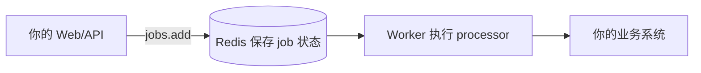

# 先用起来，再理解 Queuebit

快速开始 · 渐进学习路径

Queuebit 是一个 Redis-backed 的 Node 后台任务模块。第一次使用时，你不需要理解内部架构；只要知道：**Web/API 提交 job，Worker 从 Redis 取 job 并执行 processor**。

## 开始前只需要 5 个词

| 词 | 你可以先这样理解 |
|---|---|
| Queue | 一类任务的队列，比如 `notification` |
| Job | 一次要后台执行的任务，比如发送一封收据邮件 |
| Processor | 你写的业务函数，Worker 会调用它 |
| Producer | 提交任务的代码，通常在 Web/API 进程里 |
| Worker | 独立后台进程，负责取出 job 并执行 processor |

到这里就足够开始。结果回写、防重复、重试、数据库批处理、多 Worker 和 Redis 内部模型都可以后学。

## 四层学习路径

| 层级 | 什么时候看 | 文档 |
|---|---|---|
| 必须掌握 | 第一次跑通一个后台任务 | [快速开始](./quick-start.md)、[执行一个后台任务](./job-recipes.md) |
| 日常常用 | 任务要更稳、更可控 | [执行一个后台任务](./job-recipes.md)、[防止重复副作用](./idempotency-patterns.md) |
| 高级场景 | 数据库分页、多个 Worker、生产部署 | [批量处理数据库记录](./batch-runs.md)、[多个 Worker 怎么一起跑](./distributed-workers.md)、[生产上线怎么部署](./production-deployment.md) |
| 精确查询 | 已经接入，需要查字段、状态、错误 | [API 快查](./target-api.md)、[配置字段字典](./cli-and-config.md)、[状态和错误怎么读](./failure-modes.md) |

维护者内部页用于实现和治理，不是使用者的学习前置。

## 什么时候再学更多

| 你遇到的需求 | 再学习 |
|---|---|
| 网络失败要自动重试 | `attempts`、`backoff`、`timeoutMs` |
| 邮件、Webhook、支付不能重复生效 | `idempotencyKey` 和业务侧去重 |
| 同一个请求被重复提交 | `deduplicationKey` |
| 要处理数据库里很多记录 | 批处理 Run、数据来源、任务转换、结果回写 |
| 想多开几个进程提高吞吐 | Worker 并发、drain、健康检查 |
| 要上线和排查事故 | Redis policy、health、metrics、runbook |

## 常见误解

| 误解 | 正确理解 |
|---|---|
| 必须先会 BatchRun 才能用 Queuebit | 普通后台任务只用 `jobs.add()` |
| 必须先写结果回写 handler | 只有需要批次或最终结果回写时才写 |
| 必须先理解 Redis key 和租约 | 使用者只通过 API/CLI 接入和恢复 |
| 必须用 CLI 或 CI 跑业务 | CLI 用来验证和排查；业务可以在 Node 服务和 worker 脚本里运行 |
| 多 Worker 是入门前置 | 单 Worker 跑通后，再按吞吐需要增加 |

## 下一步

- 先跑一个任务：[快速开始](./quick-start.md)。
- 看单个后台任务：[执行一个后台任务](./job-recipes.md)。
- 只有数据库批量场景再看：[批量处理数据库记录](./batch-runs.md)。
