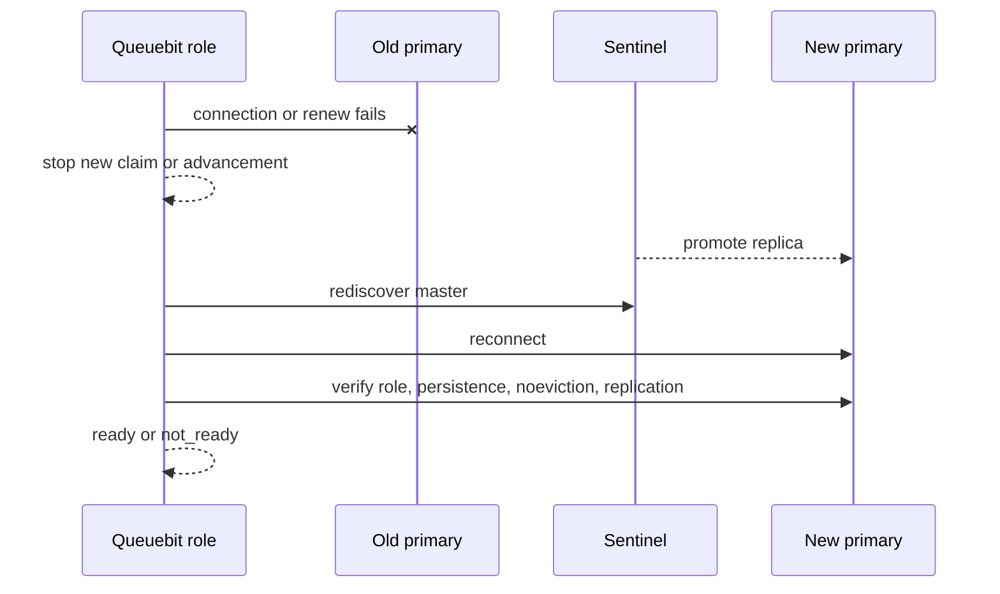

# Redis 断了怎么办：恢复边界

<span class="manual-label">生产运维 · 临时中断、failover、数据丢失怎么处理</span>

Queuebit 把 Redis 当作唯一队列状态。Worker 可以重跑业务函数，但不能从内存里重建 Redis 已经丢掉的 job、Run 或 completion event。先判断是哪一种情况，再决定是等待恢复、恢复原 Run，还是从业务数据库重新发起。

## 先判断是哪一种

| 你看到什么 | Queuebit 会怎么做 | 你该怎么做 |
|---|---|---|
| Redis 临时连不上 | 后台 Worker/Coordinator 停止领取新工作，持续重连 | 修 Redis/网络，等 health 回到 ready |
| Sentinel 正在切主 | 重新发现 primary，重新做 Redis policy 检查 | 等切换完成，不手工改 Queuebit key |
| Run 变成 `blocked` | 保留同一个 Run identity，等待你修复前置条件 | inspect 原 Run，确认安全后 resume |
| Redis 数据确认丢失 | 报告耐久性缺口，不假装旧状态还在 | 恢复 Redis 备份，或接受丢失窗口并创建新 Run |
| 下游已经成功但 job 又执行 | 这是 at-least-once 的正常风险 | 用业务 `idempotencyKey` 去重外部副作用 |

## Redis 临时中断时

- Producer、inspect 和控制命令可能直接失败或返回 `not_ready`。
- Worker、Coordinator 和时间推进 owner 会停止新 claim/load/dispatch/promotion。
- 正在跑的 processor 只有在还能证明当前任务身份和租约仍有效时，才能提交结果。
- Redis 恢复后，后台角色按 Redis 中仍存在的状态继续工作。

这意味着 Queuebit 会“停住等 Redis”，不会在本地离线继续排队，也不会事后把本地状态合并回 Redis。

## Sentinel 切换时



切主期间 Queuebit 不乐观提交。重连后会重新检查 Redis role、持久化、`noeviction` 和复制状态。如果新 primary 没有旧写入，Queuebit 不会伪造那些写入存在。

<span id="sc08-blocked-resume"></span>
## Run blocked 时怎么恢复

`executionState=blocked` 的意思是：Queuebit 认为“继续推进可能不安全”，所以停在原 Run 上等你确认。常见原因是 source/dispatch 重试耗尽、Redis 状态长时间不确定，或恢复前置检查失败。

```bash
npx queuebit run inspect <runId> --config queuebit.config.ts --json
npx queuebit run resume <runId> --config queuebit.config.ts
```

resume 前检查这几件事：

- Redis 当前 role 和 server policy 安全，原 Run 状态仍存在。
- source 用原 input、boundary、cursor 重读时，仍指向同一批业务数据。
- `dispatchCursor`、`checkpointCursor` 和已持久化 Batch 没有互相矛盾。
- 旧 Coordinator 已退出或失去资格，不会继续用旧租约提交。
- 这不是 mapper/processor 失败重放问题；没有保留可重放失败详情时，`retryFailed` 必须拒绝。

能满足这些条件，就 resume 原 Run。不能满足，就不要硬 resume；选择恢复 Redis 备份，或从业务数据库创建一个全新 Run。

## 确认 Redis 状态丢失时

1. 先停止 Producer 创建新 work，保护事故边界。
2. 保留 Redis/Queuebit 日志、failover 时间线、备份时间点和业务审计记录。
3. 优先恢复 Redis 备份；如果接受 RPO 内丢失，就从业务数据库创建新 Run。
4. 不把不完整的旧 Run 标成 completed。
5. 不用 recovery run 假装重放已经丢失的失败详情。
6. 对外部副作用按业务 `idempotencyKey` 或 provider request ID 对账。

## 三个概念别混在一起

| 概念 | 它回答的问题 | 不能替代什么 |
|---|---|---|
| 可用性 | Queuebit 角色能不能连接 Redis 并继续服务 | 不能证明历史写入没丢 |
| 耐久性 | 已确认写入在 crash/failover 后是否还在 | 取决于 Redis persistence、replication、backup 和 RPO |
| at-least-once | 状态还在时，业务 work 可能被再次执行 | 不能重建 Redis 已丢失的 work |

Sentinel 高可用不等于零数据丢失；at-least-once 也不等于 exactly-once。业务侧仍需要稳定的幂等键和对账记录。
