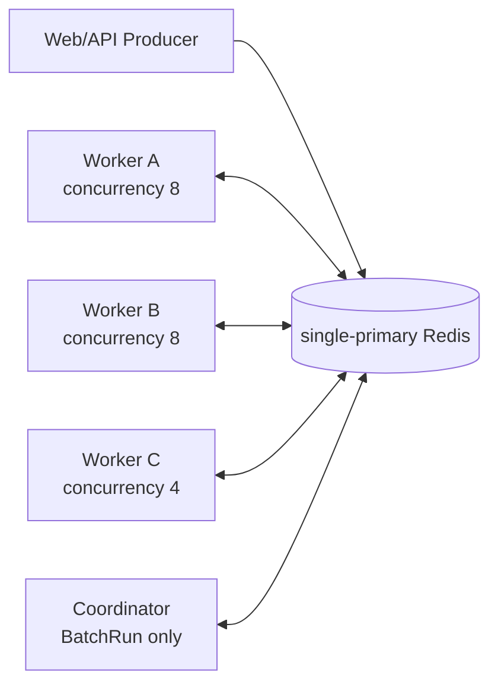
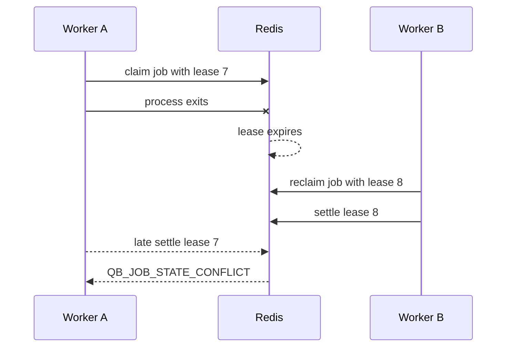

# 多个 Worker 怎么一起跑

<span class="manual-label">按需能力 · 扩容、崩溃接手、滚动发布</span>

Queuebit 的扩容方式很直接：多启动几个 Worker 进程，让它们连同一个 Redis、同一个 `namespace`、同一个 queue。Redis 负责分配谁拿到哪个 job；你的业务代码负责外部副作用防重复。

<span id="sc04-distributed-workers"></span>
## 先看你要做什么

| 你要做什么 | 关键点 |
|---|---|
| 多开 Worker | 每个 Worker 使用同一份 config/runtime 和同一个 queue name |
| 提高吞吐 | 总并发约等于所有 ready Worker 的 `concurrency` 之和 |
| Worker 挂了自动接手 | lease 过期后，其他 Worker 会重新拿到这个 job |
| 滚动发布 | 先启动新版，再 drain 旧版，不要一次停光 |
| 防止重复发邮件/扣款 | processor 必须使用稳定 `idempotencyKey` |

## 最小部署方式



所有实例使用同一个 Redis、`namespace` 和 queue name。直接 job 只需要 Producer + Worker；只有使用 `runs.start` 批量处理数据库记录时，才需要 Coordinator 推进 Run。

```ts title="worker-service.ts"
import {
  createQueuebitClient,
  createQueuebitRuntimeProcessor
} from 'queuebit';
import config from './queuebit.config.js';
import runtime from './queuebit.runtime.js';

export async function startWorker(workerId: string) {
  const client = await createQueuebitClient({ config });
  const worker = client.createWorker(
    'notification',
    createQueuebitRuntimeProcessor(runtime),
    { workerId, concurrency: 8, drainTimeoutMs: 60_000 }
  );
  worker.start();
  return { worker, stop: () => client.close({ timeoutMs: 60_000 }) };
}
```

在多台机器或多个容器中用不同 `workerId` 运行同一段服务代码。部署命令和进程管理器由你决定；Queuebit API 只管理 Worker 生命周期。

## 并发怎么算

```text
最大同时执行 job 数 = 所有 ready Worker 的 concurrency 之和
```

如果有 3 个 Worker，`concurrency` 分别是 `8`、`8`、`4`，理论上最多同时跑 `20` 个 job。这不是下游系统的配额；实际值要小于数据库连接池、第三方 provider 限额、CPU/内存和 Redis 容量里最小的那个。

扩容时不要只看 waiting count。更应该看 waiting age、下游 429/5xx、数据库连接池、Redis latency、队列 backpressure 和业务结果是否重复。

## Worker 挂了会怎样



Worker 崩溃后，Redis 等 lease 过期，再让其他 Worker 接手。旧 Worker 如果后来才返回，提交会被拒绝，不能覆盖新 Worker 的结果。

注意：这只能保护 Queuebit 在 Redis 里的状态。若旧 Worker 已经成功发了邮件、扣了款或调用了 webhook，下游副作用不会被自动撤销，所以 processor 仍要用 [防止重复副作用](./idempotency-patterns.md) 的方案。

## 扩容步骤

1. 先确认下游容量，不只看队列堆积数量。
2. 启动新 Worker，等 health 变 `ready` 且 heartbeat 出现。
3. 确认新旧 runtime 都能处理当前在途 payload。
4. 逐步增加实例数或单实例 `concurrency`。
5. 观察下游错误、Redis latency、waiting age 和 backpressure。

```bash
npx queuebit workers inspect --queue notification --config queuebit.config.ts
npx queuebit queue inspect notification --config queuebit.config.ts
```

滚动发布或事故复盘时，如果需要看到刚过期的 Worker heartbeat，而不只是 active role，在 `workers inspect` 上追加 `--include-stale`。

## 滚动发布和 drain

```bash
npx queuebit worker drain \
  --queue notification \
  --worker-id worker-a \
  --reason rolling-release \
  --config queuebit.config.ts
```

远程 drain 命令只告诉这个 Worker 停止拿新 job。Worker 看到请求后，传给 `client.createWorker()` 的 `drainTimeoutMs` 决定 active handler 最多可收尾多久。服务宿主也可以直接调用 `worker.drain({ timeoutMs: 60_000 })` 或 `client.close({ timeoutMs: 60_000 })`。如果超时，Queuebit 不会把 job 标成成功或失败；续租停止，由宿主决定退出策略，其他 Worker 等 lease 过期后接手。

滚动发布顺序：

1. 保留至少一个旧 Worker ready。
2. 启动新版 Worker，确认它能处理在途 payload。
3. drain 一个旧 Worker，等 active=0 后停止。
4. 重复替换，不要同时移除所有容量。
5. 如果有 BatchRun，Coordinator 也逐个替换；旧 Run 结束前保留旧 definition runtime。

## 时间推进不用单独进程

v0.1 固定 `scheduler.mode=cooperative`：后台 Worker 会顺手竞争时间推进资格，负责把 delayed/retrying job 推回可执行状态。用户不需要额外部署 standalone Scheduler，也不要按旧草案寻找 `scheduler start/inspect/drain`。

如果你想隔离资源，先把 Worker 与 Web/API 分成不同 Deployment，并至少保留两个 Worker 实例参与时间推进。

## 扩容前安全线

| 信号 | 拉高 Worker 前应满足 |
|---|---|
| 下游 429/5xx | 没有因现有并发持续增长 |
| DB/HTTP pool | 有明确余量 |
| Redis memory/latency | 没接近容量预算，没有 persistence error |
| Queue backpressure | jobs 和 bytes 都能在负载下回到 low watermark |
| 副作用防重复 | 已通过 ACK-loss 故障演练 |
