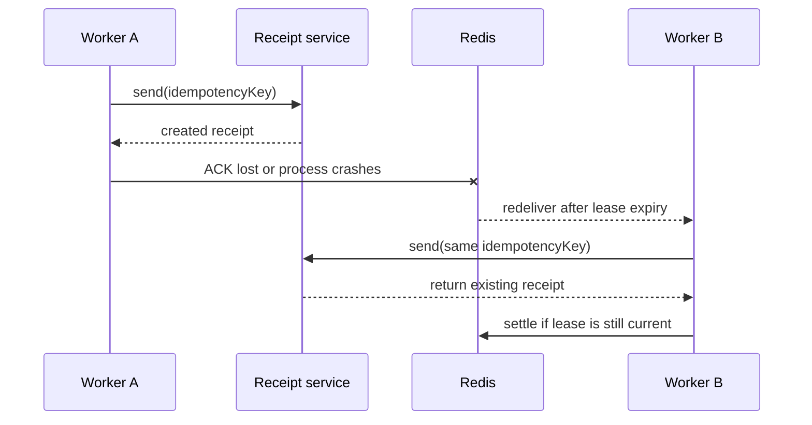

# 业务幂等：重复执行也只产生一次结果

<span class="manual-label">按需能力 · 邮件、支付、Webhook、数据库写入怎么防重复</span>

Queuebit 是 at-least-once：它会尽力把任务做完，但同一个业务动作可能执行不止一次。你的目标不是阻止 Worker 重试，而是保证邮件、支付、Webhook 或数据库写入只产生一次业务结果。

## 先记住一句话

| 名字 | 管什么 | 不管什么 |
|---|---|---|
| `deduplicationKey` | Queuebit 里是否创建第二个 job/Run identity | 外部系统是否重复发邮件、扣款、写库 |
| `idempotencyKey` | 业务动作是否只产生一次结果 | Redis 里是否已经有同一个队列 identity |

简单说：`deduplicationKey` 管“队列里是不是同一件事”，`idempotencyKey` 管“业务世界里是不是同一件事”。多数接入都应该同时传入稳定的业务 key。

<span id="sc06-business-idempotency"></span>
## 为什么会重复执行

最典型的情况是：下游已经成功，但 Worker 还没来得及把 ACK 写回 Redis 就崩了。lease 过期后，另一个 Worker 会拿到同一个 job 再执行一次。



第二个 Worker 必须拿到和第一次相同的 `idempotencyKey`。这样下游返回已有结果，而不是再发一封邮件、再扣一次款或再写一条业务记录。

## key 应该怎么生成

| 场景 | 推荐 key |
|---|---|
| 给订单发收据 | `receipt:${tenantId}:${orderId}` |
| 给支付发起扣款 | `charge:${tenantId}:${paymentIntentId}` |
| 同步一条 CRM 变更 | `crm-sync:${tenantId}:${changeId}` |
| 重跑失败 Run | 沿用原业务 key，不重新随机生成 |
| replacement job | 沿用原业务 key，只让队列 identity 变新 |

不要把 attempt、Worker ID、时间戳、随机数放进业务 `idempotencyKey`。这些值每次重试都会变，等于告诉下游“这是一个新动作”。

## 做法一：下游支持幂等键

```ts
await receiptProvider.send(receipt, {
  idempotencyKey: job.idempotencyKey,
  signal: job.signal
});
```

适合支付、邮件、短信、Webhook provider 已经支持 idempotency key 的场景。验收时不要只看 HTTP 2xx，要确认重试返回的是同一个 provider request/result ID。

## 做法二：用业务数据库做状态机

```sql
CREATE TABLE receipt_deliveries (
  idempotency_key text PRIMARY KEY,
  status text NOT NULL,
  provider_request_id text,
  updated_at timestamptz NOT NULL
);
```

处理顺序：

1. 用业务 key 原子创建 `pending`。
2. 如果已经是 `succeeded`，直接返回已有结果。
3. 如果上次超时不确定，先查 provider 或业务状态。
4. 确认失败才用原 key 重试。
5. 写入 provider request ID 和业务结果，方便对账。

只建一条唯一记录还不够。如果外部发送成功后进程崩溃，这条记录可能还没更新成 `succeeded`；外部发送本身仍需要幂等 provider，或者改用 outbox。

## 做法三：事务 Outbox

在同一个数据库事务里写业务状态和 outbox event；后续 dispatcher 用 outbox identity 作为下游幂等键。适合“必须先保证本地业务状态一致，再通知外部系统”的场景。

## 超时不确定时按这个顺序

1. 不生成新的 `idempotencyKey`。
2. 用原 key 查业务数据库或 provider。
3. 能确认成功，就返回原结果。
4. 能确认失败，才用原 key 重试。
5. 仍不确定，就保持待对账；不要把 Queuebit ACK 当成业务真相。

## 反模式

| 反模式 | 风险 | 替代 |
|---|---|---|
| 每次 attempt 生成随机业务 key | 每次都是新副作用 | 从稳定业务 identity 派生 |
| 只依赖 Queuebit deduplication | ACK 丢失后无法撤销已发副作用 | provider key / 状态机 / outbox |
| 在 Redis 中手工标记 completed | 队列状态和业务真相永久分叉 | 用公开 API，再做业务对账 |
| 把 processor result 当长期业务数据 | retention 清理后会丢失 | 结果写业务存储 |

## 验收方式

- 在下游成功后、ACK 前终止 Worker。
- 等 lease 过期，让另一个 Worker 重投。
- 确认 Queuebit attempt/stalled 证据增加，但业务结果只有一份。
- 日志里记录 `runId/jobId/attempt/leaseGeneration/idempotencyKey/providerRequestId`。
