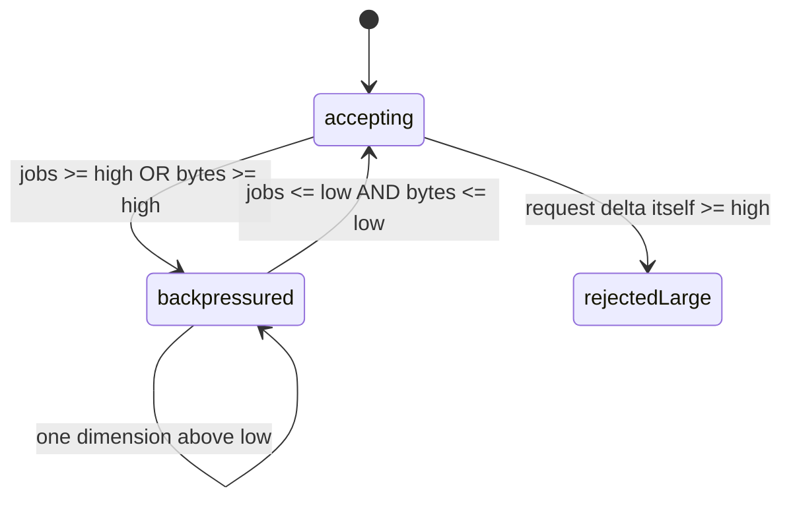

# 上线后怎么查问题

<span class="manual-label">生产运维 · 先看现象，再看指标</span>

<span id="sc12-observability"></span>
## 先判断是哪类问题

上线后排查 Queuebit，不要先背指标名。先回答四个问题：任务有没有堆积、Worker 有没有在跑、Redis 是否 ready、数据库批处理是不是停在某个 Run。

| 现象 | 先执行 | 通常说明 |
|---|---|---|
| 新任务变慢或开始排队 | `queue inspect` | Worker 不够、下游变慢、队列进入背压 |
| Worker 没在处理 | `workers inspect` | 进程挂了、正在 drain、配置版本不一致 |
| API 返回 503/429 | `health inspect` / `queue inspect` | Redis 不可用、Redis policy 不安全、队列太满 |
| 数据库批处理不推进 | `run inspect` / `coordinator inspect` | source 慢、没有 Worker、结果回写失败 |

最常用的四条命令：

```bash
npx queuebit queue inspect notification --config queuebit.config.ts --json
npx queuebit workers inspect --queue notification --config queuebit.config.ts --json
npx queuebit health inspect --config queuebit.config.ts --json
npx queuebit run inspect <runId> --config queuebit.config.ts --json
```

## 四个视图分别看什么

```bash
npx queuebit queue inspect notification --config queuebit.config.ts --json
npx queuebit workers inspect --queue notification --config queuebit.config.ts --json
npx queuebit coordinator inspect --config queuebit.config.ts --json
npx queuebit health inspect --config queuebit.config.ts --json
```

| 视图 | 先看 | 能回答 |
|---|---|---|
| Queue | waiting/active/delayed/retrying/failed、`oldestWaitingMs`、jobs/bytes 水位 | 工作卡在哪个状态 |
| Workers | ready/draining、concurrency、activeJobs、heartbeat、version | 有没有足够且版本一致的 Worker |
| Coordinator | active Runs、cursor、inFlightBatches、dispatchHoldReason、source/completion 错误 | 批处理为什么暂停或变慢 |
| Health | ready/degraded/not_ready/draining 和 checks | Redis、policy、角色租约是否安全 |

## 容量够不够：先用粗略算法

```text
Worker 总并发 = 所有 ready Worker 的 concurrency 之和
单个 Run 最多同时处理的记录数 = pageSize * maxInFlightBatches
任务启动速率 ~= Worker 总并发 / 平均处理时间
```

这个算法只是排查起点，不是压测替代。比如一条数据库记录可能生成多个 job，payload 也可能很大，所以最终还要看实际 jobs 数、序列化后的 bytes、下游限流和 Redis 容量。

应用代码可以调用 `queuebit.capacity.snapshot()` 读取已声明 Queue 的 jobs/bytes 水位。CLI inspect 适合人工排查；`capacity.snapshot()` 适合 readiness、dashboard 或本地 alert evaluation。

## 背压：什么时候拒绝，什么时候恢复

背压就是 Queuebit 的容量保护：队列太满时先拒绝新 work，等队列降到恢复线以下再自动接受。



暂时没有余量时，提交会返回可重试的 `QB_BACKPRESSURE_REJECTED`。单次请求本身过大时，会返回不可重试的 `QB_BACKPRESSURE_REQUEST_TOO_LARGE`；这时要缩小 page、bulk、fan-out 或 payload，而不是等它自动恢复。

BatchRun 暂停时常见的 `dispatchHoldReason` 有 `interval`、`in_flight_limit`、`backpressure`、`no_active_worker`、`redis_reconnecting`。这些是自动等待原因，条件消失后会继续推进，不需要手动 resume，也不会消耗 source/dispatch retry。

## 指标：先收能回答问题的少数几个

默认 `observability.metrics.prefix=queuebit_`。先用这些进程内基础样本回答“有没有进来、有没有处理、有没有失败、角色是否还活着”：

| 指标后缀 | 先用来判断 |
|---|---|
| `jobs_submitted_total` / `job_data_bytes_submitted_total` | Producer 是否还在提交，以及 payload 是否变大 |
| `worker_jobs_claimed_total` / `worker_jobs_completed_total` / `worker_jobs_failed_total` | Worker 是否在消费、成功或失败 |
| `worker_job_duration_ms_count` / `worker_job_duration_ms_sum` | 平均处理耗时是否变长 |
| `worker_job_attempts_total` / `worker_stalled_jobs_recovered_total` | 是否重试变多、Worker 是否经常被接管 |
| `role_heartbeats_total` / `role_drain_requests_observed_total` | Worker/Coordinator 是否还活着，是否在发布退出 |
| `coordinator_runs_advanced_total` / `coordinator_jobs_created_total` | BatchRun 是否还在推进和创建 job |
| `completion_events_delivered_total` | 结果回写是否还在交付 |

Queuebit core 提供进程内 registry、Prometheus render、`observabilityHttp.handle()` response helper 和 `alerts.evaluate()` 本地 findings，但不启动 HTTP server。你的应用负责挂载、鉴权和隔离 health/metrics endpoint。

有些页面视图现在来自 CLI inspect 或 `capacity.snapshot()`，不一定都有独立 Prometheus series：

| 你想看什么 | 现在怎么覆盖 |
|---|---|
| Queue 各状态深度 | `queue inspect` 状态样本 + capacity counters |
| 最老 waiting 的等待时间 | `queue inspect` 的 `oldestWaitingMs` |
| BatchRun / completion 积压 | `run` / `completion` inspect + coordinator metrics |
| role lease 是否有效 | `workers` / `coordinator` inspect heartbeat |

不要把旧文案或 dashboard 里的设想指标名当成当前一定导出的 Prometheus series。

## 告警：从少量规则开始

| 告警 | 观测窗口 | 首个动作 |
|---|---|---|
| oldest waiting 超过业务 SLO | 持续 5 到 15 分钟 | 看 Worker 容量、下游延迟和背压 |
| stalled recoveries 增长 | 单位时间增量 | 查 Worker 崩溃、event loop、renew 和 Redis latency |
| completion failed > 0 | 立即 | 修复 handler/下游，只重试 completion event |
| `role_lease_valid=0` 且还有待推进 work | 超过 2 个 lease 窗口 | 查候选进程、domain 和 Redis 连接 |
| server policy degraded/not_ready | 立即 | 停止放行新 work，修复 noeviction、persistence 或 role |
| queue bytes 接近 high | 趋势 | 降低 page、fan-out 或 payload，核对 Redis 容量 |

阈值来自业务 SLO 和压测结果，不要把“队列非空”本身当成事故。

`queuebit.alerts.evaluate()` 可以作为本地 smoke check、简单探针和默认 dashboard 的起点。生产环境仍建议把阈值放进你的监控系统，并分别抓取所有 Producer、Worker、Coordinator 进程后聚合。

Completion retention 由独立的 `retention.completionEvents.ageMs/maxCount` 控制。父 Run 已终态后，delivered 或 not_required Completion event 可以被清理；pending、retrying、delivering 或 failed Completion event 仍会保留给恢复和告警。

## 日志里至少带这些关联键

`namespace`、`queue`、`runId`、`batchId`、`jobId`、`eventId`、`attempt`、`leaseGeneration`、`workerId`、`coordinatorId`、`advancementOwnerId`、`errorCode`。

默认不要记录完整 input、job data、result、Redis 密码或敏感业务 payload。

## 优雅退出：发布时让 Worker 停下来

```bash
npx queuebit worker drain --queue notification --worker-id worker-a --reason rolling-release --config queuebit.config.ts
npx queuebit coordinator drain --coordinator-id coordinator-a --reason rolling-release --config queuebit.config.ts
```

远程 drain 命令只是告诉目标进程“准备退出”，不会等它真的停完。SDK 服务宿主在自己的 shutdown 生命周期调用 `worker.drain()`、`coordinator.drain()` 或 `queuebit.close()`；Queuebit 不会安装 signal handler。只有可选 CLI 角色宿主收到 SIGTERM 时自动 drain。每种宿主使用自己的 drain timeout；超时后停止续租并报告失败，不会伪造业务成功或失败状态。
