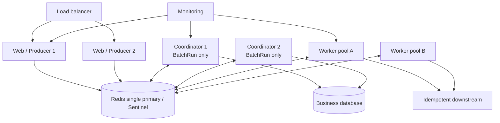

# 生产上线怎么部署

<span class="manual-label">生产运维 · Redis、Worker、Coordinator、启动顺序</span>

Queuebit 上线不需要接入项目仓库里的测试流水线。普通项目只需要：连接一个可靠 Redis，启动 Web/API Producer，独立启动 Worker；如果用 `runs.start` 批量处理数据库记录，再独立启动 Coordinator。

<span id="sc10-redis-production"></span>
## 先按环境选路径

| 你的环境 | 推荐做法 |
|---|---|
| 本地或试用 | 单 Redis + 一个 Worker；先跑通 [快速开始](./quick-start.md) |
| 生产单 Redis / 托管 Redis | Redis `>=7.2`、`noeviction`、持久化/备份、TLS/ACL |
| Sentinel | 至少两个 Sentinel 地址，接受异步复制 failover 窗口可能丢写 |
| Kubernetes / 容器 | Web、Worker、Coordinator 分开 Deployment |
| 只用直接 Job | Web/API Producer + Worker 即可 |
| 用 BatchRun 扫数据库 | Web/API Producer + Worker + Coordinator |



Web 实例只创建 work；Worker 执行业务 job；Coordinator 只在 BatchRun 场景分页推进数据库记录。Redis 是 Queuebit 唯一共享状态。

## Redis 必须满足

| 要求 | 为什么 | 怎么查 |
|---|---|---|
| Redis `>=7.2` | Queuebit 需要这些 Redis 能力 | `INFO server` |
| `maxmemory-policy=noeviction` | 队列状态不能被内存淘汰 | `CONFIG GET maxmemory-policy` |
| 持久化开启且无错误 | 明确 RPO，能从备份恢复 | `INFO persistence` |
| ACL + TLS | 限制网络和命令访问 | 连接 preflight |
| 备份恢复演练 | Sentinel 不是零丢写 | 定期 restore drill |
| `serverPolicy.mode=strict` | 不把未知/不安全 Redis 伪装成 ready | `health inspect --json` |

Redis Cluster 不在 v0.1 支持范围。Sentinel failover 可能丢失尚未复制的已确认写；Queuebit 只能恢复 Redis 中仍存在的状态。

项目仓库里的 Redis/Sentinel 环境脚本只服务维护者发布验证：direct Redis 使用 `QUEUEBIT_REDIS_URL` 或 `QUEUEBIT_REDIS_HOST`，Sentinel 使用 `QUEUEBIT_REDIS_SENTINEL_MASTER` 和 `QUEUEBIT_REDIS_SENTINELS`。它们不是用户接入 Queuebit 的必选路径。演练清理只允许删除本次创建的 Queuebit namespace，不清理共享 Redis 中的其他 key。

## 角色怎么部署

| 角色 | 最小生产数量 | 什么时候扩 |
|---|---:|---|
| Web/API Producer | 2 | HTTP 请求增长 |
| Worker | 2+ | waiting age 增长、下游还有容量 |
| Coordinator | 2 | 同时 active Runs 增多，source DB 还有容量 |
| 时间推进 | 由 2+ Worker 竞争 | delayed/retrying job 堆积 |

readiness 要检查 Redis、角色资格和业务依赖。liveness 只表示进程活着，不能替代 readiness。

## 启动顺序

1. 先确认 Redis policy、持久化、primary role 和连接。
2. 跑 `config validate --runtime`，阻断未注册 handler 或版本漂移。
3. 启动 Worker 服务宿主，确认 heartbeat 和时间推进可用。
4. 如果使用 BatchRun，启动 CoordinatorRunner 服务宿主，确认 source/completion 依赖可用。
5. 最后放开 Web/API 创建新 work。

```ts title="worker-host.ts"
import {
  createQueuebitClient,
  createQueuebitRuntimeProcessor
} from 'queuebit';
import config from './queuebit.config.js';
import runtime from './queuebit.runtime.js';

export async function startWorkerHost() {
  const workerClient = await createQueuebitClient({ config });
  const worker = workerClient.createWorker(
    'notification',
    createQueuebitRuntimeProcessor(runtime),
    { workerId: 'worker-a', concurrency: 8, drainTimeoutMs: 60_000 }
  );
  worker.start();

  return {
    async close() {
      await workerClient.close({ timeoutMs: 60_000 });
    }
  };
}
```

```ts title="coordinator-host.ts · 仅 BatchRun"
import { createQueuebitClient } from 'queuebit';
import config from './queuebit.config.js';
import runtime from './queuebit.runtime.js';

interface ErrorLogger {
  error(context: { event: unknown }, message: string): void;
}

export async function startCoordinatorHost(logger: ErrorLogger) {
  const coordinatorClient = await createQueuebitClient({ config });
  const coordinator = coordinatorClient.createCoordinatorRunner(runtime, {
    coordinatorId: 'coordinator-a',
    concurrency: 2,
    onError: event => logger.error({ event }, 'Queuebit coordinator error')
  });
  coordinator.start();

  return {
    async close() {
      await coordinatorClient.close({ timeoutMs: 60_000 });
    }
  };
}
```

这些导出的服务宿主函数如何被调用由你的进程管理器决定。保留它们返回的 service，并在宿主 shutdown 生命周期调用其 `close()`。Queuebit 不会在 import 时安装 signal handler 或启动角色。`npx queuebit config validate` 只用于可选的部署前配置检查，不是运行时接入机制。

Producer 不应在没有 active Worker 时无界创建 work。Queue 的 jobs/bytes 背压只是最后一道保护，不代替启动顺序和容量规划。

## 容器 / Kubernetes 注意事项

- Worker 和 Coordinator 用独立 Deployment，不要藏在 Web Pod sidecar 里。
- `terminationGracePeriodSeconds` 大于当前角色 `drainTimeoutMs`，并预留业务资源关闭时间。
- Redis 短暂中断时，不要用 liveness 快速循环杀死后台角色；后台会停止新 work 并持续重连。
- 每个进程暴露自己的 metrics/health，由监控系统汇总；不要把单进程 gauge 当集群总量。
- 滚动发布时，新旧 Worker 都要能处理在途 payload schema。

## 配置版本和滚动发布

- Run 创建时会保存 definition `version`、解析后策略和 config digest。
- 新 Coordinator 必须能识别在途旧 definition，或者先等旧 Runs 结束。
- Job payload 带业务 `schemaVersion`，新旧 Worker 在滚动窗口内都要兼容。
- 修改 `pageSize`、source、mapper、completion 时提升 definition version，不改写已存在 Run。
- inspect 暴露 package version/config digest；同 namespace 出现不兼容 digest 时应告警。

## 上线前验收

```bash
npx queuebit health inspect --config queuebit.config.ts --json
npx queuebit workers inspect --queue notification --config queuebit.config.ts --json
npx queuebit coordinator inspect --config queuebit.config.ts --json
npx queuebit queue inspect notification --config queuebit.config.ts --json
```

如果用应用代码验收，启动后调用 `queuebit.capacity.snapshot()` 读取已声明 queue 的 counters、jobs/bytes 水位、使用率和 backpressure 状态。它不扫描任意 Redis key，只作为容量 readiness 视图。

必须演练：Worker 处理中崩溃、Coordinator 分页/派发边界崩溃、时间推进接手、Redis 中断重连、Sentinel failover 丢写边界、completion handler 失败与 drain timeout。具体步骤见 [故障恢复](./failure-runbooks.md)。
