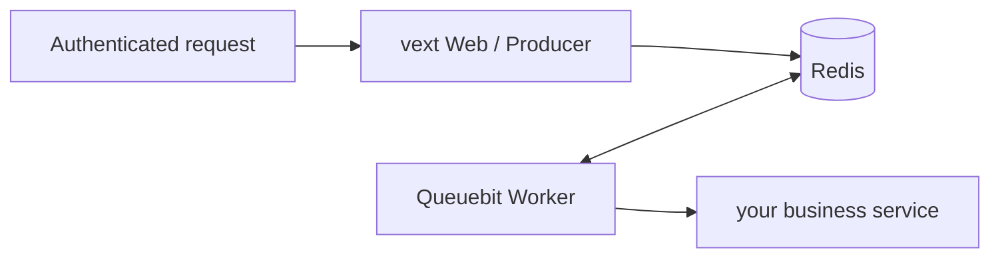

# vext 项目如何接入 Queuebit

<span class="manual-label">按需能力 · 在 vextjs@0.3.26 中使用 Queuebit</span>

如果你的项目不是 vext，按普通 Node 接入即可：创建 Queuebit client、启动 Worker 进程。vext 项目只多一件事：把长连接 client 作为 vext plugin 注入到 `app.queuebit`。

第一次接入 vext 时，先在 route 里调用 `app.queuebit.jobs.add()` 提交一个普通 job。只有需要数据库分页批处理时，才在 route 里调用 `app.queuebit.runs.start()`。

<span id="sc11-vext-integration"></span>
## 先看整体关系

| 位置 | 做什么 | 重要边界 |
|---|---|---|
| `src/plugins/queuebit.ts` | 创建 vext plugin，注入 `app.queuebit` | Web 进程只做 Producer |
| vext route | 认证、校验输入、调用 `app.queuebit.jobs.add` | tenant 必须服务端推导 |
| Worker 进程 | 执行业务 processor | 独立启动，不跟随 `vext start` |
| Coordinator 进程 | 只在 BatchRun 场景推进数据库分页 | 普通 job 不需要 |
| metrics/readiness | 由 vext 应用自己挂载和保护 | Queuebit core 不开隐藏 HTTP server |



`vext start` 只启动 Web/Producer。Queuebit Worker 是显式独立进程/容器；vext cluster worker 数不等于 Queuebit Worker 数。

## 1. 新增 vext plugin

```ts
// src/plugins/queuebit.ts
import { defineAppExtensions } from 'vextjs';
import { type QueuebitClient } from 'queuebit';
import { createQueuebitVextPlugin } from 'queuebit/vext';
import queuebitConfig from '../../queuebit.config.js';

export const appExtensions = defineAppExtensions<{
  queuebit: QueuebitClient;
}>();

export default createQueuebitVextPlugin({
  config: queuebitConfig
});
```

vext 会扫描 `src/plugins/`，通常不需要在 `vext.config.ts` 手工加 `plugins[]`。`defineAppExtensions` 放在本地 plugin 文件中，方便 `vext typegen` 把 `app.queuebit` 加进应用类型。adapter 会在应用生命周期内复用一个 Queuebit client，不会在每个 route 后关闭。

高级选项放在这里查：

| 选项 | 默认值 | 说明 |
|---|---|---|
| `config` | 必填 | Queuebit config 对象，或 `(app) => config` resolver |
| `extensionName` | `queuebit` | 注入到 `app` 上的属性名 |
| `pluginName` | `queuebit` | vext plugin 名称 |
| `dependencies` | 无 | vext plugin 依赖名 |
| `logger` | 适配 app.logger | Queuebit logger 对象，或 `(app) => logger` resolver |
| `clientOptions` | 无 | 高级 `createQueuebitClient` 选项，例如测试中注入 Redis client |
| `onClient` | 无 | client 创建并注入后的 hook |

普通应用不要碰 `clientOptions.redis`，除非你明确自己管理 Redis command client 生命周期。

## 2. 在 route 里提交一个普通 job

```ts
// src/routes/send-receipt.ts
import { defineRoutes } from 'vextjs';

export default defineRoutes((app) => {
  app.post(
    '/receipts',
    {
      auth: true,
      validate: { body: { orderId: 'string!' } }
    },
    async (req, res) => {
      const { orderId } = req.valid('body');
      const tenantId = await app.services.tenants.requireTenantId(
        req.auth.userId
      );

      const job = await app.queuebit.jobs.add(
        'notification',
        'send-receipt',
        { tenantId, orderId }
      );

      res.json({ jobId: job.id, state: job.state }, 202);
    }
  );
});
```

不要信任 request body 里的 `tenantId`；从认证用户在服务端推导。Queuebit core 不负责业务租户授权，对外暴露 job/run/failure 查询前，由 vext 应用自己判断权限。

## 3. 只有数据库批处理时才调用 `runs.start`

```ts
// src/routes/start-receipt-campaign.ts
import { defineRoutes } from 'vextjs';

export default defineRoutes((app) => {
  app.post(
    '/receipt-campaigns',
    {
      auth: true,
      validate: { body: { paidBefore: 'string!' } }
    },
    async (req, res) => {
      const { paidBefore } = req.valid('body');
      const tenantId = await app.services.tenants.requireTenantId(
        req.auth.userId
      );
      const run = await app.queuebit.runs.start('receipt-campaign', {
        input: { tenantId, paidBefore },
        idempotencyKey: `receipt:${tenantId}:${paidBefore}`
      });

      res.json({
        runId: run.id,
        deduplicated: run.deduplicated,
        executionState: run.executionState,
        completionState: run.completionState
      }, 202);
    }
  );
});
```

这段只用于 [批量处理数据库记录](./batch-runs.md)。首次创建和重复相同幂等请求都返回 202 和同一 `runId`，用 `deduplicated` 区分。

## 4. HTTP 错误怎么返回

| 情况 | HTTP | 说明 |
|---|---:|---|
| 未认证/无权 | 401/403 | 交给 vext auth |
| 请求格式错误 | 400 | vext validate 失败 |
| BatchRun input 不合法 | 422 | `QB_RUN_INPUT_INVALID` |
| 相同 key 不同 input，或状态不允许 | 409 | deduplication/state conflict |
| 队列背压 | 429 | 只有知道可重试时才返回 `Retry-After` |
| Redis 不可用 / strict policy 失败 | 503 | 不要伪装成已受理 |
| 未知错误 | 500 | 不返回 stack、cause 或完整 input |

## 5. 分别启动 Web 和 Worker

```bash title="Web / Producer"
vext start
```

```bash title="Worker"
npx queuebit worker start --config queuebit.config.ts --runtime queuebit.runtime.ts --queue notification
```

只有使用 BatchRun 时，才再启动 Coordinator：

```bash title="Coordinator · BatchRun only"
npx queuebit coordinator start --config queuebit.config.ts --runtime queuebit.runtime.ts
```

v0.1 用户路径使用上述 core CLI 角色命令。不要寻找 vext 专用的 Worker/Coordinator 启动入口；只有未来版本明确发布这些入口时，才改用对应路径。

## 6. reload 和关闭

- Web reload 会触发 plugin `onClose`，释放当前 client 连接。
- 关闭 Web 不会取消 Redis 中已存在的 jobs/runs。
- Worker/Coordinator 有自己的 SIGTERM drain，不绑定 Web reload。
- `queuebit.runtime.ts` import 不建立 DB/HTTP 连接；只有当前角色激活对应 factory 才打开资源。

## 7. 上线前验收

- 两个 Web 实例用同一 `idempotencyKey` 重复 start，只得到一个 Run。
- vext cluster 重启不会启动重复 Worker/Coordinator。
- 两个 Queuebit Worker 确实处理同一 queue 的 jobs。
- tenant A 不能查询 tenant B 的 run、failure payload 或 job result。
- metrics/readiness endpoint 由 vext 应用挂载并保护。
- reload 后旧 client 连接释放，但 Redis work 继续存在。
