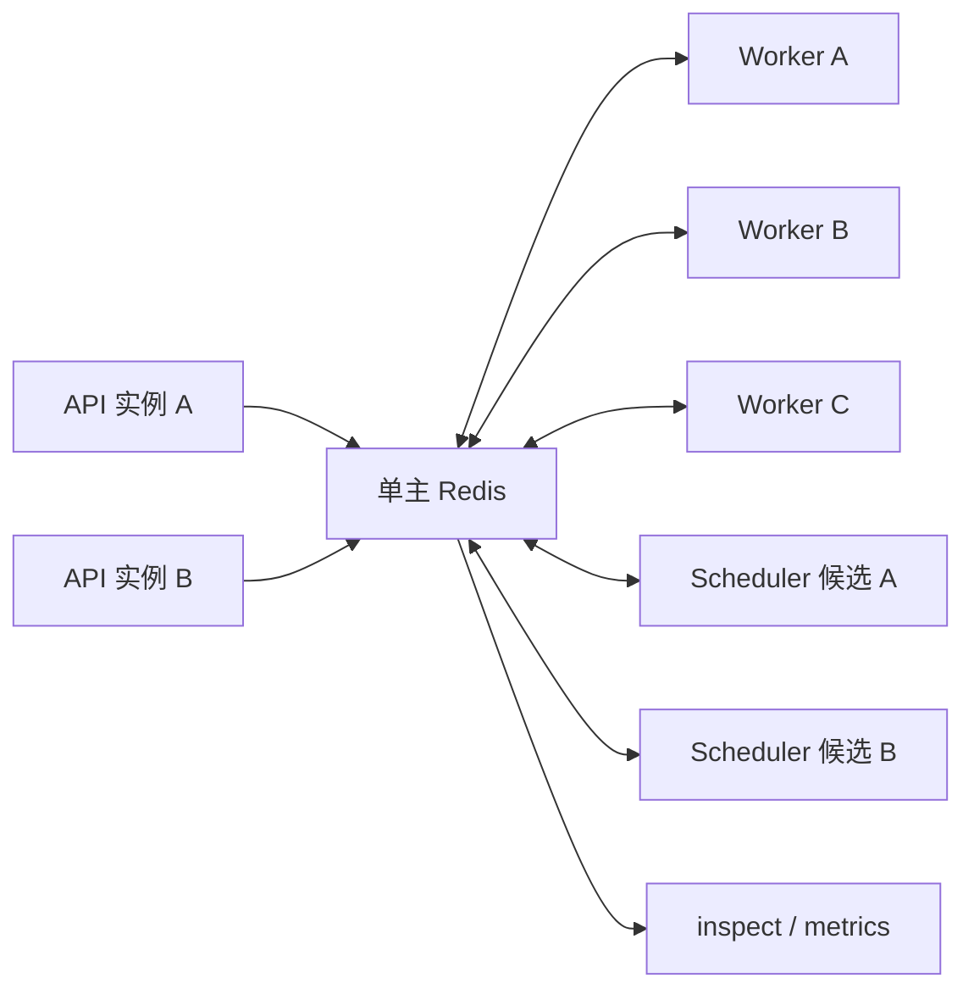
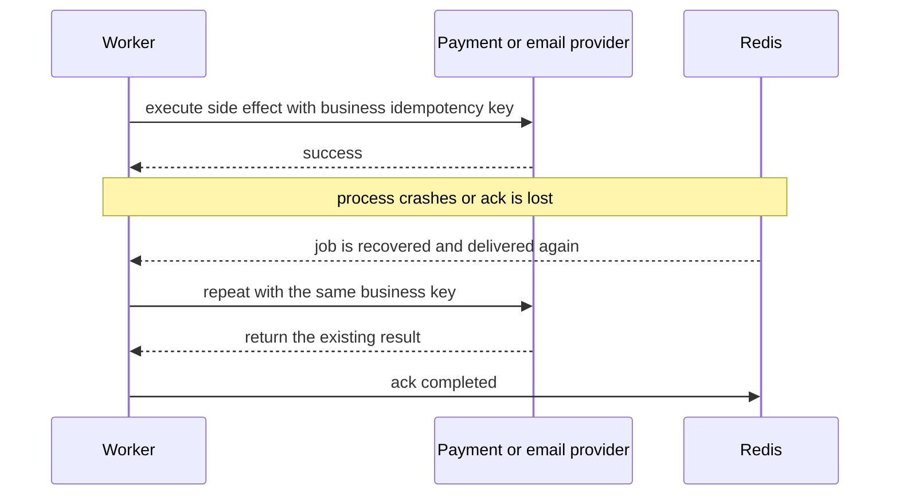

# 分布式 Worker

<!-- queuebit-v01-legacy-doc -->
> [!WARNING]
> **历史文档，已停止维护。** 当前 v0.1 最终用户手册位于 [`docs/v01/zh`](../v01/zh/index.md)。本页仅保留历史上下文，API、命令、配置和示例不得用于新接入或实现。

<span class="manual-label">集群运行手册</span>

queuebit 的正式运行模型是多个进程或节点共享一个单主 Redis。Producer 只入队，Worker 竞争领取 job，Scheduler 候选共同竞争一个单活资格。Redis Cluster 在 v0.1 不支持。



<span id="s07-multi-worker"></span>
## S07 横向扩展 Worker

在多台机器上使用相同的 Redis 连接、`namespace` 和 queue name 启动 Worker，并为每个实例设置可追踪的进程身份。job 通过 Redis 中的原子声明和 lease 分配，不依赖负载均衡器，也不需要静态分片。

扩容前先估算：`总并发 = 健康 Worker 数 × 单实例 concurrency`。下游限额、数据库连接池和 CPU 是上限。扩容后执行 `npx queuebit inspect workers --queue notification --config queuebit.config.ts`，确认新增心跳、唯一 identity 和预期总并发。

同一业务键的 jobs 可能被不同 Worker 并发处理。v0.1 不提供优先级和全局顺序保证；需要顺序时，应在业务模型中按聚合键串行化或拒绝并发更新。

<span id="s08-drain"></span>
## S08 发布前 drain

```bash
npx queuebit worker drain --config queuebit.config.ts --queue notification --timeout 30s
```

Drain 后实例停止领取新 job，但继续处理已 active 的 job。成功标准是该实例 `draining: true`、active 数降为 0，然后进程退出。超时不是 job 成功：进程退出后，未确认 job 等 lease 过期并由 active Scheduler 恢复。

发布平台的终止宽限期必须大于 `drainTimeoutMs`，并预留进程关闭 Redis 连接的时间。不要先发送强制终止再调用 drain。

<span id="s09-rolling-reload"></span>
## S09 滚动发布与 vext reload

1. 保持至少一个旧 Worker 健康。
2. 启动新版本 Worker，等待心跳和启动检查通过。
3. 对一个旧实例执行 drain，等待 active 清零后终止。
4. 逐个替换剩余实例。
5. 对 Scheduler 也逐个替换，但始终观察 active identity；不要把两个候选都当 active。

vext Web/API reload 只影响 Producer 进程，不应隐式启动或停止 Worker。若 payload schema 发生变化，先部署能同时读取旧/新 payload 的 Worker，再部署 Producer，最后移除兼容读取。

<span id="s10-worker-crash"></span>
## S10 Worker 处理中崩溃

崩溃后 Redis 中的 job 仍为 `active`，直到 lease 到期。active Scheduler 将其识别为 stalled 并重新放回可执行路径，因此 job 可能在另一 Worker 再次运行。

操作顺序：

1. 不手工删除 active job，也不立即重复提交。
2. 恢复 Worker 容量，确认 Scheduler active。
3. 观察 `stalled` 和 `stalledRecoveries` 增量。
4. 通过业务幂等记录确认第一次执行是否已产生副作用。
5. job 完成后关联两次 attempt 的日志和外部请求 ID。

<span id="s11-ack-redelivery"></span>
## S11 业务成功但 ack 不确定

最危险的窗口是下游已经成功、Worker 尚未把完成状态写回 Redis。网络断开或进程崩溃会让 job 再次投递。



`idempotencyKey` 去重入队，不能自动去重外部副作用。必须让下游接受同一个业务幂等键，或在本地数据库中原子记录处理状态。完整实现见 [业务幂等模式](./idempotency-patterns.md)。

<span id="s13-scheduler-single-active"></span>
## S13 运行多个 Scheduler 候选

为高可用可以运行多个候选，但同一 scheduling group 必须使用相同稳定 `domain`。只有能证明自己持有资格的实例才能推进 delayed、retrying 和 stalled；资格不确定时停止推进，而不是冒险双写。

```bash
npx queuebit inspect scheduler --domain billing-notification --config queuebit.config.ts
```

正常输出应只有一个 active identity，其他候选为 standby。不同环境使用不同 namespace，避免测试和生产候选竞争同一个 domain。

<span id="s14-scheduler-failover"></span>
## S14 Scheduler 故障接管

active Scheduler 停止后，delayed、retrying 和 stalled 的推进会短暂停顿；正在运行的正常 Worker job 不因此失败。候选在旧资格过期并成功取得新资格后继续推进。

演练时记录：旧 active identity、停止时间、新 active identity、接管时间、期间 delayed/retrying 深度和是否出现双 active。若长时间没有 active，检查候选进程、domain、namespace、Redis 延迟和主节点连通性；不要启动一个不同 domain 的 Scheduler 来“临时推进”。

## 容量与安全边界

| 问题 | v0.1 答案 |
|------|-----------|
| 多 Worker 会重复领取同一 attempt 吗 | 正常情况下由 Redis 原子声明阻止；故障恢复可以产生新的 attempt |
| 是否保证严格顺序 | 不保证；并发和重试都会改变完成顺序 |
| 是否有全局并发/限流 | 没有内置；由业务侧统一控制 |
| 是否支持 Redis Cluster | 不支持；使用 standalone、托管单主或 Sentinel 连接层故障转移 |
| Scheduler 是否能只运行一个进程 | 可以，但没有故障接管；生产建议多个候选、一个 active |

## 下一步

- 选择 lease、并发和 Scheduler 参数：[配置场景与配方](./configuration-recipes.md)
- Redis 或 Scheduler 故障操作：[故障处置手册](./failure-runbooks.md)
- 上线拓扑清单：[生产部署](./production-deployment.md)
