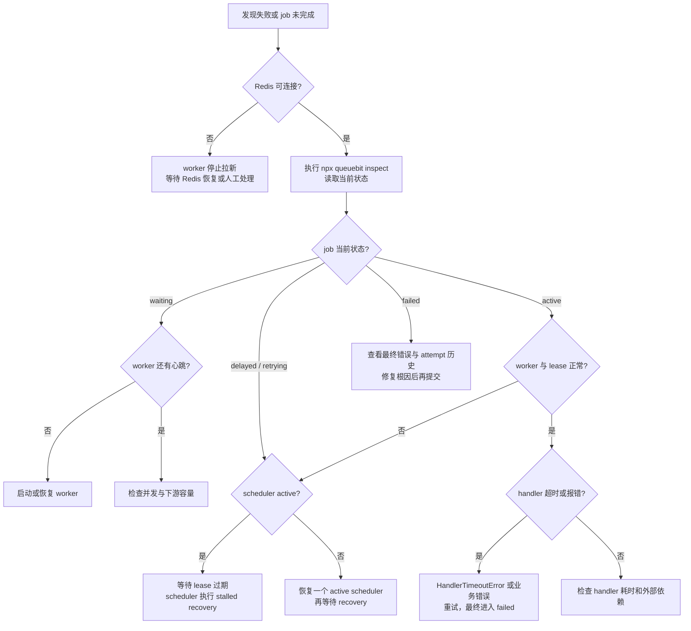

# 故障模式与恢复

<!-- queuebit-v01-legacy-doc -->
> [!WARNING]
> **历史文档，已停止维护。** 当前 v0.1 最终用户手册位于 [`docs/v01/zh`](../v01/zh/index.md)。本页仅保留历史上下文，API、命令、配置和示例不得用于新接入或实现。

## 页面定位

用户恢复手册

当 job 没有按预期完成时，用本页判断失败发生在 Redis、Worker、Scheduler 还是业务 handler，并选择下一步动作。

## 恢复原则

queuebit 的恢复策略遵循：

- 优先保持 job 可恢复，不追求 exactly-once。
- 不确定时停止推进，而不是冒险写入错误状态。
- 所有恢复动作都必须可观察。
- 使用者需要为业务副作用设计幂等或去重。

## 失败处理总流程

失败处理要先分清“谁失败了”：Redis、worker、scheduler、handler 或关闭流程。不同失败点的处理方式不同。

节点说明：

| 节点 | 处理原则 |
|------|----------|
| Redis 不可连接 | 不继续声明新 job，避免状态不确定扩大 |
| worker 无心跳 | 不假设 job 失败，等待 lease/recovery 判定 |
| handler 报错 | 按 retry/backoff 重试，业务 handler 必须幂等 |
| scheduler 不 active | 暂停 delayed/retry 推进，先恢复 single-active |
| inspect 输出 | 用户判断下一步的第一入口 |

## 故障矩阵

| 故障 | 你会看到什么 | 使用者动作 |
|------|--------------|------------|
| Redis 启动时不可用 | producer/worker/scheduler 启动失败或进入退避 | 修复 Redis，确认 namespace/连接配置 |
| Redis 处理中短暂不可用 | worker 停止 claim，续租失败进入不确定路径 | 观察 retry/stalled 指标，确认业务幂等 |
| Worker 进程崩溃 | lease 过期后 job 进入 stalled recovery | 检查 worker 日志和重复执行风险 |
| Handler 抛错 | 进入 retry 或 terminal failed | 查看错误摘要、attempts、backoff |
| Handler 超时 | 记录 `HandlerTimeoutError`，中止 `ctx.signal`，当前 attempt 重试或失败 | 向下游传递 signal，确认副作用后调整 `timeoutMs` 或拆分任务 |
| Ack 丢失 | job 可能被再次投递 | 业务用 idempotency key 防重复副作用 |
| Lease 续租失败 | worker 停止拉新，active job 等待恢复 | 检查 Redis 延迟、网络和 worker 负载 |
| Scheduler 双实例竞争 | 只有 active scheduler 推进；不确定时停止 | 检查 scheduler domain 和 identity |
| Delayed 未推进 | scheduler 未运行或失去单活 | 查看 scheduler identity 与 delayed depth |
| Drain 超时 | 已声明 job 按 lease/recovery 规则处理 | 缩短 job、提高 shutdown timeout 或拆分任务 |

## 使用者排查路径

当 job 没有按预期完成时，按这个顺序排查：

1. Queue depth 是否增加？如果没有，先看 producer enqueue 是否成功。
2. Active jobs 是否持续不变？如果是，检查 worker 是否运行和 lease 是否续租。
3. Delayed / retry 是否堆积？如果是，检查 scheduler 是否 active。
4. Stalled recovery 是否增加？如果是，检查 worker crash、Redis 延迟或 handler 超时。
5. Failed jobs 是否增加？如果是，查看错误摘要和 attempt 轨迹。

## 幂等建议

At-least-once 下，业务 handler 应考虑：

- 使用业务唯一键或 job id 做幂等。
- 对外部副作用使用“先检查后写入”或状态机保护。
- 将长任务拆小，避免 lease 和 drain 窗口过大。
- 记录处理开始、成功、失败和外部请求 id。

queuebit 可以提供 idempotency key 入口，但不能替业务系统证明 exactly-once。

## 上线前演练

- 停止一个 Worker，确认 lease 过期后 stalled recovery 增加且 job 能重新处理。
- 停止 active Scheduler，确认 delayed/retry 暂停，并在候选接管后继续推进。
- 临时阻断 Redis，确认 Worker 停止拉新，连接恢复后状态可继续观察。
- 对同一 `idempotencyKey` 模拟重复投递，确认业务 handler 不产生重复副作用。
- 执行一次 drain，确认新 job 不再被领取，active jobs 在超时前完成或交给恢复路径。
