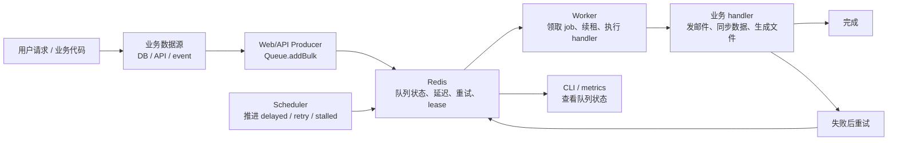

## 本手册定义

v0.1 final user manual

这份站点是 queuebit v0.1 的最终用户使用手册。它按用户接入顺序说明安装、配置、运行、排查和限制；后续开发也以这些用户路径作为验收基线。

用户主路径不从 Redis key 或维护者 checklist 开始，而是先回答：queuebit 是什么、适合谁、怎么安装、业务数据从哪里来、怎么批量提交 jobs、worker 和 scheduler 怎么跑、vext 项目怎么接入、失败时先查哪里。

## 30 秒看懂 Queuebit

如果你第一次看 queuebit，只需要先记住三句话：

1. Web/API 进程只负责提交 job。
2. Worker 进程才负责真正执行 job。
3. Scheduler 进程只负责把 delayed、retry 和 stalled recovery 推回可执行队列。

节点说明：

| 节点 | 作用 | 用户要做什么 |
|------|------|--------------|
| 业务数据源 | 提供要异步处理的真实业务对象 | 从 DB、API、事件或文件读取待处理数据 |
| Web/API Producer | 把业务对象整理成 jobs 并批量提交 | 创建 `Queue`，调用 `Queue.addBulk` |
| Redis | 保存队列、延迟任务、重试和租约状态 | 准备 Redis 7，确认不是 Redis Cluster |
| Worker | 消费 job 并执行业务 handler | 独立启动 worker 进程 |
| Scheduler | 推进 delayed、retry 和 stalled recovery | 独立启动 scheduler 进程 |
| CLI / metrics | 看 job 为什么没跑、卡在哪 | 先用 inspect 查 queue、worker、scheduler |

## 适合谁

queuebit 面向想要 Redis-backed job queue 的 Node.js / vext 项目。它适合以下场景：

- 你需要后台任务、重试、延迟任务和 worker 处理。
- 你希望首版只依赖 Redis，不想同时维护多种队列后端。
- 你关心多实例部署下的 lease、stalled recovery 和 scheduler 单活边界。
- 你希望 Web 进程和 queue worker 拓扑解耦。

如果你的首要需求是 recurring / repeatable jobs、复杂 workflow 编排、dashboard / admin UI 或多队列后端抽象，v0.1 不是目标版本；这些能力应进入后续路线，而不是塞进首版。

## 第一次成功路径

第一次接入按这个顺序完成：

1. 安装 `queuebit`。
2. 准备 Redis，并确认部署形态符合 [运行环境与兼容边界](./compatibility.md)。
3. 在 Web/API 进程从业务数据源读取一批待处理对象，并用 `Queue.addBulk` 批量提交 jobs。
4. 在独立 worker 进程创建 `Worker`，注册 handler 并开始消费。
5. 在独立 scheduler 进程创建 `Scheduler`，推进 delayed、retry 和 stalled recovery。
6. 使用 CLI 或 API inspect queue depth、active jobs、retry pending 和 stalled recovery。
7. 发布或重启时执行 graceful drain。
8. 按 at-least-once 语义验证业务 handler 幂等。

完整代码见 [快速开始](./quick-start.md)。

## 能力边界

| 能力 | v0.1 用户结论 |
|------|---------------|
| 队列后端 | 只接入 Redis，不做 memory / database / SQS / Kafka adapter |
| 投递语义 | at-least-once，业务 handler 需要幂等 |
| 延迟与重试 | 支持 delayed job、attempts、backoff 和 scheduler 推进 |
| stalled recovery | 支持 lease 过期后的恢复扫描和重投递痕迹 |
| Scheduler | 同一 `scheduler.domain` 下 single-active |
| Redis Cluster | v0.1 默认不支持；若检测到 cluster 配置应 fail fast |
| vext | 提供 `queuebit/vext` adapter；Web producer、worker、scheduler 必须显式拆分 |
| Dashboard | 非 v0.1 目标；使用 CLI / metrics / introspection 运维 |

## 用户阅读路径

推荐按这个顺序阅读：

| 阅读目标 | 入口 |
|----------|------|
| 15 分钟跑通第一批 jobs | [快速开始](./quick-start.md) |
| 判断环境、Redis 形态和分布式拓扑是否适配 | [运行环境与兼容边界](./compatibility.md) |
| 理解 Queue、Job、Worker、Scheduler、Lease | [核心概念](./concepts.md) |
| 在 vext 项目接入 queuebit | [vext 接入](./vext-integration.md) |
| 配置进程角色、worker、scheduler 和 CLI | [CLI 与配置](./cli-and-config.md) |
| 排查任务没有完成时先看什么 | [运维与排查](./operations.md) |
| 设计恢复、排查和幂等策略 | [故障模式与恢复](./failure-modes.md) |
| 查 API、配置和命令 | [参考入口](./reference.md) |

## 维护者入口

这些页面用于实现者对齐内部边界，不能替代用户手册主路径：

| 维护目标 | 入口 |
|----------|------|
| 理解 core / adapter 和部署拓扑 | [架构说明](./architecture.md) |
| 对齐公开 API 行为 | [API 参考](./target-api.md) |
| 对齐 Redis keyspace 和状态迁移 | [Redis 模型](./redis-model.md) |
| 实现 worker / scheduler runtime | [Worker 与 Scheduler 生命周期](./worker-lifecycle.md) |
| 防止后续开发偏离手册 | [开发契约](./development-contract.md) |

## 继续阅读

- [快速开始](./quick-start.md)
- [运行环境与兼容边界](./compatibility.md)
- [核心概念](./concepts.md)
- [vext 接入](./vext-integration.md)
- [CLI 与配置](./cli-and-config.md)
- [Redis-only 与分布式恢复](./distributed-semantics.md)
- [故障模式与恢复](./failure-modes.md)
- [运维与排查](./operations.md)
- [参考入口](./reference.md)
- [架构说明](./architecture.md)
- [API 参考](./target-api.md)
- [Redis 模型](./redis-model.md)
- [Worker 与 Scheduler 生命周期](./worker-lifecycle.md)
- [开发契约](./development-contract.md)
