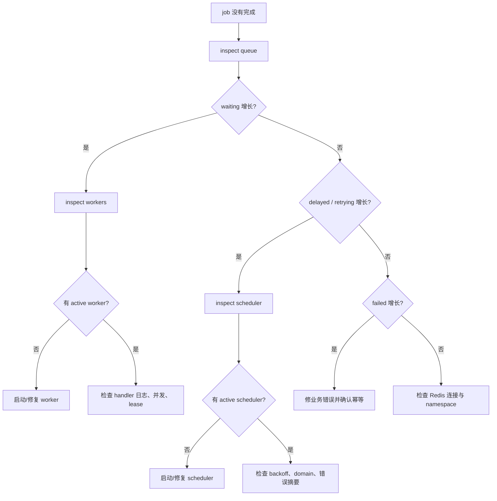

# 运维与排查

<!-- queuebit-v01-legacy-doc -->
> [!WARNING]
> **历史文档，已停止维护。** 当前 v0.1 最终用户手册位于 [`docs/v01/zh`](../v01/zh/index.md)。本页仅保留历史上下文，API、命令、配置和示例不得用于新接入或实现。

## 运维目标

<span class="manual-label">用户运维手册</span>

queuebit 的运维入口优先回答两个问题：

- 队列现在是否健康？
- 如果 job 没有按预期完成，应该从哪里判断原因？

## 排查流程图

job 没有完成时，先用 CLI 判断它卡在哪个阶段，再决定下一步。不要一开始就修改配置或删除 Redis key。



节点说明：

| 节点 | 你要看什么 | 下一步 |
|------|------------|--------|
| inspect queue | waiting / active / delayed / retrying / failed | 判断卡在哪类状态 |
| inspect workers | worker identity、heartbeat、drain 状态 | 没有 worker 就先启动 worker |
| inspect scheduler | active scheduler identity、domain | 没有 scheduler 就先启动 scheduler |
| handler 日志 | 业务异常、外部依赖、超时 | 修业务错误，不要先改队列 |
| Redis / namespace | 连接、namespace、queue name 是否一致 | 修配置并重启对应进程 |

## 指标与自检（Metrics / Introspection）

queuebit v0.1 暴露以下观察面：

- queue depth
- active jobs
- delayed jobs
- retry pending
- stalled recovery count
- active worker identity
- active scheduler identity

这些指标用于帮助使用者区分“没有 job”、“worker 没有消费”、“scheduler 没有推进”和“job 正在恢复”。

## 健康检查矩阵

运维时要把“看到什么指标”和“下一步做什么”连起来。

| 观察项 | 健康含义 | 异常信号 | 可能原因 | 下一步 |
|--------|----------|----------|----------|--------|
| queue depth | 等待数量稳定在业务预期内，或能被 worker 持续消化 | depth 持续增长且 active jobs 为 0 | 没有 worker、worker 配置错误、Redis claim 失败 | 看 worker identity，再看 [CLI 与配置](./cli-and-config.md) |
| active jobs | 数量不超过有效 worker concurrency，且不会长期停留 | active 长期不变、超过预期并发或 lease 接近过期 | handler 卡住、lease 续租失败、worker 崩溃 | 看 [Worker 与 Scheduler 生命周期](./worker-lifecycle.md) |
| delayed jobs | 未到期 job 保留在 delayed，到期后被推进 | 到期后仍不进入 waiting | scheduler 未启动、scheduler domain 冲突、Redis 原子迁移失败 | 看 active scheduler identity 与 [Redis 模型](./redis-model.md) |
| retry pending | 失败 job 按 backoff 等待，并在到期后重试 | retry pending 持续增长 | handler 持续失败、外部依赖不可用、backoff 配置过激 | 看错误摘要与 [故障模式与恢复](./failure-modes.md) |
| stalled recovery count | 偶发且能回落 | count 快速增长或周期性尖峰 | worker 频繁崩溃、lease 太短、任务超过预期耗时 | 调整 lease / concurrency，并验证幂等 |
| active worker identity | 期望的 worker 实例持续心跳 | worker 缺失、重复身份、心跳过期 | 部署副本未启动、身份生成不稳定、drain 卡住 | 检查 worker 启动配置和 drain 状态 |
| active scheduler identity | 同一 domain 只有一个 active scheduler | 无 active、多个候选都认为自己 active、频繁切换 | domain 配置不一致、Redis 续期失败、时钟/连接抖动 | 停止推进，确认 single-active 策略 |
| drain state | drain 后停止拉新，active jobs 在窗口内归零 | drain 超时、仍继续 claim 新 job | shutdown hook 未接入、handler 不响应取消、drainTimeout 过短 | 看 worker lifecycle 和配置错误 |

## 卡住任务恢复（Stalled recovery）

Stalled recovery 处理的是 worker 持有 job 后失联、超时、无法续租或 ack 丢失的情况。

运维输出必须说明 stalled recovery count、恢复窗口和重复投递风险：

- stalled recovery 不是“正常吞吐指标”，持续增长应视为故障信号。
- 运维输出必须能区分“worker 正在 drain”和“worker 已失联”。
- 重投递后必须提醒业务 handler 遵守幂等。
- 如果 scheduler 无法确认单活资格，应该停止推进，而不是冒险恢复。

## 故障模式（Failure modes）

本页覆盖：

- Redis 不可用
- worker 崩溃
- scheduler 单活资格不可确认
- lease 续租失败
- ack 丢失
- graceful drain 超时

每种 failure mode 都应该有“系统会怎么做”和“使用者应该怎么排查”两个视角。

## 排查步骤（Troubleshooting）

排查时先运行 inspect：

```bash
npx queuebit inspect queue notification --config queuebit.config.ts
npx queuebit inspect workers --queue notification --config queuebit.config.ts
npx queuebit inspect scheduler --domain billing-notification --config queuebit.config.ts
```

inspect 输出应足够像下面这样，让用户一眼判断问题：

```text
queue: notification
waiting: 12
active: 0
delayed: 3
retrying: 1
failed: 0
stalledRecoveries: 0
activeWorkers: []
activeScheduler: billing-notification@scheduler-1
hint: waiting > 0 but activeWorkers is empty. Start a worker for queue "notification".
```

再按这些规则判断：

- at-least-once 意味着业务处理函数需要能承受重复执行。
- 单活 scheduler 不确定时应停止推进，而不是冒险继续。
- worker 无法确认 lease 时应停止拉新，并让 job 可恢复。
- Redis Cluster 未支持时不能通过“看起来连上了”绕过启动校验。
- Web 进程没有消费 job 是预期行为，除非它显式启用了 worker 角色。

## 排查入口顺序

用户遇到 job 没有完成时，目标文档和 CLI 应按这个顺序引导：

1. Redis 是否可连接，namespace / queue 是否匹配。
2. queue depth 是否增长，active jobs 是否为 0。
3. active worker identity 是否存在，worker 是否在 drain。
4. active scheduler identity 是否唯一，delayed/retry 是否被推进。
5. retry pending 和 stalled recovery count 是否异常增长。
6. 业务 handler 是否幂等，外部依赖是否持续失败。
7. 配置是否误把 Web producer 当 worker 或 scheduler。

## 参考关联

| 运维问题 | 先读 |
|----------|------|
| 指标从哪里来 | [Redis 模型](./redis-model.md) |
| 环境和 Redis Cluster 是否支持 | [运行环境与兼容边界](./compatibility.md) |
| Worker 为什么会 stalled | [Worker 与 Scheduler 生命周期](./worker-lifecycle.md) |
| Redis、ack、lease、scheduler 故障怎么恢复 | [故障模式与恢复](./failure-modes.md) |
| API 或 CLI 如何暴露 inspect | [API 参考](./target-api.md) 与 [CLI 与配置](./cli-and-config.md) |
