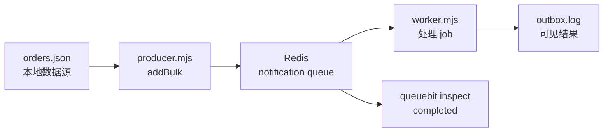

# 快速开始

<!-- queuebit-v01-legacy-doc -->
> [!WARNING]
> **历史文档，已停止维护。** 当前 v0.1 最终用户手册位于 [`docs/v01/zh`](../v01/zh/index.md)。本页仅保留历史上下文，API、命令、配置和示例不得用于新接入或实现。

## 5 分钟目标

<span class="manual-label">首次成功路径</span>

本页只做一件事：从一个明确的数据文件读取两条订单，用 `Queue.addBulk` 批量入队，再由 Worker 写入本地 `outbox.log`。完成后，你能确认 Redis、Producer、Worker 和查询入口都已连通。

这里的 handler 只是本地验证夹具，不代表生产通知实现。生产环境应把写文件替换为邮件、推送、同步或文件生成服务，并继续阅读 [生产部署](./production-deployment.md)。



## 前置条件

- Node.js `>= 20`
- Redis `>= 7.0`，standalone 或单主 Redis
- 一个空目录

Redis Cluster 在 v0.1 不支持。环境不确定时先看 [运行环境与兼容边界](./compatibility.md)。

## 1. 安装并启动 Redis

```bash
npm install queuebit
docker run --name queuebit-redis -p 6379:6379 redis:7
```

如果本机已经有 Redis，只要 `redis://127.0.0.1:6379` 可连接，就不需要再次启动容器。

## 2. 写最小配置

新建 `queuebit.config.mjs`：

```js
import { defineQueuebitConfig } from 'queuebit';

export default defineQueuebitConfig({
  connection: { url: 'redis://127.0.0.1:6379' },
  namespace: 'dev:billing',
  queues: {
    notification: {}
  }
});
```

首次运行只需要理解三个值：

| 值 | 含义 |
|---|---|
| `connection.url` | Redis 地址 |
| `namespace` | 当前应用在 Redis 中的隔离前缀 |
| `notification` | 业务队列名；Producer 和 Worker 必须一致 |

认证、TLS、Sentinel、重试、租约和 Scheduler 都属于生产配置，本页先不展开。

## 3. 准备一批业务数据

新建 `orders.json`：

```json
[
  {
    "id": "order-1001",
    "userId": "user-42",
    "email": "ada@example.com",
    "orderNo": "NO-1001",
    "amountText": "¥128.00"
  },
  {
    "id": "order-1002",
    "userId": "user-77",
    "email": "lin@example.com",
    "orderNo": "NO-1002",
    "amountText": "¥86.00"
  }
]
```

这就是首次运行的数据来源。queuebit 不会替你查询用户或凭空生成接收人；生产项目应把这一步替换为数据库查询、内部 API、事件流或导入文件。

## 4. 启动 Worker

新建 `worker.mjs`：

```js
import { appendFile } from 'node:fs/promises';
import { Worker } from 'queuebit';

const connection = { url: 'redis://127.0.0.1:6379' };
const namespace = 'dev:billing';

const worker = new Worker('notification', async (job) => {
  await appendFile(
    'outbox.log',
    `${JSON.stringify({
      jobId: job.id,
      orderId: job.data.orderId,
      recipient: job.data.recipient,
      templateId: job.data.templateId
    })}\n`
  );
}, {
  connection,
  namespace
});

await worker.run();
```

在终端 A 运行：

```bash
node worker.mjs
```

Worker 是执行任务的进程。它会持续等待新 job，因此终端保持运行是正常现象。

## 5. 批量提交 jobs

新建 `producer.mjs`：

```js
import { readFile } from 'node:fs/promises';
import { Queue } from 'queuebit';

const orders = JSON.parse(await readFile('orders.json', 'utf8'));

const queue = new Queue('notification', {
  connection: { url: 'redis://127.0.0.1:6379' },
  namespace: 'dev:billing'
});

const jobs = orders.flatMap((order) => {
  if (!order.email) {
    return [];
  }

  return [{
    name: 'send-receipt-notification',
    data: {
      orderId: order.id,
      userId: order.userId,
      recipient: order.email,
      templateId: 'receipt-paid',
      variables: {
        orderNo: order.orderNo,
        amountText: order.amountText
      }
    },
    opts: {
      idempotencyKey: `receipt:${order.id}`
    }
  }];
});

const createdJobs = await queue.addBulk(jobs);
console.log('queued job ids:', createdJobs.map((job) => job.id));
await queue.close();
```

在终端 B 运行：

```bash
node producer.mjs
```

这里使用 `addBulk`，因为一批业务对象应映射为一批 jobs。没有邮箱的订单会被跳过，而不是伪造接收人。

## 6. 确认成功

先查看 handler 结果：

```bash
cat outbox.log
```

应该看到两行 JSON，分别包含 `order-1001` 和 `order-1002`。再查看队列：

```bash
npx queuebit inspect queue notification --config queuebit.config.mjs
```

成功标准：

- Producer 输出两个 job id。
- `outbox.log` 出现两条结果。
- `waiting` 和 `active` 最终回到 `0`。
- `completed` 至少增加 `2`。

## 为什么这里没有 Scheduler

这批 jobs 立即执行且不需要重试，所以首次成功不依赖 Scheduler。生产环境中，Scheduler 负责推进 delayed、retry 和 stalled recovery；在验证最小闭环后，应按 [生产部署](./production-deployment.md) 启动独立 Scheduler。

## 第一次失败怎么查

| 现象 | 先检查 | 处理 |
|---|---|---|
| Producer 连接失败 | Redis 是否运行、端口是否为 `6379` | 修正 `connection.url` |
| job 一直 waiting | 终端 A 是否仍在运行；queue/namespace 是否一致 | 重启 Worker，核对三个最小值 |
| `outbox.log` 不存在 | Worker 是否报错、当前目录是否可写 | 查看 Worker stderr，修复文件权限 |
| job 执行两次 | at-least-once 可能重投递 | 在真实 handler 中使用业务幂等键 |
| inspect 找不到队列 | config 路径或 namespace 不一致 | 使用本页的 `queuebit.config.mjs` |

更多排查方法见 [运维与排查](./operations.md)。

## 下一步

- 准备生产环境：[生产部署](./production-deployment.md)
- 接入 vext：[vext 接入](./vext-integration.md)
- 查询全部字段和命令：[CLI 与配置](./cli-and-config.md)
- 理解重复投递：[故障模式与恢复](./failure-modes.md)
