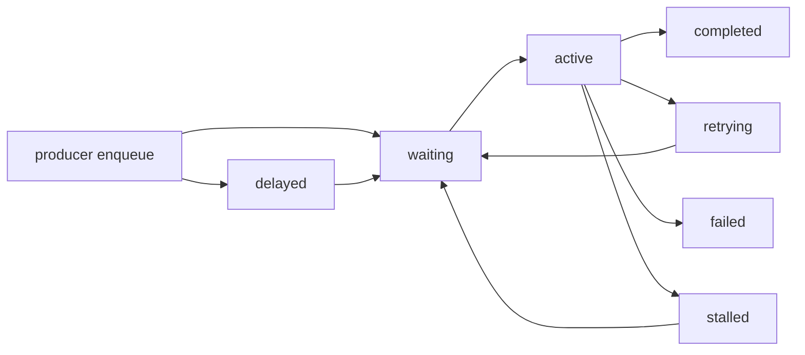

# API 参考

## API 定位

<span class="manual-label">v0.1 final user manual</span>

本页定义 queuebit v0.1 用户侧公开 API。后续实现必须让 quick start、vext adapter、CLI 和测试与本页语义保持一致。

## API 设计原则

- API 首先表达 queue 语义，不暴露 Redis key 作为普通用户主路径。
- Producer、worker、scheduler 可以独立创建和运行。
- 所有会影响分布式语义的选项必须显式，例如 namespace、queue name、lease、retry、scheduler domain。
- 业务处理函数必须按 at-least-once 设计；API 不承诺 exactly-once。
- 长生命周期对象必须有关闭或 drain 入口。

## 核心对象

| 对象 | 目标职责 | 生命周期 |
|------|----------|----------|
| `Queue` | queue 的用户入口，提交 job、读取状态、关闭连接 | 应用生命周期内复用，关闭时释放 Redis 连接或引用 |
| `Producer` | 提交 job，返回 job handle | 可短生命周期，也可随应用常驻 |
| `Worker` | 处理 job，续租，ack/fail，drain | 长生命周期，必须可 graceful shutdown |
| `Scheduler` | 推进 delayed、retry、stalled recovery | 长生命周期，必须可确认 single-active |
| `Job` | job 元数据、payload、attempt、状态、错误摘要 | 由 queuebit 持久化并可查询 |

公开类型轮廓：

```ts
type QueuebitConnection = {
  url?: string;
  host?: string;
  port?: number;
  database?: number;
};

type QueueOptions = {
  connection: QueuebitConnection;
  namespace: string;
};

type QueuebitJobState =
  | 'waiting'
  | 'delayed'
  | 'active'
  | 'retrying'
  | 'completed'
  | 'failed'
  | 'stalled'
  | 'draining';

type JobInput<TPayload> = {
  name: string;
  data: TPayload;
  opts?: {
    idempotencyKey?: string;
    delayMs?: number;
    attempts?: number;
    backoff?: { type: 'fixed' | 'exponential'; delayMs: number };
  };
};
```

## 最小示例

Producer：

`pendingReceipts` 应来自你的业务数据库、API、事件或导入文件；queuebit API 只接收整理后的 job payload。

```ts
import { Queue } from 'queuebit';

const queue = new Queue('notification', {
  connection: { url: 'redis://127.0.0.1:6379' },
  namespace: 'dev:billing'
});

const jobs = pendingReceipts.map((order) => ({
  name: 'send-receipt-notification',
  data: {
    orderId: order.id,
    userId: order.user.id,
    recipient: order.user.email,
    templateId: 'receipt-paid'
  },
  opts: {
    idempotencyKey: `receipt:${order.id}`,
    attempts: 3,
    backoff: { type: 'exponential', delayMs: 1000 }
  }
}));

await queue.addBulk(jobs);
```

Worker：

```ts
import { Worker } from 'queuebit';

const worker = new Worker('notification', async (job) => {
  await sendReceiptNotification(job.data);
}, {
  connection: { url: 'redis://127.0.0.1:6379' },
  namespace: 'dev:billing',
  concurrency: 4
});

await worker.run();
```

Scheduler：

```ts
import { Scheduler } from 'queuebit';

const scheduler = new Scheduler({
  connection: { url: 'redis://127.0.0.1:6379' },
  namespace: 'dev:billing',
  queues: ['notification'],
  domain: 'billing-notification'
});

await scheduler.run();
```

## Queue 操作

| 操作 | 目标语义 | 必要约束 |
|------|----------|----------|
| create queue | 绑定 Redis 连接、namespace 和 queue name | namespace 必填；queue name 必须稳定 |
| add | 写入单个 waiting 或 delayed job | 返回可追踪 job id；适合测试、管理操作或确实只有单条业务对象的场景 |
| addBulk | 原子提交一批 jobs | 返回这一批 job ids；首个用户接入路径应优先展示批量提交 |
| get job | 查询 job 元数据与状态 | 不要求读取 payload 明文策略之外的信息 |
| inspect | 查询 queue depth、active、delayed、retry、stalled 概况 | 不应触发状态迁移 |
| drain | 停止新声明或请求 worker drain | 不等于删除 job，不等于强制成功 |
| close | 释放资源 | 必须不会留下本进程续租循环 |

## Worker 操作

| 操作 | 目标语义 | 必要约束 |
|------|----------|----------|
| start | 开始声明 job 并执行 handler | 必须设置 worker identity 和 concurrency |
| renew lease | 在处理期间续租 | 续租失败后必须进入不确定处理 |
| ack complete | 将 job 标为 completed | ack 丢失可能导致重投递 |
| fail retryable | 记录失败并进入 retry 计划 | attempts 和 backoff 必须可观察 |
| fail terminal | 达到最大 attempts 后进入 failed | 错误摘要必须可诊断 |
| drain | 停止声明新 job，等待已声明 job 结束或超时 | 超时后 job 按 lease/recovery 规则处理 |
| stop | 停止 worker runtime | 不得继续拉新或续租未知 job |

## Scheduler 操作

| 操作 | 目标语义 | 必要约束 |
|------|----------|----------|
| acquire leadership | 获取 scheduler domain 单活资格 | 不确定时必须停止推进 |
| promote delayed | 将到期 delayed job 推入 waiting | 必须原子迁移 |
| reschedule retry | 将到期 retry job 推入 waiting | 不得重复消耗 attempt |
| recover stalled | 找出 lease 过期的 active job 并恢复 | 恢复必须保留重投递痕迹 |
| heartbeat | 维持 scheduler identity | 丢失资格后停止推进 |
| stop | 停止时间推进 | 不应留下伪 active 状态 |

## Job 状态

目标状态机：



节点说明：

| 节点 | 说明 |
|------|------|
| `waiting` | job 可被 worker 声明 |
| `delayed` | job 未到可执行时间，由 scheduler 推进 |
| `active` | job 已被 worker 声明并持有 lease |
| `retrying` | job 失败后等待下一次 attempt |
| `completed` | job 已被确认完成 |
| `failed` | job 达到终止失败条件 |
| `stalled` | active job 的 worker/lease 不确定，等待恢复 |

## 错误与事件

v0.1 至少需要区分：

| 类型 | 目标示例 | 用户动作 |
|------|----------|----------|
| 配置错误 | 缺少 namespace、queue name、Redis 配置无效 | 启动前失败，修正配置 |
| Redis 不可用 | 连接失败、命令超时、脚本失败 | 停止声明新 job，等待恢复或人工介入 |
| Lease 不确定 | 续租失败、token 不匹配、TTL 丢失 | worker 停止拉新，job 交给恢复路径 |
| Handler 失败 | 业务异常、超时、显式失败 | 按 retry/terminal failure 处理 |
| Scheduler 不确定 | 无法确认单活资格 | 停止 delayed/retry 推进 |

## 参考关联

| 问题 | 入口 |
|------|------|
| 完整第一次接入 | [快速开始](./quick-start.md) |
| 配置字段和 CLI | [CLI 与配置](./cli-and-config.md) |
| vext adapter API | [vext 接入](./vext-integration.md) |
| Redis keyspace 与状态迁移 | [Redis 模型](./redis-model.md) |
| Worker / scheduler 生命周期 | [Worker 与 Scheduler 生命周期](./worker-lifecycle.md) |
