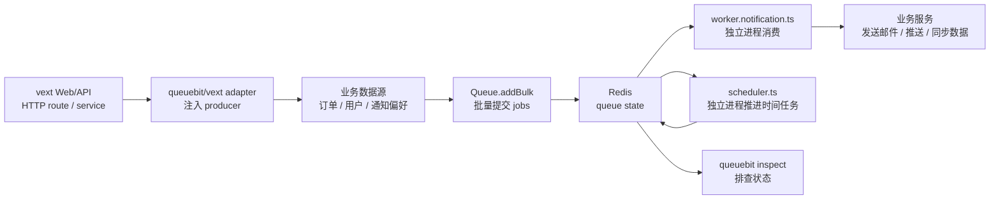

# vext 接入

## 定位

`vext` 是 queuebit 的首个真实接入目标，但不是 queuebit core 的依赖。

queuebit 通过 `queuebit/vext` 提供 adapter。adapter 负责把 vext 配置、生命周期和依赖注入接到 queuebit，但不会把 `vext start` 隐式变成 worker 或 scheduler。

<span class="manual-label">v0.1 final user manual</span>

## 接入流程图

vext 接入时，不要把所有事情塞进 `vext start`。推荐流程是：Web/API 进程只提交 job，worker 和 scheduler 都是独立入口。



节点说明：

| 节点 | 作用 | 常见误区 |
|------|------|----------|
| vext Web/API | 接收请求、校验输入、提交 job | 不应该默认消费 job |
| queuebit/vext adapter | 把 vext 配置接到 queuebit | 不应该隐藏 worker/scheduler 拓扑 |
| 业务数据源 | 提供用户、订单、通知偏好和设备 token | 不要在示例里硬编码用户数据或凭空生成推送地址 |
| Worker 入口 | 执行业务 handler | 不要依赖 Web 热重载生命周期 |
| Scheduler 入口 | 推进 delayed、retry、stalled recovery | 不处理业务 handler |
| inspect | 排查 job 卡在哪里 | 不要直接从 Redis key 猜状态 |

## 安装

```bash
npm install queuebit
```

## Web/API 进程启用 Producer

在 vext 应用配置中启用 producer。这个配置只让 Web/API 进程提交 job，不启动 worker，也不抢占 scheduler。

```ts
import { defineConfig } from 'vext';
import { queuebit } from 'queuebit/vext';

export default defineConfig({
  plugins: [
    queuebit({
      connection: { url: 'redis://127.0.0.1:6379' },
      namespace: 'prod:billing',
      queues: {
        notification: {
          defaultJobOptions: {
            attempts: 3,
            backoff: { type: 'exponential', delayMs: 1000 }
          }
        }
      },
      producer: { enabled: true },
      worker: { enabled: false },
      scheduler: { enabled: false }
    })
  ]
});
```

## 从 vext route 批量提交 jobs

在 route、service 或 action 中取得 queue，但用户数据必须先来自你的业务系统。vext route 只负责接收触发条件、校验权限、查询待处理对象，并把每条对象整理成 job payload。

```ts
import { useQueuebit } from 'queuebit/vext';
import { services } from './services';

export async function POST(request: Request) {
  const { orderIds, limit = 100 } = await request.json();
  const queuebit = useQueuebit();

  const orders = await services.orders.findPaidOrdersNeedingReceipt({
    ids: orderIds,
    limit
  });

  const jobs = orders.flatMap((order) => {
    const wantsPush = order.user.preferredChannel === 'push' && Boolean(order.user.pushToken);
    const channel = wantsPush ? 'push' : 'email';
    const recipient = wantsPush ? order.user.pushToken : order.user.email;

    if (!recipient) {
      return [];
    }

    return [{
      name: 'send-receipt-notification',
      data: {
        orderId: order.id,
        userId: order.user.id,
        channel,
        recipient,
        templateId: 'receipt-paid',
        variables: {
          orderNo: order.orderNo,
          amountText: order.amountText
        }
      },
      opts: {
        idempotencyKey: `receipt:${order.id}`
      }
    }];
  });

  const createdJobs = jobs.length > 0
    ? await queuebit.queue('notification').addBulk(jobs)
    : [];

  if (jobs.length > 0) {
    await services.orders.markReceiptNotificationQueued(
      jobs.map((job) => job.data.orderId)
    );
  }

  return Response.json({
    jobIds: createdJobs.map((job) => job.id),
    skipped: orders.length - jobs.length
  });
}
```

这段代码里的用户、订单、邮箱、push token 和模板变量都来自业务服务；queuebit 不负责获取这些数据，只负责可靠排队、重试和交给 worker 执行。

## 独立 Worker 入口

创建 `worker.notification.ts`。worker 必须显式启动，不能依赖 Web/API 进程热重载或 HTTP worker 数量。

```ts
import { createVextQueueWorker } from 'queuebit/vext';

const worker = createVextQueueWorker({
  config: './vext.config.ts',
  queue: 'notification',
  concurrency: 4,
  handlers: {
    'send-receipt-notification': async (job, ctx) => {
      const order = await ctx.services.orders.findById(job.data.orderId);

      if (!order) {
        throw new Error(`Missing order for job ${job.id}`);
      }

      if (job.data.channel === 'email') {
        await ctx.services.email.sendReceipt({
          to: job.data.recipient,
          orderId: job.data.orderId,
          variables: job.data.variables
        });
        return;
      }

      await ctx.services.push.sendReceipt({
        token: job.data.recipient,
        orderId: job.data.orderId,
        variables: job.data.variables
      });
    }
  }
});

await worker.run();
```

启动命令：

```bash
node worker.notification.ts
```

或使用 queuebit CLI：

```bash
queuebit worker start --vext ./vext.config.ts --queue notification
```

## 独立 Scheduler 入口

创建 `scheduler.ts`。scheduler 只推进 delayed、retry 和 stalled recovery，不处理业务 handler。

```ts
import { createVextQueueScheduler } from 'queuebit/vext';

const scheduler = createVextQueueScheduler({
  config: './vext.config.ts',
  domain: 'billing-notification',
  queues: ['notification']
});

await scheduler.run();
```

启动命令：

```bash
node scheduler.ts
```

或使用 queuebit CLI：

```bash
queuebit scheduler start --vext ./vext.config.ts --domain billing-notification
```

## 推荐进程拓扑

| 进程 | 推荐职责 | 不应该承担 |
|------|----------|------------|
| vext Web / API | 接收请求、校验业务输入、提交 job | 默认启动 worker、默认推进 delayed / retry |
| queuebit worker | 拉取 job、续租、执行 handler、ack / fail、drain | 依赖 Web reload 生命周期、隐式共享 HTTP 并发 |
| queuebit scheduler | 在 single-active domain 内推进 delayed、retry、stalled recovery | 多实例同时无保护推进 |
| Redis | 保存队列状态、lease、延迟任务和恢复所需状态 | 作为多个后端之一被抽象掉 |

这一拆分可以避免 Web 进程扩缩容时意外放大 worker 数量，也避免 reload 导致 worker 生命周期不清晰。

## 配置关系

vext adapter 读取 vext 配置，但最终仍生成 queuebit 配置摘要。用户必须能在启动日志或 inspect 中看到这些字段：

| 配置层 | 说明 |
|--------|------|
| Redis 连接 | queuebit 首版唯一后端连接信息 |
| queue namespace | 隔离不同业务队列和环境 |
| producer | Web / API 进程提交 job 所需的最小配置 |
| worker | 并发、lease、drainTimeout、handler 注册等运行参数 |
| scheduler | scheduler domain、续期窗口、推进 delayed / retry / stalled recovery 的策略 |
| observability | metrics、health check、introspection 输出 |

字段默认值和错误策略见 [CLI 与配置](./cli-and-config.md)。

## 发布检查清单

- Web / API 进程只提交 job，不会因为启动 vext app 而隐式消费。
- worker 有独立启动命令、关闭策略和日志标识。
- scheduler domain 唯一、可观察，并能解释 delayed / retry 没有推进时的原因。
- Redis Cluster 未被标记支持前，启动校验不会静默放行。
- reload / shutdown 会进入 drain，而不是让 worker 在不确定状态继续拉新。
- 运维页面能解释 queue depth、active jobs、active worker、active scheduler 和 stalled recovery。

## 下一步

- 用 [快速开始](./quick-start.md) 跑通非 vext 的最小链路。
- 用 [CLI 与配置](./cli-and-config.md) 固化 worker、scheduler 和 inspect 命令。
- 用 [运维与排查](./operations.md) 建立上线前检查项。
