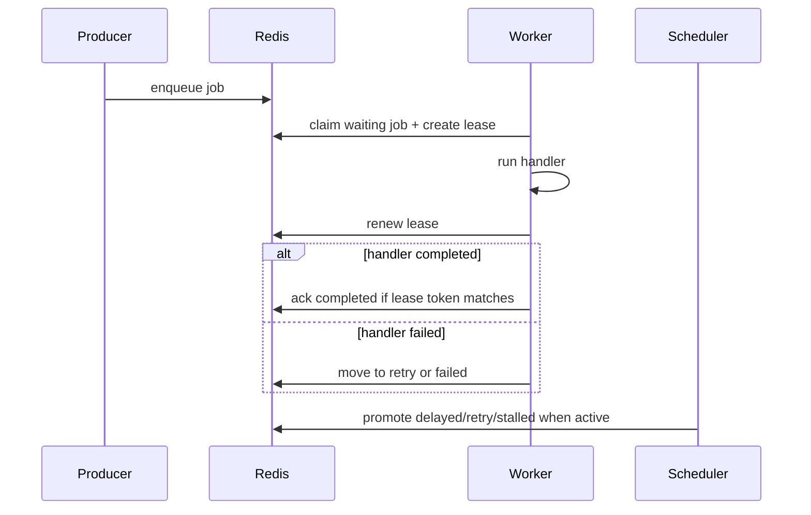

# Worker 与 Scheduler 生命周期

## 页面定位

v0.1 final user manual

本页说明 queuebit v0.1 中 Producer、Worker、Scheduler 的运行生命周期，以及用户在启动、关闭、drain 和恢复时能观察到的行为。

## Producer 生命周期

Producer 路径：

1. 读取 Redis 连接、namespace、queue name。
2. 校验 enqueue 参数、payload 限制和 retry/delay 选项。
3. 创建 job id 和 job 元数据。
4. 写入 waiting 或 delayed。
5. 返回 job handle，供调用方追踪状态。

Producer 不启动 worker，不续租 active job，也不推进 delayed/retry。

## Worker 生命周期

Worker 路径：

| 阶段 | 动作 | 失败处理 |
|------|------|----------|
| boot | 创建 worker identity，校验配置，连接 Redis | 启动失败，不进入消费 |
| claim | 从 waiting 原子声明 job，创建 lease | 无 job 时等待；Redis 失败时退避 |
| handle | 调用业务 handler | handler 失败进入 retry 或 failed |
| renew | 周期性续租 active job | 续租失败进入 lease uncertainty |
| ack | 完成后校验 lease 并写 completed | ack 不确定时按 at-least-once 处理 |
| fail | 记录错误、attempt 和 retry/failed | 状态迁移必须原子 |
| drain | 停止 claim 新 job，等待 active job 收尾 | 超时后交给恢复路径 |
| stop | 清理续租循环和 Redis 资源 | 不得留下孤儿 timer |

Lease uncertainty 的规则是保守的：worker 只要无法证明自己仍持有 job，就必须停止拉新，并让系统恢复路径处理该 job。

## Scheduler 生命周期

Scheduler 路径：

| 阶段 | 动作 | 失败处理 |
|------|------|----------|
| boot | 校验 scheduler domain，连接 Redis | 启动失败，不推进时间 |
| acquire | 获取 single-active token | 获取失败则 standby 或退出 |
| heartbeat | 续期 scheduler token | 续期失败立即停止推进 |
| promote delayed | 扫描到期 delayed job，迁移到 waiting | 失败时保留可重试状态 |
| reschedule retry | 扫描到期 retry job，迁移到 waiting | 不重复消耗 attempt |
| recover stalled | 检查 active job lease，恢复过期 job | 记录 stalled 痕迹 |
| stop | 释放或停止续期 single-active token | 不再推进任何时间状态 |

Scheduler 不执行业务 handler，不创建 producer，也不绕过 worker lease 规则。

## Drain 与关闭

Drain 是 graceful shutdown 的核心：

- Worker 进入 drain 后停止 claim 新 job。
- 已 active 的 job 可以继续处理到完成、失败或 drain timeout。
- drain timeout 后，worker 不应强行写 completed，除非仍能确认 lease。
- 进程关闭前必须停止续租循环。
- 如果进程崩溃，stalled recovery 负责把 job 带回可声明状态。

## 时序图

节点说明：

| 节点 | 说明 |
|------|------|
| Producer | 只负责提交 job，不消费 job |
| Redis | 所有共享状态和协调状态的唯一来源 |
| Worker | 声明、处理、续租、ack/fail job |
| Scheduler | 推进时间状态和恢复状态，且同 domain 单活 |

## 实现验收

- Worker 关闭路径必须能证明没有遗留续租 timer。
- Scheduler 失去 single-active 后必须停止推进。
- Drain、lease failure、handler timeout、Redis reconnect 都必须有测试。
- vext reload 必须映射到 worker drain 或 stop，不得静默硬杀。
